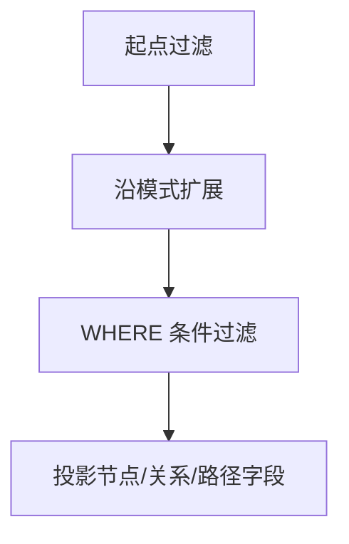

# 模式匹配

## 方向语义

| 模式 | 含义 |
|---|---|
| `(a)-[:REL]->(b)` | 从 `a` 指向 `b` 的出边 |
| `(a)<-[:REL]-(b)` | 从 `b` 指向 `a` 的入边 |
| `(a)-[:REL]-(b)` | 不限定方向，匹配两种 |

## 基本匹配与组合匹配

单模式 — 查找所有 KNOWS 关系：

```cypher
MATCH (a:Person)-[:KNOWS]->(b:Person)
RETURN a.name, b.name;
```

组合模式 — 一次 `MATCH` 中声明多个关系模式：

```cypher
MATCH (a:Person)-[:KNOWS]->(b:Person),
      (b)-[:WORKS_AT]->(c:Company)
RETURN a.name, b.name, c.name;
```

:::tip
组合模式下，所有模式共享中间变量（如上例的 `b`），引擎会自动做等值连接。
:::

## 变长模式

| 写法 | 含义 |
|---|---|
| `*` | 任意跳数 |
| `*N` | 恰好 N 跳 |
| `*N..M` | N 到 M 跳 |
| `*N..` | 至少 N 跳 |
| `*..M` | 至多 M 跳 |

```cypher
MATCH p = (a:Person)-[:KNOWS*1..3]->(b:Person)
RETURN p, length(p);
```

:::warning
变长模式不设上界时（`*1..`）可能导致全图遍历。始终优先给上界（如 `*1..4`）。
:::

## 多关系类型匹配

```cypher
MATCH (a)-[:TYPE1|TYPE2]->(x)
RETURN x;
```

## 可选匹配与存在性检查

`OPTIONAL MATCH` 在模式不匹配时返回 `null` 而非丢弃行：

```cypher
MATCH (p:Person)
OPTIONAL MATCH (p)-[:WORKS_AT]->(c:Company)
RETURN p.name, c.name;
```

用 `exists()` 在 WHERE 中判断模式是否存在：

```cypher
MATCH (n:Person)
WHERE exists((n)-[:KNOWS]->())
RETURN n.name;
```

## 最短路径

查找两个节点之间的最短路径：

```cypher
MATCH p = shortestPath((a:Person {name: 'Alice'})-[:KNOWS*]-(b:Person {name: 'Charlie'}))
RETURN p;
```

:::info
也可以使用 `algo.shortestPath` 过程获取最短路径，或通过 GDS 的 `gds.shortestPath.dijkstra.stream` 获取带权最短路径。
:::

## 模式推导（Pattern Comprehension）

将匹配结果直接投影为列表：

```cypher
MATCH (n:Person {name: 'Alice'})
RETURN [(n)-[:KNOWS]->(m) | m.name] AS friends;
```

## 查询处理流程



## 性能检查清单

- 尽量在起点/终点就加标签和可索引属性过滤
- 变长模式优先给上界（`*1..N`）
- 仅在关系确实可缺省时使用 `OPTIONAL MATCH`
- 只有需要路径对象本身时才命名并返回路径变量 `p`
