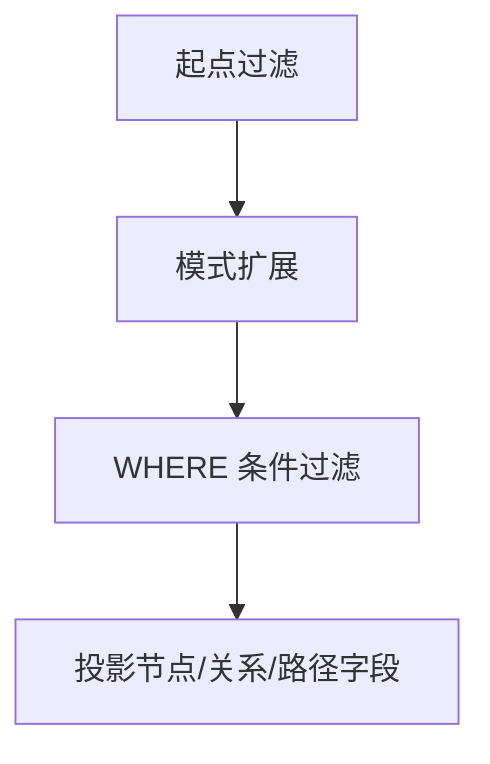

# 模式匹配

## 方向语义

| 模式 | 含义 |
|---|---|
| `(a)-[:REL]->(b)` | 从 `a` 指向 `b` 的出边 |
| `(a)<-[:REL]-(b)` | 从 `b` 指向 `a` 的入边 |
| `(a)-[:REL]-(b)` | 不限定方向 |

## 单模式与组合模式

```cypher
MATCH (a:Person)-[:KNOWS]->(b:Person)
RETURN a.name, b.name;
```

```cypher
MATCH (a:Person)-[:KNOWS]->(b:Person),
      (b)-[:WORKS_AT]->(c:Company)
RETURN a.name, b.name, c.name;
```

## 变长模式

当前支持形式：

- `*`
- `*N`
- `*N..M`
- `*N..`
- `*..M`

```cypher
MATCH p = (a:Person)-[:KNOWS*1..3]->(b:Person)
RETURN p, length(p);
```

## 多关系类型匹配

```cypher
MATCH (a)-[:TYPE1|TYPE2]->(x)
RETURN x;
```

## 可选匹配与存在性匹配

```cypher
MATCH (p:Person)
OPTIONAL MATCH (p)-[:WORKS_AT]->(c:Company)
RETURN p.name, c.name;
```

```cypher
MATCH (n:Person)
WHERE exists((n)-[:KNOWS]->())
RETURN n.name;
```

## 模式推导（Pattern Comprehension）

```cypher
MATCH (n:Person {name: 'Alice'})
RETURN [(n)-[:KNOWS]->(m) | m.name] AS friends;
```



## 实战检查清单

- 尽量在起点/终点就加标签和可索引属性过滤。
- 变长模式优先给上界（`*1..N`）。
- 仅在关系确实可缺省时使用 `OPTIONAL MATCH`。
- 只有需要路径对象本身时才返回 `p`。
