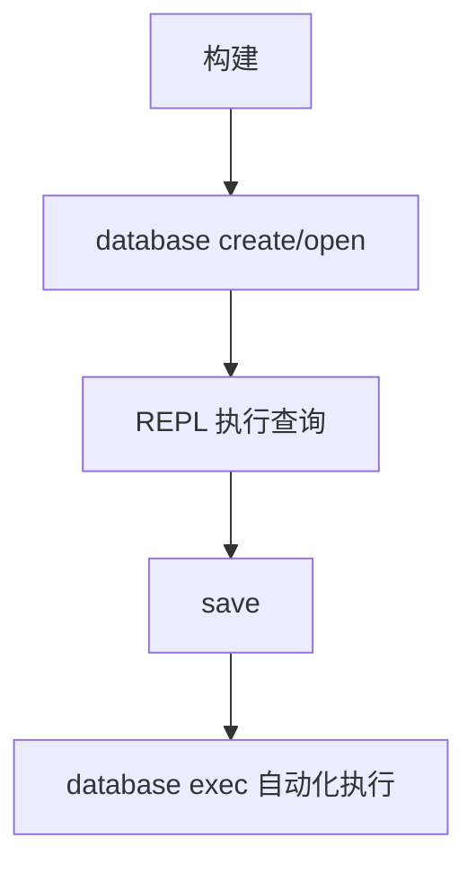

# 快速开始

## 1) 一次构建

```bash
./scripts/run_tests.sh --quick
```

构建后 CLI 通常位于：

```bash
./buildDir/apps/cli/zyx
```

## 2) 打开数据库

创建并进入交互模式：

```bash
./buildDir/apps/cli/zyx database create ./demo.graph
```

打开已有数据库：

```bash
./buildDir/apps/cli/zyx database open ./demo.graph
```

不存在则创建再打开：

```bash
./buildDir/apps/cli/zyx database open ./demo.graph --create-if-missing
```

## 3) 执行第一组图查询

```cypher
CREATE (a:User {name: 'Alice', age: 30});
CREATE (b:User {name: 'Bob', age: 25});
MATCH (a:User {name: 'Alice'}), (b:User {name: 'Bob'})
CREATE (a)-[:KNOWS {since: 2026}]->(b);
MATCH (a:User)-[r:KNOWS]->(b:User)
RETURN a.name, b.name, r.since;
```

## 4) REPL 常用命令

- `help`：打印帮助
- `save`：将数据 flush 到磁盘
- `debug ...`：查看内部状态（进阶）
- `exit`：退出 REPL

## 5) 脚本模式（可复用执行）

```bash
./buildDir/apps/cli/zyx database exec ./demo.graph ./seed.cypher
```

`seed.cypher` 建议每条语句以 `;` 结束。



## 快速排障

| 现象 | 常见原因 | 处理建议 |
|---|---|---|
| `Script file not found` | 脚本路径错误 | 使用绝对路径或检查当前目录 |
| `Syntax Error at line ...` | 缺少 `;` 或使用了未支持语法 | 先对照 [Cypher 基础](cypher-basics) |
| 查不到预期数据 | 标签/属性名不匹配 | 先执行 `MATCH (n) RETURN n LIMIT 10;` 做全局检查 |
