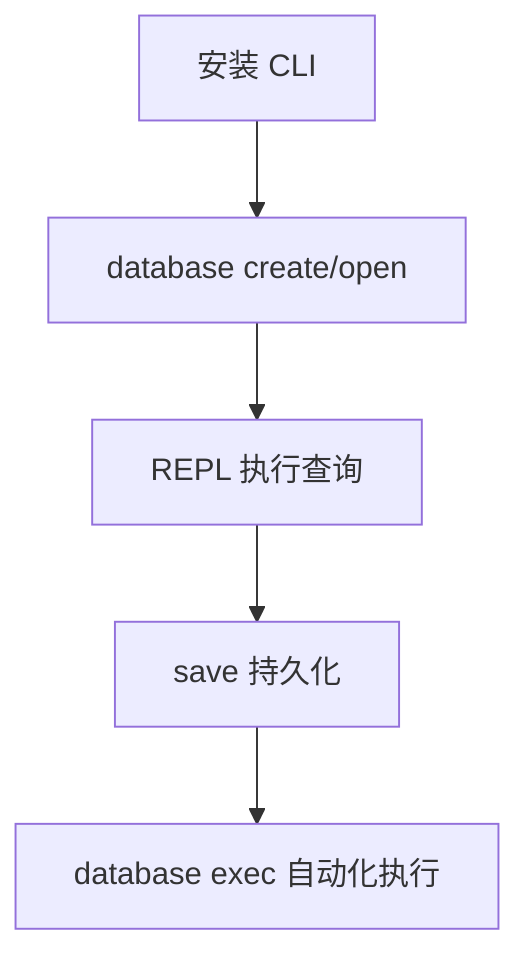

# 快速开始

本指南面向 CLI 产品用户。大多数用户不需要自行从源码构建。

## 1) 下载安装 CLI

你可以通过以下方式获得 ZYX：

- 下载预构建可执行文件
- 通过包管理器安装
- 从源码构建（可选）：[安装指南](../contributing/installation)

先执行以下命令确认 CLI 可用：

```bash
zyx --help
```

:::info
如果可执行文件不在 `PATH` 中，请改用实际路径（例如 `./zyx` 或 `./buildDir/apps/cli/zyx`）。
:::

## 2) 打开数据库

创建并进入 REPL 交互模式：

```bash
zyx database create ./demo.zyx
```

打开已有数据库：

```bash
zyx database open ./demo.zyx
```

不存在则自动创建再打开：

```bash
zyx database open ./demo.zyx --create-if-missing
```

:::tip 快捷方式
`zyx database open ./demo.zyx -c` 是 `--create-if-missing` 的简写形式，在脚本和自动化场景中特别实用。
:::

## 3) 执行第一组图查询

进入 REPL 后输入以下 Cypher 语句：

```cypher
CREATE (a:User {name: 'Alice', age: 30});
CREATE (b:User {name: 'Bob', age: 25});
MATCH (a:User {name: 'Alice'}), (b:User {name: 'Bob'})
CREATE (a)-[:KNOWS {since: 2026}]->(b);
MATCH (a:User)-[r:KNOWS]->(b:User)
RETURN a.name, b.name, r.since;
```

:::info
REPL 中每条语句以 `;` 结束后立即执行，也可以输入空行触发多行语句执行。默认以隐式事务运行（成功提交，失败回滚）；需要多步原子操作时可用 `BEGIN` / `COMMIT` / `ROLLBACK`，详见[事务控制](transactions)。
:::

## 4) REPL 常用命令

| 命令 | 说明 |
|---|---|
| `help` | 打印可用命令列表 |
| `save` | 将数据持久化到磁盘 |
| `debug` | 进入调试模式（输入 `debug help` 查看子命令） |
| `exit` | 退出 REPL |

:::tip 调试模式
`debug` 命令支持多个子命令：
- `debug summary` — 查看全局文件头信息
- `debug nodes [page]` — 查看节点段页面
- `debug edges [page]` — 查看边段页面
- `debug props [page]` — 查看属性段页面
- `debug blobs [page]` — 查看 Blob 段页面
- `debug indexes [page]` — 查看索引段页面
- `debug states [page]` — 查看 State 段页面
- `debug state <key>` — 查看特定 State 键值的详细属性
:::

## 5) 脚本模式（可复用执行）

```bash
zyx database exec ./demo.zyx ./seed.cypher
```

`seed.cypher` 中每条语句以 `;` 结束，支持 `//` 行注释，空行会被忽略。

:::info
脚本模式会自动创建不存在的数据库（等价于 `--create-if-missing`），脚本执行完成后自动 flush 数据到磁盘。
:::



## 6) 批量导入数据

除了在 REPL 中逐条写入，ZYX 还提供了专用的导入命令，支持 CSV 和 JSONL 格式：

```bash
zyx import \
  --database ./demo.zyx \
  --nodes ./nodes.csv \
  --relationships ./rels.csv
```

:::tip
导入命令的完整参数说明请参考 [导入与导出](import-export) 章节。
:::

## 快速排障

| 现象 | 常见原因 | 处理建议 |
|---|---|---|
| `zyx: command not found` | CLI 未安装或不在 `PATH` 中 | 先安装/下载 ZYX，或使用可执行文件完整路径 |
| `Script file not found` | 脚本路径错误 | 使用绝对路径或检查当前目录 |
| `Syntax Error at line ...` | 缺少 `;` 或使用了未支持语法 | 先对照 [Cypher 基础](cypher-basics) |
| 查不到预期数据 | 标签/属性名不匹配 | 先执行 `MATCH (n) RETURN n LIMIT 10;` 做全局检查 |

:::warning 特性支持边界
ZYX 的 Cypher 实现尚未覆盖所有 openCypher 特性。遇到语法错误时，请先查阅仓库根目录的 [`UNSUPPORTED_CYPHER_FEATURES.md`](https://github.com/nexepic/zyx/blob/main/UNSUPPORTED_CYPHER_FEATURES.md) 确认该特性是否已支持。
:::
