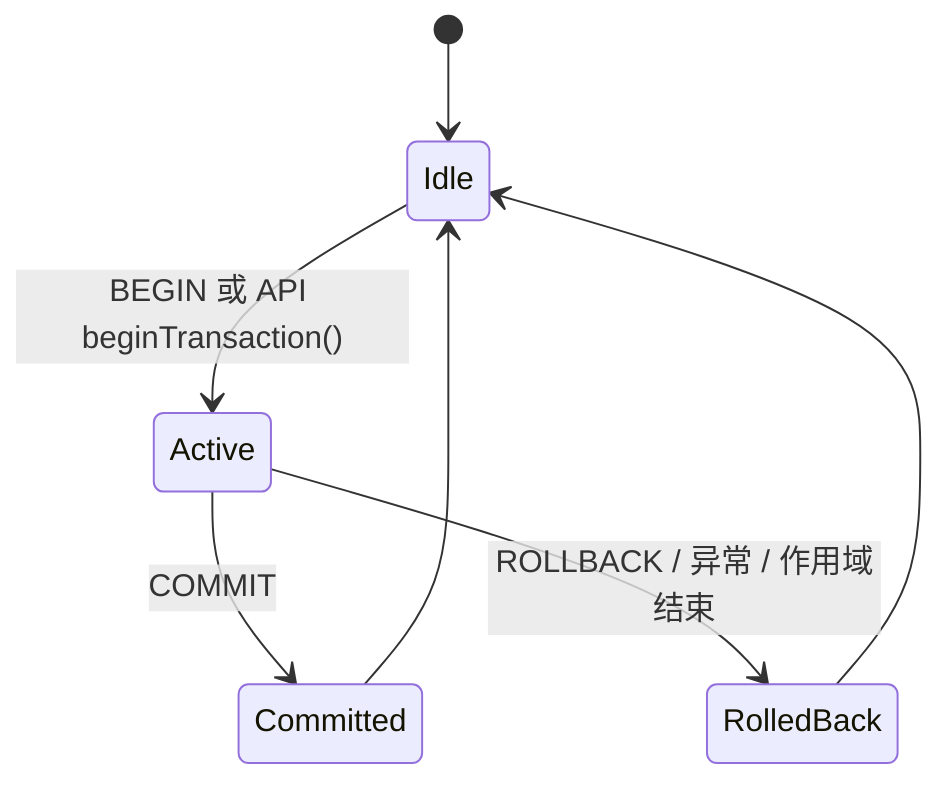

# 事务控制

## 事务生命周期



## REPL 显式事务

```cypher
BEGIN;
CREATE (:User {name: 'Alice'});
CREATE (:User {name: 'Bob'});
COMMIT;
```

回滚示例：

```cypher
BEGIN;
CREATE (:User {name: 'Temp'});
ROLLBACK;
```

## 隐式事务与显式事务

| 模式 | 适用场景 | 说明 |
|---|---|---|
| 隐式（单语句） | 简单一次性读写 | 操作开销最低 |
| 显式（`BEGIN...COMMIT`） | 多步骤原子写入 | 成功/失败边界清晰 |
| API 事务对象 | 服务端流程编排 | 未提交自动回滚 |

## 行为要点

- 不支持嵌套事务。
- 写入模型偏单写者；读取通过快照执行。
- 未提交数据在 `COMMIT` 前不具备持久性。
- 需要运维可控性时可在提交后执行 `save`/flush。

## 故障处理建议

1. 多步骤写入统一放入显式事务。
2. 中间用 `MATCH ... RETURN` 做关键校验。
3. 全部通过后再 `COMMIT`。
4. 任一步失败立即 `ROLLBACK`。
