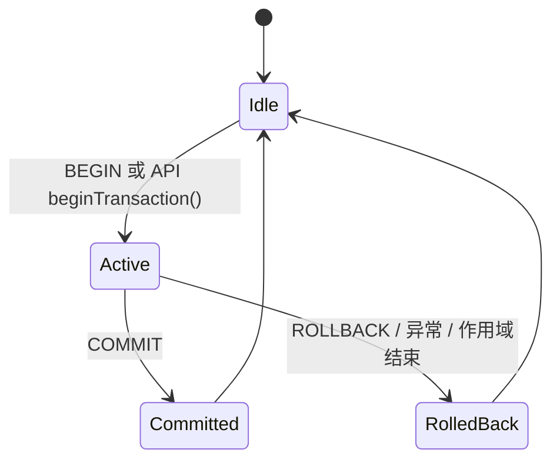
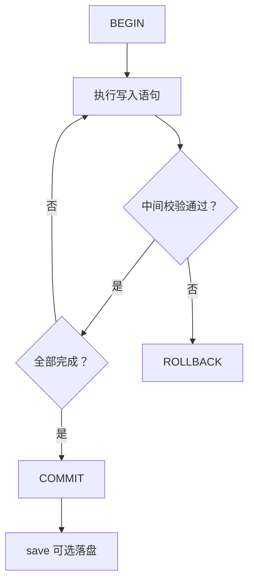

# 事务控制

## 事务生命周期



## REPL 中的显式事务

```cypher
BEGIN;
CREATE (:User {name: 'Alice'});
CREATE (:User {name: 'Bob'});
COMMIT;
```

回滚示例：

```cypher
BEGIN;
CREATE (:User {name: 'Temp'});
ROLLBACK;
```

## 三种事务模式

| 模式 | 适用场景 | 说明 |
|---|---|---|
| 隐式（单语句） | 简单一次性读写 | 每条语句自动包裹事务，开销最低 |
| 显式（`BEGIN...COMMIT`） | 多步骤原子写入 | 成功/失败边界清晰 |
| API 事务对象 | 服务端流程编排 | C++ `Transaction` 析构时未提交则自动回滚；Python `with` 块正常退出自动提交，异常时自动回滚 |

:::tip API 事务自动回滚
通过 C++ API 获取的 `Transaction` 对象在析构时如果没有调用 `commit()`，会自动执行回滚，确保不会留下未提交的脏数据。
:::

## Python 事务示例

```python
import zyxdb

with zyxdb.Database("/tmp/mydb.zyx") as db:
    # 写事务 — 正常退出时自动提交
    with db.begin_transaction() as tx:
        tx.execute("CREATE (n:User {name: 'Alice'})")
        tx.execute("CREATE (n:User {name: 'Bob'})")
        # 此处自动提交

    # 显式回滚
    with db.begin_transaction() as tx:
        tx.execute("CREATE (n:User {name: 'Temp'})")
        tx.rollback()

    # 异常时自动回滚
    try:
        with db.begin_transaction() as tx:
            tx.execute("CREATE (n:User {name: 'Ghost'})")
            raise ValueError("oops")  # 自动回滚
    except ValueError:
        pass

    # 只读事务（快照隔离）
    with db.begin_read_only_transaction() as tx:
        rows = list(tx.execute("MATCH (n:User) RETURN n.name AS name"))
```

:::tip
完整的 Python 事务 API 请参考 [Python API 参考](../api/python-api#transaction)。
:::

## 行为要点

:::warning 并发模型
ZYX 采用**单写者多读者**模型：同一时刻只允许一个写事务，读事务通过快照隔离并发执行。不支持嵌套事务。
:::

- 未提交的数据在 `COMMIT` 前不具备持久性
- `COMMIT` 后数据写入 WAL，即使进程崩溃也可通过 WAL 恢复
- 需要立即落盘时可在提交后执行 `save` 或 API `save()`

## 故障处理模式



1. 多步骤写入统一放入显式事务
2. 中间用 `MATCH ... RETURN` 做关键校验
3. 全部通过后再 `COMMIT`
4. 任一步失败立即 `ROLLBACK`
