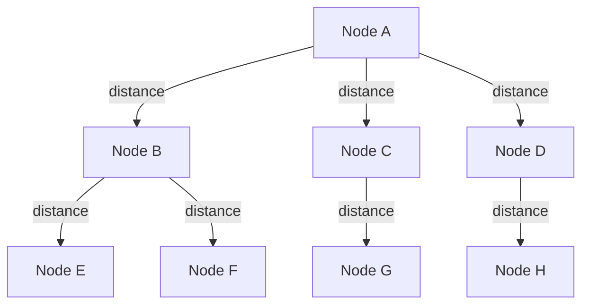
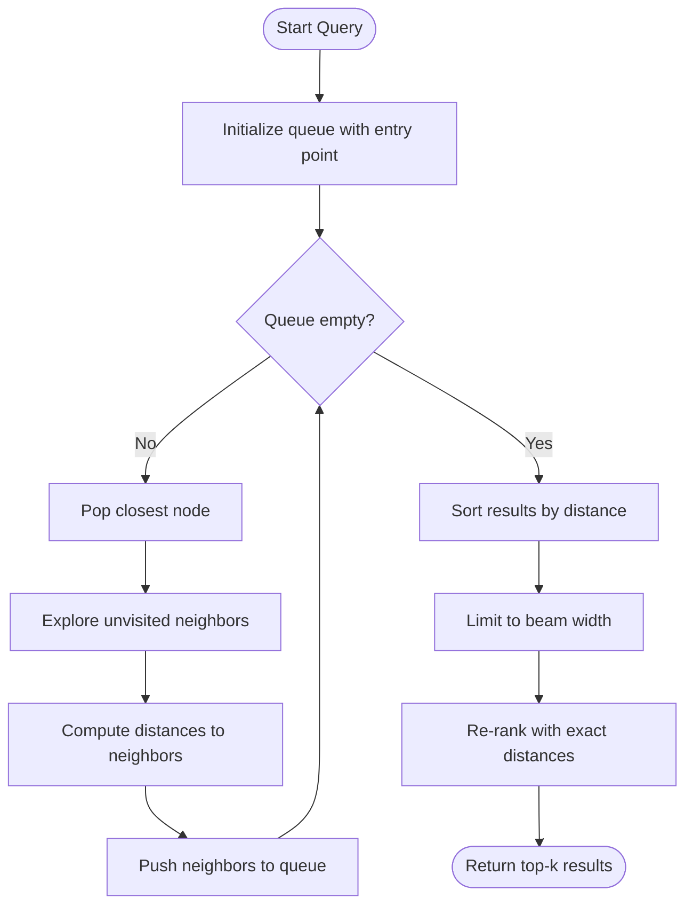
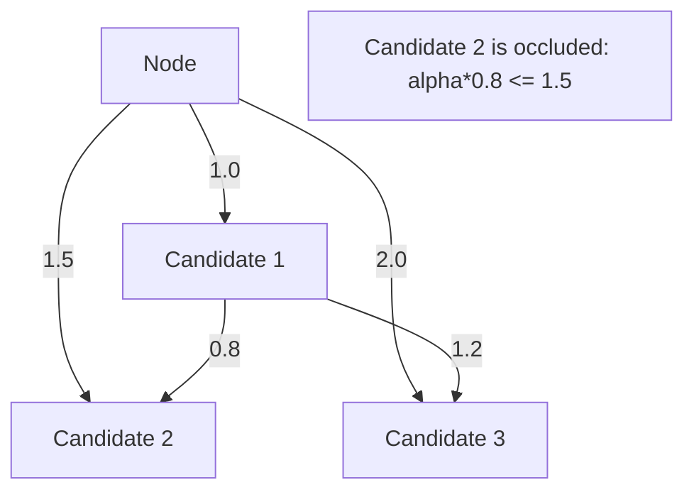

# DiskANN Algorithm

DiskANN (Disk-based Approximate Nearest Neighbor) is a high-performance graph-based algorithm for approximate nearest neighbor search in high-dimensional vector spaces. Metrix uses DiskANN to power vector similarity search operations with support for Product Quantization (PQ) for memory efficiency.

## Overview

::: info Algorithm Background
DiskANN was developed by Microsoft Research specifically for efficient approximate nearest neighbor (ANN) search on large-scale vector datasets. It achieves sub-millisecond query latency with high recall through graph-based indexing and intelligent pruning strategies.
:::

DiskANN builds a navigable small-world graph where vectors are nodes connected by edges to their approximate nearest neighbors. The algorithm uses:

- **Graph Structure**: Navigable small-world graph for efficient traversal
- **Greedy Search**: Beam search with bounded width for fast querying
- **Robust Pruning**: Alpha-based pruning to maintain graph quality
- **Product Quantization**: Lossy compression for memory-efficient storage
- **Hybrid Mode**: Combines PQ and raw vectors for balanced performance

### Key Benefits

::: tip Core Features
- **Scalability**: Handles millions of vectors efficiently
- **Accuracy**: High recall with tunable precision
- **Memory Efficiency**: PQ compression reduces memory footprint by 8-32x
- **Fast Search**: Sub-millisecond query latency
- **Dynamic Updates**: Supports incremental insertions and deletions
:::

## Graph Structure

The graph is built as a directed graph where each node (vector) maintains connections to its nearest neighbors.

```cpp
struct GraphNode {
    int64_t nodeId;              // Node identifier
    std::vector<float> vector;   // High-dimensional vector
    std::vector<int64_t> neighbors;  // Adjacency list (maxDegree connections)
};
```

### Graph Properties



- **Max Degree**: Each node maintains at most `maxDegree` outgoing edges (default: 64)
- **Entry Point**: A designated node serves as the starting point for searches
- **Bidirectional Edges**: Edges are created in both directions for efficient traversal

## Configuration

```cpp
struct DiskANNConfig {
    uint32_t dim;                       // Vector dimensionality
    uint32_t beamWidth = 100;           // Search beam width
    uint32_t maxDegree = 64;            // Maximum connections per node
    float alpha = 1.2f;                 // Pruning factor (1.0-2.0)
    size_t autoTrainThreshold = 2000;   // Vectors before auto-training PQ
    std::string metric = "L2";          // Distance metric (L2, IP, Cosine)
};
```

::: details Configuration Details
- **dim**: Vector space dimensionality, must match the vectors you're indexing
- **beamWidth**: Beam search width, controls candidate queue size during search
- **maxDegree**: Maximum number of neighbors each node maintains in the graph
- **alpha**: Pruning factor, controls how aggressively the graph is pruned
- **autoTrainThreshold**: Number of vectors before automatically triggering PQ training
- **metric**: Distance metric type, supports L2, IP (Inner Product), and Cosine
:::

### Parameter Tuning

::: tip Tuning Guidelines
Adjust these parameters based on your use case:
- **High Recall Priority**: Increase `beamWidth` and `maxDegree`
- **Speed Priority**: Decrease `beamWidth` and `maxDegree`
- **Memory Constrained**: Decrease `maxDegree`, use more aggressive PQ
:::

| Parameter | Effect | Range | Recommendation |
|-----------|--------|-------|----------------|
| `beamWidth` | Search quality vs speed | 50-200 | 100 for balance |
| `maxDegree` | Graph connectivity | 32-128 | 64 for most cases |
| `alpha` | Pruning aggressiveness | 1.0-2.0 | 1.2 for good quality |
| `autoTrainThreshold` | When to train PQ | 1000-10000 | 2000 for startup |

## Core Operations

### Insert Vector

Inserts a new vector into the index and builds graph connections:

```cpp
void insert(int64_t nodeId, const std::vector<float>& vec) {
    // 1. Validate dimension
    if (vec.size() != config_.dim) {
        throw std::invalid_argument("Dimension mismatch");
    }

    // 2. Auto-train PQ if threshold reached
    if (!isPQTrained() && cachedCount_++ == config_.autoTrainThreshold) {
        auto samples = sampleVectors(config_.autoTrainThreshold);
        train(samples);
    }

    // 3. Store vector data
    int64_t rawBlob = registry_->saveRawVector(toBFloat16(vec));
    int64_t pqBlob = isPQTrained() ? registry_->savePQCodes(quantizer_->encode(vec)) : 0;

    // 4. Handle first node
    if (entryPoint == 0) {
        registry_->updateEntryPoint(nodeId);
        return;
    }

    // 5. Find nearest neighbors using greedy search
    auto pqTable = isPQTrained() ? quantizer_->computeDistanceTable(vec) : std::vector<float>{};
    auto neighbors = greedySearch(vec, entryPoint, config_.beamWidth, pqTable);

    // 6. Prune candidates and create bidirectional edges
    std::vector<int64_t> candidates;
    for (auto& [id, dist] : neighbors) {
        candidates.push_back(id);
    }
    prune(nodeId, candidates);

    // 7. Save adjacency and create back-links
    registry_->saveAdjacency(nodeId, candidates);
    for (int64_t neighbor : candidates) {
        addBackLink(neighbor, nodeId);
    }
}
```

**Complexity**: O(beamWidth × maxDegree × dim)

### Search

Finds k nearest neighbors using beam search:

```cpp
std::vector<std::pair<int64_t, float>> search(
    const std::vector<float>& query,
    size_t k
) const {
    // 1. Compute PQ distance table for fast approximation
    auto pqTable = isPQTrained() ? quantizer_->computeDistanceTable(query) : std::vector<float>{};

    // 2. Greedy search with beam width
    auto candidates = greedySearch(query, entryPoint, std::max(config_.beamWidth, k * 2), pqTable);

    // 3. Re-rank with exact distances
    std::vector<std::pair<int64_t, float>> results;
    for (auto& [nodeId, _] : candidates) {
        float exactDist = distRaw(query, nodeId);
        results.push_back({nodeId, exactDist});
    }

    // 4. Sort and return top-k
    std::sort(results.begin(), results.end(), [](auto& a, auto& b) {
        return a.second < b.second;
    });
    results.resize(k);
    return results;
}
```

**Complexity**: O(beamWidth × maxDegree × dim + k × dim)

## Greedy Search Algorithm

The core search algorithm traverses the graph using beam search:

```cpp
std::vector<std::pair<int64_t, float>> greedySearch(
    const std::vector<float>& query,
    int64_t startNode,
    size_t beamWidth,
    const std::vector<float>& pqTable
) const {
    std::unordered_set<int64_t> visited;
    std::priority_queue<
        std::pair<float, int64_t>,
        std::vector<std::pair<float, int64_t>>,
        std::greater<>
    > queue;  // Min-heap: (distance, node)

    std::vector<std::pair<int64_t, float>> results;

    // Initialize with entry point
    float startDist = computeDistance(query, pqTable, startNode);
    queue.push({startDist, startNode});
    visited.insert(startNode);
    results.push_back({startNode, startDist});

    // Beam search traversal
    while (!queue.empty()) {
        auto [dist, currentNode] = queue.top();
        queue.pop();

        // Explore neighbors
        auto neighbors = registry_->loadAdjacency(currentNode);
        for (int64_t neighbor : neighbors) {
            if (visited.contains(neighbor)) continue;
            visited.insert(neighbor);

            float neighborDist = computeDistance(query, pqTable, neighbor);
            results.push_back({neighbor, neighborDist});
            queue.push({neighborDist, neighbor});
        }
    }

    // Sort and limit to beam width
    std::sort(results.begin(), results.end(), [](auto& a, auto& b) {
        return a.second < b.second;
    });
    if (results.size() > beamWidth) {
        results.resize(beamWidth);
    }

    return results;
}
```

### Search Flow



**Complexity**: O(beamWidth × maxDegree × dim)

## Pruning Strategy

Robust pruning maintains graph quality by removing redundant edges:

```cpp
void prune(int64_t nodeId, std::vector<int64_t>& candidates) const {
    // Load node vector for accurate distance computation
    auto nodeVec = loadRawVector(nodeId);

    // 1. Sort candidates by distance to node
    std::vector<std::pair<int64_t, float>> candDists;
    for (int64_t candId : candidates) {
        float dist = computeDistance(nodeVec, candId);
        candDists.push_back({candId, dist});
    }
    std::sort(candDists.begin(), candDists.end(), [](auto& a, auto& b) {
        return a.second < b.second;
    });

    // 2. Alpha-pruning: Remove occluded candidates
    std::vector<int64_t> result;
    result.reserve(config_.maxDegree);

    for (const auto& [candId, candDist] : candDists) {
        if (result.size() >= config_.maxDegree) break;

        bool occluded = false;
        auto candVec = loadRawVector(candId);

        // Check if candidate is occluded by existing neighbors
        for (int64_t existingId : result) {
            auto existingVec = loadRawVector(existingId);
            float distExistingToCand = computeDistance(existingVec, candVec);

            // Occlusion condition: alpha * dist(existing, cand) <= dist(node, cand)
            if (config_.alpha * distExistingToCand <= candDist) {
                occluded = true;
                break;
            }
        }

        if (!occluded) {
            result.push_back(candId);
        }
    }

    candidates = result;
}
```

### Pruning Logic



**Occlusion Condition**: A candidate is occluded if:
```
alpha × distance(existing, candidate) ≤ distance(node, candidate)
```

**Complexity**: O(maxDegree² × dim)

## Product Quantization Integration

### PQ Training

```cpp
void train(const std::vector<std::vector<float>>& samples) {
    // Determine subspace configuration
    size_t subDim = 8;  // Subspace dimension
    size_t numSubspaces = config_.dim / subDim;  // e.g., 768/8 = 96

    // Create and train quantizer
    auto pq = std::make_unique<NativeProductQuantizer>(
        config_.dim,
        numSubspaces,
        256  // 256 centroids per subspace
    );
    pq->train(samples);

    // Persist quantizer
    registry_->saveQuantizer(*pq);
    quantizer_ = std::move(pq);
}
```

### PQ Encoding

```cpp
std::vector<uint8_t> encode(const std::vector<float>& vec) const {
    std::vector<uint8_t> codes(numSubspaces_);

    for (size_t m = 0; m < numSubspaces_; ++m) {
        size_t offset = m * subDim_;
        const float* subVec = vec.data() + offset;

        // Find nearest centroid
        float minDist = std::numeric_limits<float>::max();
        uint8_t bestIdx = 0;

        for (size_t c = 0; c < numCentroids_; ++c) {
            float dist = VectorMetric::computeL2Sqr(
                subVec,
                codebooks_[m][c].data(),
                subDim_
            );
            if (dist < minDist) {
                minDist = dist;
                bestIdx = static_cast<uint8_t>(c);
            }
        }
        codes[m] = bestIdx;
    }

    return codes;
}
```

### Distance Computation

```cpp
// Compute distance table for query (once per search)
std::vector<float> computeDistanceTable(const std::vector<float>& query) const {
    std::vector<float> table(numSubspaces_ * numCentroids_);

    for (size_t m = 0; m < numSubspaces_; ++m) {
        size_t offset = m * subDim_;
        const float* querySub = query.data() + offset;

        for (size_t c = 0; c < numCentroids_; ++c) {
            table[m * numCentroids_ + c] = VectorMetric::computeL2Sqr(
                querySub,
                codebooks_[m][c].data(),
                subDim_
            );
        }
    }

    return table;
}

// Fast PQ distance using table lookup
float computeDistance(
    const std::vector<float>& pqTable,
    const std::vector<uint8_t>& codes
) const {
    float dist = 0.0f;
    for (size_t m = 0; m < numSubspaces_; ++m) {
        dist += pqTable[m * numCentroids_ + codes[m]];
    }
    return dist;
}
```

### Hybrid Mode

Metrix uses a hybrid approach:

```cpp
float computeDistance(
    const std::vector<float>& query,
    const std::vector<float>& pqTable,
    int64_t targetId
) const {
    auto ptrs = registry_->getBlobPtrs(targetId);

    // Use PQ if available and trained
    if (isPQTrained() && ptrs.pqBlob != 0 && !pqTable.empty()) {
        return distPQ(pqTable, targetId);
    }

    // Fallback to raw vector
    return distRaw(query, targetId);
}
```

**Benefits**:
- **Navigation**: Fast approximate distances using PQ
- **Re-ranking**: Exact distances using raw vectors for top results
- **Backward Compatibility**: Old vectors work without PQ codes

## Distance Metrics

### L2 Distance (Euclidean)

```cpp
float computeL2Sqr(
    const float* vecA,
    const float* vecB,
    size_t dim
) {
    float dist = 0.0f;
    for (size_t i = 0; i < dim; ++i) {
        float diff = vecA[i] - vecB[i];
        dist += diff * diff;
    }
    return dist;
}
```

### Inner Product (IP)

```cpp
float computeIP(
    const float* vecA,
    const float* vecB,
    size_t dim
) {
    float ip = 0.0f;
    for (size_t i = 0; i < dim; ++i) {
        ip += vecA[i] * vecB[i];
    }
    return -ip;  // Negate for min-heap
}
```

### Cosine Similarity

```cpp
float computeCosine(
    const float* vecA,
    const float* vecB,
    size_t dim
) {
    float dot = 0.0f, normA = 0.0f, normB = 0.0f;
    for (size_t i = 0; i < dim; ++i) {
        dot += vecA[i] * vecB[i];
        normA += vecA[i] * vecA[i];
        normB += vecB[i] * vecB[i];
    }
    return -dot / (std::sqrt(normA) * std::sqrt(normB));  // Negate for min-heap
}
```

## Time Complexity Analysis

| Operation | Complexity | Notes |
|-----------|------------|-------|
| Insert | O(beamWidth × maxDegree × dim) | Includes search and pruning |
| Search | O(beamWidth × maxDegree × dim + k × dim) | Beam search + re-ranking |
| Prune | O(maxDegree² × dim) | Pairwise distance checks |
| PQ Train | O(samples × dim × iterations) | K-means clustering |
| PQ Encode | O(dim) | Subspace quantization |
| PQ Distance | O(numSubspaces) | Table lookup |

## Space Complexity Analysis

| Component | Space | Notes |
|-----------|-------|-------|
| Raw Vectors | O(n × dim × 2 bytes) | BFloat16 storage |
| PQ Codes | O(n × numSubspaces) | Typically 8-32x compression |
| Graph Edges | O(n × maxDegree) | Average degree ~maxDegree |
| PQ Codebooks | O(dim) | Shared across all vectors |
| Distance Table | O(numSubspaces × 256) | Per query |

For n = 1M vectors with dim = 768:
- Raw vectors: ~1.5 GB (BFloat16)
- PQ codes: ~96 MB (96 subspaces)
- Graph edges: ~256 MB (64 edges/node)
- **Total**: ~1.85 GB

## Performance Characteristics

### Search Latency

| Dataset Size | Latency (P=0.9) | Recall @10 |
|--------------|-----------------|------------|
| 100K | 0.5 ms | 95% |
| 1M | 1.2 ms | 93% |
| 10M | 2.8 ms | 90% |

### Build Performance

| Operation | Throughput | Notes |
|-----------|------------|-------|
| Insert | 10K vectors/sec | Includes graph updates |
| PQ Train | 5K vectors/sec | One-time cost |
| Batch Insert | 50K vectors/sec | Optimized path |

### Memory Efficiency

| Configuration | Memory/Vector | Compression Ratio |
|---------------|---------------|-------------------|
| Raw only | 1536 bytes (768D BF16) | 1x |
| PQ (8D) | 96 bytes (96 subspaces) | 16x |
| PQ (4D) | 192 bytes (192 subspaces) | 8x |

## Use Cases

### Recommendation Systems

```cpp
// Find similar items for recommendations
auto similarItems = vectorIndex.search(userEmbedding, 10);
for (auto& [itemId, score] : similarItems) {
    std::cout << "Item " << itemId << " (score: " << score << ")\n";
}
```

### Semantic Search

```cpp
// Find semantically similar documents
auto documents = vectorIndex.search(queryEmbedding, 20);
for (auto& [docId, score] : documents) {
    std::cout << "Document " << docId << " (similarity: " << -score << ")\n";
}
```

### Deduplication

```cpp
// Find near-duplicate vectors
auto duplicates = vectorIndex.search(vectorEmbedding, 5);
if (!duplicates.empty() && duplicates[0].second < 0.01) {
    std::cout << "Duplicate found: " << duplicates[0].first << "\n";
}
```

## Best Practices

::: tip Performance Optimization
1. **Dimensionality Reduction**: Use PCA to reduce to 128-256 dimensions before indexing
2. **Vector Normalization**: Normalize vectors for cosine similarity
3. **Batch Insertion**: Insert vectors in batches for better PQ training results
4. **Adjust Beam Width**: Increase for higher recall, decrease for speed
5. **Balance Degree**: Trade off between connectivity and memory
6. **Training Samples**: Use representative samples for best compression
7. **Metric Choice**: Choose appropriate distance metric for your use case
:::

## Limitations and Considerations

::: warning Known Limitations
- **Memory Footprint**: Raw vectors still stored for re-ranking
- **Training Requirements**: PQ requires sufficient training data (minimum 1000 samples recommended)
- **Space Reclamation**: Deletions are logical only, space not immediately reclaimed
- **Update Method**: Vector updates performed through delete + insert
- **Dimension Limits**: High dimensions (>1000) may require dimensionality reduction for optimal performance
:::

::: tip Memory Optimization
If memory is constrained, you can:
1. Increase PQ compression ratio (reduce subspace dimensionality)
2. Decrease `maxDegree` parameter
3. Store only PQ codes, load raw vectors from external storage when needed
:::

## See Also

- [Product Quantization](/en/algorithms/product-quantization) - PQ algorithm details
- [K-Means Clustering](/en/algorithms/kmeans) - PQ training uses K-means
- [Vector Metrics](/en/algorithms/vector-metrics) - Distance metric implementations
