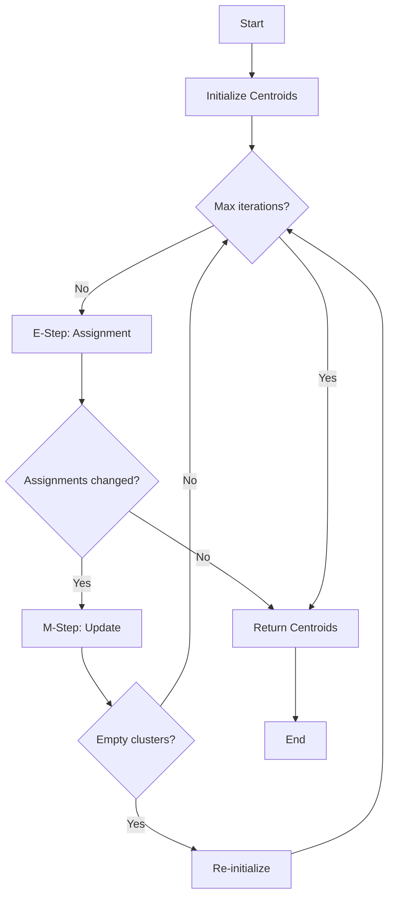

# K-Means Clustering Algorithm

K-Means is a fundamental unsupervised machine learning algorithm used for clustering data points into groups based on similarity. In Metrix, K-Means is specifically used for training Product Quantization (PQ) codebooks, which are essential for efficient vector similarity search and compression.

## Overview

K-Means partitions a set of n data points into k clusters, where each data point belongs to the cluster with the nearest mean (centroid). The algorithm iteratively refines cluster assignments to minimize the within-cluster sum of squares (WCSS), also known as inertia.

### Key Characteristics

- **Partitioning Clustering**: Divides data into non-overlapping clusters
- **Centroid-based**: Each cluster represented by its mean point
- **Iterative Optimization**: Converges to local minimum through EM algorithm
- **L2 Distance**: Uses squared Euclidean distance as similarity metric

## Mathematical Foundation

### Objective Function

K-Means optimizes the following objective function:

```
J = Σ(i=1 to n) Σ(j=1 to k) ||x_i - μ_j||²
```

Where:
- `J` = Objective function (within-cluster sum of squares)
- `n` = Number of data points
- `k` = Number of clusters
- `x_i` = i-th data point
- `μ_j` = Centroid of cluster j
- `||·||` = L2 norm (Euclidean distance)

### Convergence Properties

- **Monotonic Convergence**: Objective function never increases
- **Local Minimum**: Converges to local, not necessarily global, optimum
- **Finite Convergence**: Guaranteed convergence in finite iterations
- **Linear Convergence**: Typically converges in O(log n) iterations

## Algorithm Steps

The K-Means algorithm follows an iterative Expectation-Maximization (EM) approach:

### 1. Initialization

Choose initial centroids from the data:

```cpp
std::vector centroids(k, std::vector<float>(dim));
std::mt19937 rng(42);  // Fixed seed for reproducibility
std::uniform_int_distribution<size_t> dist(0, n - 1);

for (size_t i = 0; i < k; ++i) {
    centroids[i] = data[dist(rng)];  // Random selection
}
```

### 2. E-Step (Expectation)

Assign each point to the nearest centroid:

```cpp
for (size_t i = 0; i < n; ++i) {
    float min_dist = std::numeric_limits<float>::max();
    int best_c = 0;

    for (size_t c = 0; c < k; ++c) {
        float dist_val = VectorMetric::computeL2Sqr(
            data[i].data(),
            centroids[c].data(),
            dim
        );

        if (dist_val < min_dist) {
            min_dist = dist_val;
            best_c = c;
        }
    }
    assignment[i] = best_c;
}
```

### 3. M-Step (Maximization)

Update centroids to be the mean of assigned points:

```cpp
for (size_t c = 0; c < k; ++c) {
    if (counts[c] > 0) {
        float inv_count = 1.0f / static_cast<float>(counts[c]);
        for (size_t d = 0; d < dim; ++d) {
            centroids[c][d] = sums[c][d] * inv_count;
        }
    } else {
        // Re-initialize empty cluster
        centroids[c] = data[dist(rng)];
    }
}
```

### 4. Convergence Check

Stop when assignments don't change or max iterations reached:

```cpp
if (!changed) {
    break;  // Converged
}
```

## Algorithm Flowchart



**K-Means Algorithm Flow:**
- Initialize: Random selection of k centroids from data
- E-Step: Assign each point to nearest centroid
- M-Step: Recompute centroids as mean of assigned points
- Check for convergence or max iterations
- Handle empty clusters by re-initialization

## Centroid Initialization Strategies

### Random Initialization (Default)

Select k random data points as initial centroids:

```cpp
std::uniform_int_distribution<size_t> dist(0, n - 1);
for (size_t i = 0; i < k; ++i) {
    centroids[i] = data[dist(rng)];
}
```

**Pros**: Simple, fast
**Cons**: Poor initialization can lead to slow convergence or suboptimal results

### K-Means++ Initialization

Probabilistically select centroids to be far apart:

```cpp
// First centroid: random selection
centroids[0] = data[dist(rng)];

// Subsequent centroids: probability proportional to distance
for (size_t i = 1; i < k; ++i) {
    std::vector<float> distances(n);
    float total_dist = 0.0f;

    // Compute distance to nearest centroid
    for (size_t j = 0; j < n; ++j) {
        float min_dist = std::numeric_limits<float>::max();
        for (size_t c = 0; c < i; ++c) {
            float d = VectorMetric::computeL2Sqr(
                data[j].data(), centroids[c].data(), dim
            );
            min_dist = std::min(min_dist, d);
        }
        distances[j] = min_dist;
        total_dist += min_dist;
    }

    // Select with probability proportional to distance²
    std::uniform_real_distribution<float> prob_dist(0, total_dist);
    float threshold = prob_dist(rng);
    float cumulative = 0.0f;

    for (size_t j = 0; j < n; ++j) {
        cumulative += distances[j];
        if (cumulative >= threshold) {
            centroids[i] = data[j];
            break;
        }
    }
}
```

**Pros**: Better spread of initial centroids, faster convergence
**Cons**: More expensive initialization

## Handling Empty Clusters

When a cluster becomes empty (no assigned points), several strategies exist:

### 1. Re-initialization Strategy (Used in Metrix)

```cpp
if (counts[c] == 0) {
    centroids[c] = data[dist(rng)];  // New random point
}
```

### 2. Split Largest Cluster

Move a point from the largest cluster to the empty one.

### 3. Ignore Empty Clusters

Reduce effective number of clusters (not recommended).

## Complete Implementation

The complete K-Means implementation used in Metrix:

```cpp
#include <limits>
#include <random>
#include <vector>
#include "graph/vector/core/VectorMetric.hpp"

namespace graph::vector {
    class KMeans {
    public:
        static std::vector<std::vector<float>> run(
            const std::vector<std::vector<float>>& data,
            size_t k,
            size_t max_iter = 15
        ) {
            if (data.empty())
                return {};

            size_t dim = data[0].size();
            size_t n = data.size();

            // Initialize Centroids
            std::vector centroids(k, std::vector<float>(dim));
            std::vector<int> assignment(n);
            std::mt19937 rng(42);  // Fixed seed for reproducibility
            std::uniform_int_distribution<size_t> dist(0, n - 1);

            for (size_t i = 0; i < k; ++i) {
                centroids[i] = data[dist(rng)];
            }

            // Main iteration loop
            for (size_t it = 0; it < max_iter; ++it) {
                bool changed = false;
                std::vector sums(k, std::vector(dim, 0.0f));
                std::vector<size_t> counts(k, 0);

                // E-Step: Assign points to nearest centroid
                for (size_t i = 0; i < n; ++i) {
                    float min_dist = std::numeric_limits<float>::max();
                    int best_c = 0;

                    for (size_t c = 0; c < k; ++c) {
                        float dist_val = VectorMetric::computeL2Sqr(
                            data[i].data(),
                            centroids[c].data(),
                            dim
                        );

                        if (dist_val < min_dist) {
                            min_dist = dist_val;
                            best_c = c;
                        }
                    }

                    if (assignment[i] != best_c)
                        changed = true;
                    assignment[i] = best_c;

                    // Accumulate for M-Step
                    for (size_t d = 0; d < dim; ++d)
                        sums[best_c][d] += data[i][d];
                    counts[best_c]++;
                }

                // Check convergence
                if (!changed)
                    break;

                // M-Step: Update centroids
                for (size_t c = 0; c < k; ++c) {
                    if (counts[c] > 0) {
                        float inv_count = 1.0f / static_cast<float>(counts[c]);
                        for (size_t d = 0; d < dim; ++d)
                            centroids[c][d] = sums[c][d] * inv_count;
                    } else {
                        // Re-initialize empty cluster
                        centroids[c] = data[dist(rng)];
                    }
                }
            }

            return centroids;
        }
    };
} // namespace graph::vector
```

## Time and Space Complexity

### Time Complexity

**Per Iteration:**
- Assignment step: O(n × k × d)
  - n data points
  - k centroids
  - d dimensions
- Update step: O(n × d)
- **Total per iteration**: O(n × k × d)

**Overall:**
- **Worst case**: O(n × k × d × I)
  - I = number of iterations (typically 10-50)
- **Average case**: O(n × k × d × log I)
- **Typical**: O(n × k × d × 15) [default max iterations]

### Space Complexity

- **Centroids**: O(k × d)
- **Assignments**: O(n)
- **Accumulators**: O(k × d)
- **Total**: O(k × d + n)

### Complexity Comparison

| Component | Space | Time (per iter) |
|-----------|-------|-----------------|
| Centroids | O(k×d) | - |
| Assignments | O(n) | - |
| E-Step | - | O(n×k×d) |
| M-Step | - | O(n×d) |
| **Total** | **O(n + k×d)** | **O(n×k×d)** |

## Integration with Product Quantization

K-Means is used to train codebooks in Product Quantization:

### Codebook Training Process

```cpp
// Split vector into sub-vectors
size_t num_subspaces = 8;
size_t sub_dim = dim / num_subspaces;

// Train codebook for each subspace
for (size_t s = 0; s < num_subspaces; ++s) {
    // Extract sub-vectors
    std::vector<std::vector<float>> sub_data(n, std::vector<float>(sub_dim));
    for (size_t i = 0; i < n; ++i) {
        std::copy(
            data[i].begin() + s * sub_dim,
            data[i].begin() + (s + 1) * sub_dim,
            sub_data[i].begin()
        );
    }

    // Run K-Means to get codebook
    size_t k = 256;  // 256 codewords (8 bits)
    auto codebook = KMeans::run(sub_data, k);

    // Store codebook for this subspace
    codebooks[s] = codebook;
}
```

### PQ Encoding

Each vector is encoded as a sequence of codeword indices:

```cpp
std::vector<uint8_t> encode(const std::vector<float>& vec) {
    std::vector<uint8_t> codes(num_subspaces);

    for (size_t s = 0; s < num_subspaces; ++s) {
        // Find nearest codeword in subspace
        float min_dist = std::numeric_limits<float>::max();
        uint8_t best_code = 0;

        for (size_t k = 0; k < 256; ++k) {
            float dist = VectorMetric::computeL2Sqr(
                vec.data() + s * sub_dim,
                codebooks[s][k].data(),
                sub_dim
            );

            if (dist < min_dist) {
                min_dist = dist;
                best_code = static_cast<uint8_t>(k);
            }
        }

        codes[s] = best_code;
    }

    return codes;
}
```

## L2 Distance Computation

K-Means uses L2 squared distance for efficiency:

```cpp
static float computeL2Sqr(const float* a, const float* b, size_t dim) {
    float sum = 0.0f;
    size_t i = 0;

    // 4-way unrolling for vectorization
    for (; i + 4 <= dim; i += 4) {
        float d0 = a[i] - b[i];
        float d1 = a[i + 1] - b[i + 1];
        float d2 = a[i + 2] - b[i + 2];
        float d3 = a[i + 3] - b[i + 3];

        sum += d0 * d0 + d1 * d1 + d2 * d2 + d3 * d3;
    }

    // Handle remaining elements
    for (; i < dim; ++i) {
        float d = a[i] - b[i];
        sum += d * d;
    }

    return sum;
}
```

**Why squared distance?**
- Avoids expensive sqrt operation
- Preserves ordering (same argmin)
- Faster computation
- Sufficient for comparison

## Configuration Parameters

### Key Parameters

| Parameter | Default | Range | Description |
|-----------|---------|-------|-------------|
| `k` | Required | 2-√n | Number of clusters |
| `max_iter` | 15 | 1-1000 | Maximum iterations |
| `seed` | 42 | Any | Random seed for initialization |

### Parameter Selection Guidelines

**Choosing k:**
- For PQ: k = 256 (8-bit codes)
- For compression: k = 16-128
- Elbow method: Plot WCSS vs k
- Silhouette analysis: Measure cluster quality

**Choosing max_iter:**
- Default 15 works for most cases
- Increase for high-dimensional data
- Decrease for faster training
- Monitor convergence rate

## Performance Optimization

### Optimization Techniques Used

1. **Fixed Seed**: Deterministic initialization for reproducibility
2. **Loop Unrolling**: 4-way unrolling in distance computation
3. **Accumulation**: Efficient sum computation in M-step
4. **Early Convergence**: Stop when assignments stabilize

### Memory Efficiency

- **In-place updates**: Centroids updated without allocation
- **Contiguous storage**: Vector of vectors for cache locality
- **Minimal overhead**: Only essential data structures

### Parallelization Opportunities

```cpp
// Parallel E-step (future enhancement)
#pragma omp parallel for
for (size_t i = 0; i < n; ++i) {
    // Assignment computation
}

// Parallel distance computation
for (size_t c = 0; c < k; ++c) {
    #pragma omp parallel for
    for (size_t i = 0; i < n; ++i) {
        // Distance to centroid c
    }
}
```

## Use Cases in Metrix

### 1. Product Quantization Training

Train codebooks for vector compression:

```cpp
// Train PQ codebooks
auto codebooks = trainPQCodebooks(vectors, num_subspaces=8, k=256);
```

### 2. Vector Clustering

Group similar vectors for analysis:

```cpp
auto clusters = KMeans::run(vectors, k=10);
```

### 3. Data Compression

Reduce storage through quantization:

```cpp
auto compressed = encodeWithPQ(vectors, codebooks);
```

## Advantages and Limitations

### Advantages

- **Simple**: Easy to understand and implement
- **Efficient**: Linear scaling with data size
- **Effective**: Works well for many applications
- **Fast convergence**: Typically 10-20 iterations

### Limitations

- **Local Optima**: Sensitive to initialization
- **Fixed k**: Requires knowing number of clusters
- **Spherical Clusters**: Assumes isotropic clusters
- **Outlier Sensitivity**: Mean is sensitive to outliers

## Best Practices

1. **Normalization**: Scale features to similar ranges
2. **Initialization**: Use K-Means++ for better results
3. **Multiple Runs**: Try different initializations
4. **Convergence**: Monitor objective function
5. **Empty Clusters**: Handle appropriately
6. **Outliers**: Consider preprocessing or robust variants

## See Also

- [Product Quantization](/en/algorithms/product-quantization) - Vector compression using K-Means
- [Vector Metrics](/en/algorithms/vector-metrics) - Distance computation details
- [DiskANN](/en/algorithms/diskann) - Graph-based vector search algorithm
