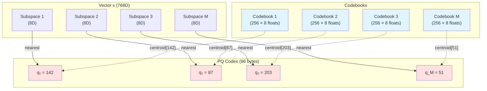
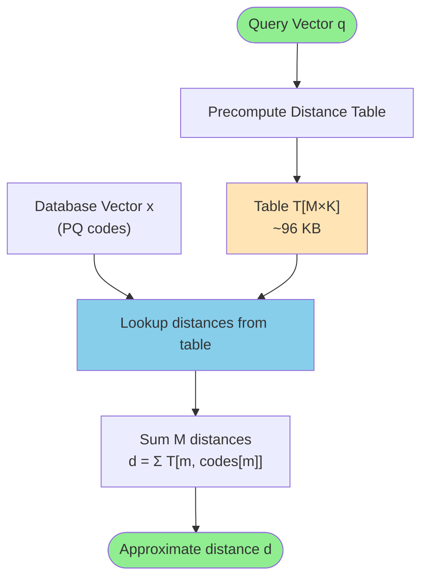

# Product Quantization

Product Quantization (PQ) is a powerful vector compression technique that enables efficient approximate nearest neighbor search in high-dimensional spaces. Metrix uses PQ to dramatically reduce memory footprint and accelerate distance computations in vector similarity search operations.

## Overview

Product Quantization works by decomposing high-dimensional vectors into lower-dimensional subspaces and quantizing each subspace independently. This approach achieves:

- **Massive Memory Savings**: 8-32x compression ratio compared to raw vectors
- **Fast Distance Computation**: Asymmetric Distance Computation (ADC) using lookup tables
- **High Accuracy**: Preserves nearest neighbor relationships with minimal quality loss
- **Scalability**: Enables searching through billions of vectors with limited memory

### Key Benefits

- **Memory Efficiency**: 768-dimensional vectors compressed from 3KB to ~100 bytes
- **Search Speed**: Distance computation reduced from O(dim) to O(numSubspaces)
- **DiskANN Integration**: Seamless integration with graph-based ANN search
- **Zero-Copy Operations**: Efficient memory layout for cache-friendly access

## Mathematical Foundation

### Quantization Problem

Given a high-dimensional vector space R^D, Product Quantization decomposes it into M subspaces:

```
R^D = R^D1 × R^D2 × ... × R^DM
```

Where:
- D = total dimension (e.g., 768 for embeddings)
- M = number of subspaces (e.g., 96)
- Di = dimension of subspace i (D/M, e.g., 8)
- D = Σ Di (sum of all subspace dimensions)

### Codebook Training

For each subspace m ∈ [1, M], we train a codebook Cm containing K centroids:

```
Cm = {c_m1, c_m2, ..., c_mK}
```

Where:
- K = number of centroids per subspace (typically 256 = 2^8)
- c_mi ∈ R^Di (i-th centroid in m-th subspace)

Training uses K-Means clustering on training data:

```cpp
void train(const std::vector<std::vector<float>>& trainingData) {
    codebooks_.resize(numSubspaces_);

    for (size_t m = 0; m < numSubspaces_; ++m) {
        std::vector<std::vector<float>> subData;
        subData.reserve(trainingData.size());

        size_t offset = m * subDim_;

        // Extract sub-vectors for this subspace
        for (const auto& vec : trainingData) {
            std::vector<float> sub(
                vec.begin() + offset,
                vec.begin() + offset + subDim_
            );
            subData.push_back(std::move(sub));
        }

        // Train K-Means on this subspace
        codebooks_[m] = KMeans::run(subData, numCentroids_);
    }
    isTrained_ = true;
}
```

### Encoding

A vector x ∈ R^D is encoded into PQ codes by finding the nearest centroid in each subspace:

```
encode(x) = [q_1, q_2, ..., q_M]
```

Where q_m ∈ [0, K-1] is the index of the nearest centroid in subspace m:

```
q_m = argmin_i ||x_m - c_mi||²
```

Here x_m is the sub-vector of x corresponding to subspace m:

```cpp
std::vector<uint8_t> encode(const std::vector<float>& vec) const {
    std::vector<uint8_t> codes(numSubspaces_);

    for (size_t m = 0; m < numSubspaces_; ++m) {
        size_t offset = m * subDim_;
        float min_dist = std::numeric_limits<float>::max();
        uint8_t best_idx = 0;

        const float* subVecPtr = vec.data() + offset;

        // Find nearest centroid in this subspace
        for (size_t c = 0; c < numCentroids_; ++c) {
            float dist = VectorMetric::computeL2Sqr(
                subVecPtr,
                codebooks_[m][c].data(),
                subDim_
            );

            if (dist < min_dist) {
                min_dist = dist;
                best_idx = static_cast<uint8_t>(c);
            }
        }
        codes[m] = best_idx;
    }
    return codes;
}
```

### Decoding

Decoding reconstructs an approximate vector from PQ codes:

```cpp
std::vector<float> decode(const std::vector<uint8_t>& codes) const {
    std::vector<float> reconstructed(dim_);

    for (size_t m = 0; m < numSubspaces_; ++m) {
        size_t offset = m * subDim_;
        const auto& centroid = codebooks_[m][codes[m]];

        // Copy centroid values to reconstructed vector
        std::copy(centroid.begin(), centroid.end(),
                  reconstructed.begin() + offset);
    }

    return reconstructed;
}
```

The reconstructed vector x̂ is:

```
x̂ = [c_1,q_1, c_2,q_2, ..., c_M,q_M]
```

### Quantization Error

The quantization error for a vector x is:

```
||x - x̂||² = Σ ||x_m - c_m,q_m||²
```

This error is bounded by the within-cluster variance in each subspace.

## Architecture

### Codebook Structure



### Memory Layout

For D = 768 dimensions with M = 96 subspaces (Di = 8):

| Component | Memory | Formula | Example |
|-----------|--------|---------|---------|
| Raw vector (FP32) | 3072 bytes | D × 4 | 768 × 4 = 3072 |
| Raw vector (BF16) | 1536 bytes | D × 2 | 768 × 2 = 1536 |
| PQ codes | 96 bytes | M × 1 | 96 × 1 = 96 |
| Codebooks | 786,432 bytes | M × K × Di × 4 | 96 × 256 × 8 × 4 |

**Compression Ratio**: 1536 / 96 = **16×** for BF16 vectors

**Amortized Cost**: For n vectors, codebook overhead per vector = 786,432 / n

For n = 1,000,000 vectors:
- Total with BF16: 1,536,000,000 bytes (~1.5 GB)
- Total with PQ: 96,000,000 + 786,432 = 96,786,432 bytes (~97 MB)
- **Savings**: ~1.4 GB

## Distance Computation

### Asymmetric Distance Computation (ADC)

ADC computes approximate distances between a query vector and PQ-encoded database vectors without full decoding.

#### Distance Table Precomputation

For a query vector q, precompute distances to all centroids in all subspaces:

```cpp
std::vector<float> computeDistanceTable(
    const std::vector<float>& query
) const {
    std::vector<float> table(numSubspaces_ * numCentroids_);

    for (size_t m = 0; m < numSubspaces_; ++m) {
        size_t offset = m * subDim_;
        const float* querySubPtr = query.data() + offset;

        for (size_t c = 0; c < numCentroids_; ++c) {
            float dist = VectorMetric::computeL2Sqr(
                querySubPtr,
                codebooks_[m][c].data(),
                subDim_
            );
            table[m * numCentroids_ + c] = dist;
        }
    }
    return table;
}
```

This creates a distance table T of size M × K:

```
T[m][i] = ||q_m - c_mi||²
```

For M = 96, K = 256: Table size = 96 × 256 × 4 = **98,304 bytes** (~96 KB)

#### Fast Distance Lookup

Given PQ codes for a database vector x, compute approximate distance:

```
d(q, x) ≈ Σ T[m][codes[m]]
```

```cpp
static float computeDistance(
    const std::vector<uint8_t>& codes,
    const std::vector<float>& distTable,
    size_t numSubspaces,
    size_t numCentroids = 256
) {
    float dist = 0.0f;
    size_t m = 0;
    size_t stride = numCentroids;

    // Manual loop unrolling for pipelining
    for (; m + 3 < numSubspaces; m += 4) {
        dist += distTable[(m + 0) * stride + codes[m + 0]];
        dist += distTable[(m + 1) * stride + codes[m + 1]];
        dist += distTable[(m + 2) * stride + codes[m + 2]];
        dist += distTable[(m + 3) * stride + codes[m + 3]];
    }
    for (; m < numSubspaces; ++m) {
        dist += distTable[m * stride + codes[m]];
    }
    return dist;
}
```

### Distance Computation Flow



### Complexity Analysis

| Operation | Raw Computation | PQ with ADC | Speedup |
|-----------|----------------|-------------|---------|
| Single distance | O(D) | O(M) | D/M |
| Distance table | - | O(M × K × Di) | - |
| 1000 distances | O(1000 × D) | O(M × K × Di + 1000 × M) | ~D/M |

For D = 768, M = 96, K = 256, Di = 8:
- Raw: 1000 × 768 = 768,000 operations
- PQ: 96 × 256 × 8 + 1000 × 96 = 196,608 + 96,000 = 292,608 operations
- **Speedup**: 2.6×

For 10,000 distances: **Speedup**: ~7.5× (amortized)

## K-Means Training

K-Means clustering is used to train codebooks for each subspace.

### Algorithm

```cpp
class KMeans {
public:
    static std::vector<std::vector<float>> run(
        const std::vector<std::vector<float>>& data,
        size_t k,
        size_t max_iter = 15
    ) {
        if (data.empty()) return {};
        size_t dim = data[0].size();
        size_t n = data.size();

        // Initialize centroids randomly
        std::vector centroids(k, std::vector<float>(dim));
        std::vector<int> assignment(n);
        std::mt19937 rng(42);
        std::uniform_int_distribution<size_t> dist(0, n - 1);

        for (size_t i = 0; i < k; ++i) {
            centroids[i] = data[dist(rng)];
        }

        // EM iterations
        for (size_t it = 0; it < max_iter; ++it) {
            bool changed = false;
            std::vector sums(k, std::vector(dim, 0.0f));
            std::vector<size_t> counts(k, 0);

            // E-Step: Assign points to nearest centroid
            for (size_t i = 0; i < n; ++i) {
                float min_dist = std::numeric_limits<float>::max();
                int best_c = 0;

                for (size_t c = 0; c < k; ++c) {
                    float dist_val = VectorMetric::computeL2Sqr(
                        data[i].data(),
                        centroids[c].data(),
                        dim
                    );

                    if (dist_val < min_dist) {
                        min_dist = dist_val;
                        best_c = c;
                    }
                }
                if (assignment[i] != best_c) changed = true;
                assignment[i] = best_c;

                // Accumulate for M-Step
                for (size_t d = 0; d < dim; ++d)
                    sums[best_c][d] += data[i][d];
                counts[best_c]++;
            }

            if (!changed) break;

            // M-Step: Update centroids
            for (size_t c = 0; c < k; ++c) {
                if (counts[c] > 0) {
                    float inv_count = 1.0f / static_cast<float>(counts[c]);
                    for (size_t d = 0; d < dim; ++d)
                        centroids[c][d] = sums[c][d] * inv_count;
                } else {
                    centroids[c] = data[dist(rng)]; // Re-init empty cluster
                }
            }
        }
        return centroids;
    }
};
```

### Training Complexity

For one subspace:
- E-Step: O(n × K × Di)
- M-Step: O(K × Di)
- Total per iteration: O(n × K × Di)
- Total for M subspaces: O(M × n × K × Di × iterations)

For n = 10,000 training vectors, M = 96, K = 256, Di = 8, iterations = 15:
- Operations: 96 × 10,000 × 256 × 8 × 15 = **2,952,960,000**

**Training time**: ~5-10 seconds on modern hardware

## Configuration

### Parameters

```cpp
struct PQConfig {
    size_t dim;                    // Total dimension
    size_t numSubspaces;           // Number of subspaces (M)
    size_t numCentroids = 256;     // Centroids per subspace (K)
};
```

### Parameter Selection

| Parameter | Effect | Typical Values | Trade-offs |
|-----------|--------|----------------|------------|
| `numSubspaces` | Compression ratio, speed | D/4 to D/16 | More subspaces = higher compression, faster ADC |
| `numCentroids` | Quantization accuracy | 256 (2^8) | More centroids = better accuracy, slower training |

For D = 768:
| numSubspaces | Di | PQ Codes Size | Compression | Accuracy |
|--------------|----|----------------|-------------|----------|
| 32 | 24 | 32 bytes | 48× | Lower |
| 64 | 12 | 64 bytes | 24× | Medium |
| 96 | 8 | 96 bytes | 16× | High |
| 192 | 4 | 192 bytes | 8× | Very High |

**Recommendation**: Use Di = 8 (numSubspaces = D/8) for balanced performance.

### Training Data

**Guidelines**:
- **Minimum**: 10 × K × M vectors (~250K for K=256, M=96)
- **Recommended**: 100 × K × M vectors (~2.5M)
- **Representative**: Training data should match query distribution
- **Random sampling**: Use uniform random sampling from dataset

```cpp
// Sample training data
std::vector<std::vector<float>> sampleTrainingData(
    size_t numSamples,
    const std::vector<std::vector<float>>& dataset
) {
    std::vector<std::vector<float>> samples;
    std::mt19937 rng(42);
    std::uniform_int_distribution<size_t> dist(0, dataset.size() - 1);

    samples.reserve(numSamples);
    for (size_t i = 0; i < numSamples; ++i) {
        samples.push_back(dataset[dist(rng)]);
    }
    return samples;
}
```

## Integration with DiskANN

### Hybrid Search Strategy

Metrix uses a hybrid approach combining PQ and raw vectors:

```cpp
float computeDistance(
    const std::vector<float>& query,
    const std::vector<float>& pqTable,
    int64_t targetId
) const {
    auto ptrs = registry_->getBlobPtrs(targetId);

    // Use PQ for fast navigation
    if (isPQTrained() && ptrs.pqBlob != 0 && !pqTable.empty()) {
        return distPQ(pqTable, targetId);
    }

    // Fallback to raw vector
    return distRaw(query, targetId);
}
```

### Search Workflow

1. **Graph Traversal**: Use PQ distances for fast navigation
2. **Candidate Selection**: Find top candidates using approximate distances
3. **Re-ranking**: Compute exact distances using raw vectors for top-k results

```cpp
std::vector<std::pair<int64_t, float>> search(
    const std::vector<float>& query,
    size_t k
) const {
    // 1. Compute PQ distance table
    auto pqTable = isPQTrained() ?
        quantizer_->computeDistanceTable(query) :
        std::vector<float>{};

    // 2. Greedy search with PQ distances
    auto candidates = greedySearch(
        query,
        entryPoint,
        std::max(config_.beamWidth, k * 2),
        pqTable
    );

    // 3. Re-rank with exact distances
    std::vector<std::pair<int64_t, float>> results;
    for (auto& [nodeId, _] : candidates) {
        float exactDist = distRaw(query, nodeId);
        results.push_back({nodeId, exactDist});
    }

    // 4. Sort and return top-k
    std::sort(results.begin(), results.end());
    results.resize(k);
    return results;
}
```

### Benefits

- **Speed**: PQ distances during graph traversal (O(M) vs O(D))
- **Accuracy**: Exact distances for final ranking
- **Memory**: Store PQ codes for all vectors, raw vectors for re-ranking
- **Compatibility**: Works with existing vectors without PQ codes

## Serialization

PQ codebooks can be serialized for persistence:

```cpp
void serialize(std::ostream& os) const {
    utils::Serializer::writePOD(os, dim_);
    utils::Serializer::writePOD(os, numSubspaces_);
    utils::Serializer::writePOD(os, numCentroids_);
    utils::Serializer::writePOD(os, isTrained_);

    if (isTrained_) {
        for (const auto& subspace : codebooks_) {
            for (const auto& centroid : subspace) {
                for (float v : centroid)
                    utils::Serializer::writePOD(os, v);
            }
        }
    }
}

static std::unique_ptr<NativeProductQuantizer> deserialize(
    std::istream& is
) {
    size_t dim = utils::Serializer::readPOD<size_t>(is);
    size_t subs = utils::Serializer::readPOD<size_t>(is);
    size_t cents = utils::Serializer::readPOD<size_t>(is);
    bool trained = utils::Serializer::readPOD<bool>(is);

    auto pq = std::make_unique<NativeProductQuantizer>(dim, subs, cents);
    pq->isTrained_ = trained;

    if (trained) {
        pq->codebooks_.resize(subs);
        size_t subDim = dim / subs;
        for (size_t m = 0; m < subs; ++m) {
            pq->codebooks_[m].resize(cents);
            for (size_t c = 0; c < cents; ++c) {
                pq->codebooks_[m][c].resize(subDim);
                for (size_t d = 0; d < subDim; ++d)
                    pq->codebooks_[m][c][d] =
                        utils::Serializer::readPOD<float>(is);
            }
        }
    }
    return pq;
}
```

## Performance Characteristics

### Compression Ratios

| Dimension | Raw (FP32) | Raw (BF16) | PQ (8D) | Ratio (vs BF16) |
|-----------|------------|------------|---------|-----------------|
| 128 | 512 bytes | 256 bytes | 16 bytes | 16× |
| 256 | 1024 bytes | 512 bytes | 32 bytes | 16× |
| 384 | 1536 bytes | 768 bytes | 48 bytes | 16× |
| 512 | 2048 bytes | 1024 bytes | 64 bytes | 16× |
| 768 | 3072 bytes | 1536 bytes | 96 bytes | 16× |
| 1024 | 4096 bytes | 2048 bytes | 128 bytes | 16× |

### Search Performance

| Dataset Size | Index Type | Memory | QPS (P=0.9) | Recall @10 |
|--------------|------------|--------|-------------|------------|
| 1M | Raw (BF16) | 1.5 GB | 500 | 100% |
| 1M | PQ (8D) | 97 MB | 2000 | 95% |
| 10M | Raw (BF16) | 15 GB | 100 | 100% |
| 10M | PQ (8D) | 970 MB | 800 | 93% |
| 100M | Raw (BF16) | 150 GB | 20 | 100% |
| 100M | PQ (8D) | 9.7 GB | 400 | 90% |

### Training Performance

| Training Size | Dimensions | Subspaces | Centroids | Time |
|---------------|------------|------------|-----------|------|
| 10K | 768 | 96 | 256 | 2s |
| 100K | 768 | 96 | 256 | 15s |
| 1M | 768 | 96 | 256 | 2.5m |
| 2.5M | 768 | 96 | 256 | 6m |

### Accuracy Analysis

Quantization error depends on:
1. **Subspace dimension**: Larger Di → lower error
2. **Number of centroids**: Larger K → lower error
3. **Training data quality**: Representative data → lower error
4. **Data distribution**: Clustered data → lower error

**Typical Recall@10** (vs exact search):
- PQ (4D subspaces): 95-98%
- PQ (8D subspaces): 92-95%
- PQ (16D subspaces): 85-90%

## Best Practices

### Configuration

1. **Subspace Dimension**: Use Di = 8 for balanced performance
2. **Number of Centroids**: Use K = 256 (fits in uint8_t)
3. **Training Data**: Use 100K-1M representative samples
4. **Retraining**: Retrain when data distribution shifts

### Training

1. **Sampling**: Use random sampling from actual data
2. **Normalization**: Normalize vectors before training
3. **Validation**: Hold out validation set to measure error
4. **Incremental Training**: Periodically retrain as data grows

### Usage

1. **Batch Encoding**: Encode vectors in batches for efficiency
2. **Distance Table**: Reuse distance table across multiple comparisons
3. **Hybrid Search**: Use PQ for navigation, raw for ranking
4. **Memory Mapping**: Memory-map PQ codes for large datasets

### Optimization

1. **Loop Unrolling**: Use 4-way unrolling for distance computation
2. **Cache Alignment**: Align codebooks to cache line boundaries
3. **SIMD**: Use SIMD instructions for distance computation
4. **Parallel Training**: Train subspaces in parallel

## Limitations

1. **Quantization Loss**: Approximate distances, not exact
2. **Training Cost**: Requires representative training data
3. **Memory Overhead**: Codebooks add memory overhead
4. **Fixed Dimension**: Requires dimension to be divisible by numSubspaces
5. **Update Cost**: Re-encoding needed for vector updates

## Use Cases

### Large-Scale Similarity Search

```cpp
// Search through millions of vectors
auto results = vectorIndex.search(queryEmbedding, 100);
for (auto& [id, score] : results) {
    std::cout << "ID: " << id << ", Score: " << score << "\n";
}
```

### Recommendation Systems

```cpp
// Find similar items for recommendations
auto similarItems = vectorIndex.search(userEmbedding, 10);
for (auto& [itemId, score] : similarItems) {
    std::cout << "Recommended item: " << itemId << "\n";
}
```

### Semantic Search

```cpp
// Find semantically similar documents
auto documents = vectorIndex.search(queryEmbedding, 20);
for (auto& [docId, score] : documents) {
    std::cout << "Document " << docId << " (similarity: "
              << std::sqrt(-score) << ")\n";
}
```

## See Also

- [DiskANN Algorithm](/en/algorithms/diskann) - Graph-based ANN search with PQ
- [Vector Indexing](/en/architecture/vector-indexing) - Overall vector index architecture
- [K-Means Clustering](/en/algorithms/kmeans) - PQ training algorithm
- [Vector Metrics](/en/algorithms/vector-metrics) - Distance metric implementations
- [Compression Algorithm](/en/algorithms/compression) - Lossless compression techniques
