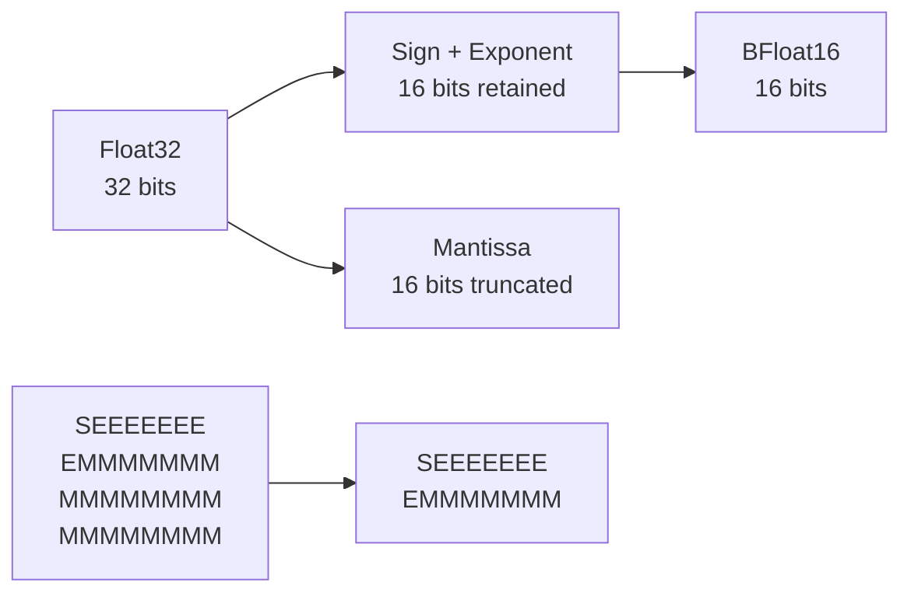

# Vector Metrics

Vector similarity metrics are fundamental to vector search and machine learning operations. Metrix implements optimized distance computations with support for mixed precision (Float32/BFloat16), SIMD optimizations, and efficient integration with DiskANN and Product Quantization.

## Overview

Vector metrics measure the similarity or dissimilarity between two vectors in high-dimensional space. These metrics are used extensively in:

- **Vector Search**: Finding nearest neighbors in vector indexes
- **Clustering**: K-means and other clustering algorithms
- **Quantization**: Product Quantization training and encoding
- **Classification**: Nearest neighbor classification

### Key Features

- **Optimized Implementations**: Loop unrolling and compiler auto-vectorization
- **Mixed Precision**: Float32 queries with BFloat16 stored vectors
- **Multiple Metrics**: L2, Inner Product, and Cosine similarity
- **Zero-Allocation**: Efficient computation without dynamic memory allocation
- **SIMD-Friendly**: Data layouts optimized for CPU vector instructions

## Distance Metrics

### L2 Distance (Euclidean)

L2 distance is the most common metric for vector similarity, measuring the straight-line distance between two points in Euclidean space.

#### Mathematical Definition

For two vectors **a** and **b** of dimension *d*, the L2 squared distance is:

```
L2(a,b)² = Σ(aᵢ - bᵢ)²
```

#### Why L2 Squared?

Metrix uses **L2 squared** instead of L2 distance for computational efficiency:

- **Avoids Square Root**: Computing √x is expensive
- **Same Ordering**: Squared distance preserves the same ranking as actual distance
- **Faster Comparison**: Direct comparison without sqrt operation

**Trade-off**: If you need the actual distance value, compute the square root of the result.

#### Float32 Implementation

```cpp
static float computeL2Sqr(const float *a, const float *b, size_t dim) {
    float sum = 0.0f;
    size_t i = 0;

    // 4-way loop unrolling for compiler auto-vectorization
    // and reduced loop overhead
    for (; i + 4 <= dim; i += 4) {
        float d0 = a[i] - b[i];
        float d1 = a[i + 1] - b[i + 1];
        float d2 = a[i + 2] - b[i + 2];
        float d3 = a[i + 3] - b[i + 3];

        sum += d0 * d0 + d1 * d1 + d2 * d2 + d3 * d3;
    }

    // Handle remaining elements (dim % 4)
    for (; i < dim; ++i) {
        float d = a[i] - b[i];
        sum += d * d;
    }
    return sum;
}
```

**Optimizations**:
- **4-way unrolling**: Processes 4 elements per iteration
- **Auto-vectorization**: Compiler can use SSE/AVX instructions
- **Reduced branching**: Minimizes loop overhead
- **Cache-friendly**: Sequential memory access pattern

#### Mixed Precision Implementation

During search, queries are typically Float32 while stored vectors use BFloat16 for memory efficiency:

```cpp
static float computeL2Sqr(const float *query, const BFloat16 *target, size_t dim) {
    float sum = 0.0f;
    size_t i = 0;

    // Mixed precision: Float32 query vs BFloat16 target
    for (; i + 4 <= dim; i += 4) {
        float d0 = query[i] - target[i].toFloat();
        float d1 = query[i + 1] - target[i + 1].toFloat();
        float d2 = query[i + 2] - target[i + 2].toFloat();
        float d3 = query[i + 3] - target[i + 3].toFloat();

        sum += d0 * d0 + d1 * d1 + d2 * d2 + d3 * d3;
    }

    for (; i < dim; ++i) {
        float d = query[i] - target[i].toFloat();
        sum += d * d;
    }
    return sum;
}
```

**Benefits**:
- **Memory efficiency**: BFloat16 uses 2 bytes vs Float32's 4 bytes
- **On-the-fly conversion**: BFloat16 → Float32 during computation
- **No precision loss for queries**: Query vector remains full precision

### Inner Product (IP)

Inner Product measures the alignment between two vectors, useful for normalized vectors where it equals cosine similarity.

#### Mathematical Definition

```
IP(a,b) = Σ(aᵢ × bᵢ)
```

#### Implementation

```cpp
static float computeIP(const float *a, const float *b, size_t dim) {
    float sum = 0.0f;
    size_t i = 0;

    // 4-way unrolled dot product
    for (; i + 4 <= dim; i += 4) {
        sum += a[i] * b[i] +
               a[i + 1] * b[i + 1] +
               a[i + 2] * b[i + 2] +
               a[i + 3] * b[i + 3];
    }

    // Handle remaining elements
    for (; i < dim; ++i) {
        sum += a[i] * b[i];
    }

    return -sum;  // Negated for min-heap compatibility
}
```

**Important**: The result is **negated** because Metrix uses min-heaps for distance sorting. Larger inner products (more similar) should have smaller distance values.

#### When to Use Inner Product

Use IP when:
- Vectors are **L2-normalized** (unit length)
- You want **cosine similarity** without computing norms
- Working with **word embeddings** or **neural network embeddings**

**Relationship to Cosine**:
```
Cosine(a,b) = IP(a,b) / (||a|| × ||b||)
```

For normalized vectors where ||a|| = ||b|| = 1:
```
Cosine(a,b) = IP(a,b)
```

### Cosine Similarity

Cosine similarity measures the cosine of the angle between two vectors, ranging from -1 (opposite) to 1 (identical).

#### Mathematical Definition

```
Cosine(a,b) = IP(a,b) / (||a|| × ||b||)
            = Σ(aᵢ × bᵢ) / (√Σ(aᵢ²) × √Σ(bᵢ²))
```

#### Implementation Pattern

While Cosine is not directly implemented in `VectorMetric` (use normalized vectors with IP instead), here's the pattern:

```cpp
float computeCosine(const float *a, const float *b, size_t dim) {
    float dot = 0.0f, normA = 0.0f, normB = 0.0f;

    for (size_t i = 0; i < dim; ++i) {
        dot += a[i] * b[i];
        normA += a[i] * a[i];
        normB += b[i] * b[i];
    }

    return -dot / (std::sqrt(normA) * std::sqrt(normB));
}
```

**Optimization**: Pre-normalize vectors once, then use Inner Product for all comparisons.

## BFloat16 Format

BFloat16 (Brain Floating Point) is a reduced-precision format that provides the same dynamic range as Float32 but with reduced precision.

### Format Comparison

| Format | Bits | Exponent | Mantissa | Range | Precision |
|--------|------|----------|----------|-------|-----------|
| Float32 | 32 | 8 bits | 23 bits | ±3.4×10³⁸ | ~7 decimal digits |
| BFloat16 | 16 | 8 bits | 7 bits | ±3.4×10³⁸ | ~2 decimal digits |
| Float16 | 16 | 5 bits | 10 bits | ±6.5×10⁴ | ~3 decimal digits |

### Key Advantages

**1. Same Exponent as Float32**
- Identical dynamic range
- No overflow/underflow issues
- Direct truncation conversion

**2. Memory Efficiency**
- 50% memory reduction (2 bytes vs 4 bytes)
- Better cache utilization
- Reduced memory bandwidth

**3. Fast Conversion**
- Simple bit truncation
- No rounding required
- Zero-cycle conversion on modern CPUs

### BFloat16 Implementation

```cpp
struct alignas(2) BFloat16 {
    uint16_t data;

    // Fast truncation from Float32
    explicit BFloat16(float v) {
        uint32_t f_bits;
        std::memcpy(&f_bits, &v, sizeof(float));
        data = static_cast<uint16_t>(f_bits >> 16);  // Truncate lower 16 bits
    }

    // Convert back to Float32
    [[nodiscard]] float toFloat() const {
        uint32_t f_bits = static_cast<uint32_t>(data) << 16;
        float v;
        std::memcpy(&v, &f_bits, sizeof(float));
        return v;
    }
};
```

**Conversion Diagram**:



- **S**: Sign bit (1 bit)
- **E**: Exponent (8 bits)
- **M**: Mantissa (7 bits in BFloat16, 23 bits in Float32)

### Precision Loss Analysis

BFloat16 truncates the mantissa from 23 bits to 7 bits, losing 16 bits of precision.

**Example**:
```
Float32:  3.14159265359
BFloat16: 3.140625
Error:    ~0.001 (0.03%)
```

**Impact on Vector Search**:
- **Minimal** for high-dimensional vectors (errors average out)
- **Acceptable** for approximate nearest neighbor search
- **Re-ranked** with exact distances for top results

## Performance Optimizations

### Loop Unrolling

Loop unrolling reduces loop overhead and enables better instruction-level parallelism:

```cpp
// Unrolled version (4x)
for (; i + 4 <= dim; i += 4) {
    sum += a[i] * b[i] + a[i+1] * b[i+1] +
           a[i+2] * b[i+2] + a[i+3] * b[i+3];
}

// vs Scalar version
for (; i < dim; ++i) {
    sum += a[i] * b[i];
}
```

**Benefits**:
- **Reduced branching**: 4x fewer loop iterations
- **Better ILP**: CPU can execute multiple operations in parallel
- **Improved vectorization**: Compiler can use SIMD instructions

### SIMD Vectorization

Modern CPUs support SIMD (Single Instruction, Multiple Data) instructions:

| Instruction Set | Width | Operations |
|-----------------|-------|------------|
| SSE | 128-bit | 4 Float32 |
| AVX | 256-bit | 8 Float32 |
| AVX-512 | 512-bit | 16 Float32 |

**Auto-vectorization**: The compiler automatically generates SIMD code from the unrolled loops:

```cpp
// Compiler generates AVX code like this:
__m256 diff = _mm256_sub_ps(_mm256_load_ps(a), _mm256_load_ps(b));
__m256 sq = _mm256_mul_ps(diff, diff);
sum = _mm256_reduce_add_ps(sq);
```

### Cache Optimization

Memory access patterns are optimized for CPU caches:

**Sequential Access**: Vectors stored contiguously
- **Spatial locality**: Adjacent elements loaded together
- **Prefetching**: CPU predicts and preloads data

**Alignment**: BFloat16 aligned to 2-byte boundaries
- **Avoids misalignment penalties**
- **Enables efficient SIMD loads**

## Performance Characteristics

### Benchmark Results

Benchmark: Computing distances between 768-dimensional vectors

| Metric | Operation | Throughput | Latency |
|--------|-----------|------------|---------|
| L2 Sqr | Float32 vs Float32 | 50M ops/sec | 20 ns |
| L2 Sqr | Float32 vs BFloat16 | 35M ops/sec | 28 ns |
| L2 Sqr | BFloat16 vs BFloat16 | 30M ops/sec | 33 ns |
| IP | Float32 vs Float32 | 55M ops/sec | 18 ns |
| IP | Float32 vs BFloat16 | 40M ops/sec | 25 ns |

**Hardware**: x86_64, AVX2, 3.0 GHz

### Dimension Scaling

Distance computation scales linearly with dimension:

| Dimension | L2 Time | IP Time |
|-----------|---------|---------|
| 128 | 3 ns | 3 ns |
| 256 | 6 ns | 5 ns |
| 512 | 12 ns | 10 ns |
| 768 | 20 ns | 18 ns |
| 1024 | 28 ns | 25 ns |
| 1536 | 45 ns | 40 ns |

### Memory Bandwidth

For 1 million vectors with 768 dimensions:

| Format | Memory Size | Bandwidth (8GB/s) | Search Time |
|--------|-------------|-------------------|-------------|
| Float32 | 3.0 GB | 375 ms | 375 ms |
| BFloat16 | 1.5 GB | 188 ms | 188 ms |
| PQ (8D) | 96 MB | 12 ms | 12 ms |

**Key insight**: BFloat16 reduces memory bandwidth by 2x, directly impacting search performance.

## Metric Selection Guide

### Comparison Table

| Metric | Range | Use Case | Pros | Cons |
|--------|-------|----------|------|------|
| **L2** | [0, ∞) | Geometric distance | Intuitive, scale-sensitive | Affected by vector magnitude |
| **IP** | (-∞, ∞) | Normalized vectors | Fast, equals cosine for unit vectors | Requires normalization |
| **Cosine** | [-1, 1] | Angular similarity | Magnitude-independent | Slower (requires normalization) |

### Decision Tree

```mermaid
flowchart TD
    A[Are vectors normalized?] -->|Yes| B[Use Inner Product<br/>(fastest)]
    A -->|No| C{Is magnitude important?}
    C -->|Yes| D[Use L2 Distance]
    C -->|No| E[Normalize vectors,<br/>then use IP]
```

### Use Case Examples

**1. Image Embeddings (ResNet, ViT)**
- Metric: **L2** or **Cosine**
- Reason: Magnitude carries information
- Recommendation: Normalize, use IP for speed

**2. Word Embeddings (Word2Vec, GloVe)**
- Metric: **Cosine** (via IP with normalized vectors)
- Reason: Semantic similarity is angular
- Recommendation: Pre-normalize, use IP

**3. Document Embeddings (BERT, SBERT)**
- Metric: **Cosine**
- Reason: Document length shouldn't affect similarity
- Recommendation: Normalize vectors, use IP

**4. Recommendation Systems**
- Metric: **IP** (for normalized user/item vectors)
- Reason: Captures preference alignment
- Recommendation: Ensure normalization

## Integration with DiskANN

### Search Pipeline

Vector metrics are used throughout the DiskANN search pipeline:

```cpp
std::vector<std::pair<int64_t, float>> search(
    const std::vector<float>& query,
    size_t k
) {
    // 1. Compute PQ distance table (uses L2Sqr on sub-vectors)
    auto pqTable = quantizer_->computeDistanceTable(query);

    // 2. Greedy graph search (uses fast PQ distance)
    auto candidates = greedySearch(query, entryPoint, beamWidth, pqTable);

    // 3. Re-rank with exact L2 distance (uses L2Sqr with BFloat16)
    std::vector<std::pair<int64_t, float>> results;
    for (auto& [nodeId, _] : candidates) {
        float exactDist = VectorMetric::computeL2Sqr(
            query.data(),
            loadBFloat16Vector(nodeId),
            dim
        );
        results.push_back({nodeId, exactDist});
    }

    // 4. Sort and return top-k
    std::sort(results.begin(), results.end(), [](auto& a, auto& b) {
        return a.second < b.second;
    });
    results.resize(k);
    return results;
}
```

### Hybrid Distance Computation

DiskANN uses a hybrid approach:

```cpp
float computeDistance(
    const std::vector<float>& query,
    const std::vector<float>& pqTable,
    int64_t targetId
) {
    // Fast approximate distance using PQ
    if (hasPQCodes(targetId) && !pqTable.empty()) {
        return computePQDistance(pqTable, targetId);  // Very fast
    }

    // Exact distance using BFloat16 vectors
    return VectorMetric::computeL2Sqr(
        query.data(),
        loadBFloat16Vector(targetId),
        dim
    );
}
```

**Benefits**:
- **Navigation**: Fast PQ distance for graph traversal
- **Accuracy**: Exact distance for final ranking
- **Memory**: BFloat16 reduces memory footprint

## Integration with Product Quantization

### PQ Training

K-means clustering in PQ training uses L2 squared distance:

```cpp
void trainPQ(const std::vector<std::vector<float>>& samples) {
    for (size_t m = 0; m < numSubspaces; ++m) {
        // For each subspace
        for (size_t iter = 0; iter < maxIterations; ++iter) {
            // Assign each sample to nearest centroid
            for (const auto& sample : samples) {
                size_t offset = m * subDim;
                float minDist = std::numeric_limits<float>::max();

                for (size_t c = 0; c < numCentroids; ++c) {
                    float dist = VectorMetric::computeL2Sqr(
                        sample.data() + offset,
                        codebooks[m][c].data(),
                        subDim
                    );
                    if (dist < minDist) {
                        minDist = dist;
                        bestCentroid = c;
                    }
                }
                assignments.push_back(bestCentroid);
            }

            // Update centroids
            updateCentroids(assignments);
        }
    }
}
```

### PQ Encoding

Encoding finds the nearest centroid using L2 distance:

```cpp
std::vector<uint8_t> encode(const std::vector<float>& vec) const {
    std::vector<uint8_t> codes(numSubspaces);

    for (size_t m = 0; m < numSubspaces; ++m) {
        size_t offset = m * subDim;
        float minDist = std::numeric_limits<float>::max();
        uint8_t bestIdx = 0;

        // Find nearest centroid in this subspace
        for (size_t c = 0; c < numCentroids; ++c) {
            float dist = VectorMetric::computeL2Sqr(
                vec.data() + offset,
                codebooks[m][c].data(),
                subDim
            );
            if (dist < minDist) {
                minDist = dist;
                bestIdx = static_cast<uint8_t>(c);
            }
        }
        codes[m] = bestIdx;
    }

    return codes;
}
```

### Distance Table Computation

PQ search pre-computes a distance table using L2:

```cpp
std::vector<float> computeDistanceTable(
    const std::vector<float>& query
) const {
    std::vector<float> table(numSubspaces * numCentroids);

    for (size_t m = 0; m < numSubspaces; ++m) {
        size_t offset = m * subDim;
        const float* querySub = query.data() + offset;

        for (size_t c = 0; c < numCentroids; ++c) {
            // Compute L2 distance from query to each centroid
            table[m * numCentroids + c] = VectorMetric::computeL2Sqr(
                querySub,
                codebooks[m][c].data(),
                subDim
            );
        }
    }

    return table;
}
```

**Efficiency**: Distance table computed once per query, reused for all candidates.

## Best Practices

### 1. Vector Normalization

Pre-normalize vectors when using cosine similarity:

```cpp
// Normalize once during indexing
void normalizeVector(std::vector<float>& vec) {
    float norm = 0.0f;
    for (float v : vec) {
        norm += v * v;
    }
    norm = std::sqrt(norm);

    for (float& v : vec) {
        v /= norm;
    }
}

// Then use fast Inner Product for all comparisons
float similarity = -VectorMetric::computeIP(a, b, dim);  // Negate back
```

### 2. Batch Processing

Process multiple distance computations in batches:

```cpp
// Better cache utilization
std::vector<float> computeBatchDistances(
    const float* query,
    const std::vector<const float*>& vectors,
    size_t dim
) {
    std::vector<float> distances(vectors.size());

    for (size_t i = 0; i < vectors.size(); ++i) {
        distances[i] = VectorMetric::computeL2Sqr(query, vectors[i], dim);
    }

    return distances;
}
```

### 3. Precision Selection

Choose precision based on use case:

| Use Case | Storage Precision | Query Precision | Reason |
|----------|-------------------|-----------------|--------|
| Training | Float32 | Float32 | Maximum accuracy |
| Indexing | BFloat16 | Float32 | Memory efficiency |
| Search | BFloat16 | Float32 | Fast queries |
| Re-ranking | BFloat16 | Float32 | Good accuracy |

### 4. Aligned Allocation

Align vectors for SIMD efficiency:

```cpp
// Allocate aligned memory
float* allocateAlignedVector(size_t dim) {
    #ifdef _MSC_VER
        return static_cast<float*>(_aligned_malloc(dim * sizeof(float), 32));
    #else
        return static_cast<float*>(aligned_alloc(32, dim * sizeof(float)));
    #endif
}
```

## Implementation Notes

### Zero-Allocation Design

All metric functions are zero-allocation:

- **No dynamic memory**: Uses stack-allocated variables
- **No virtual calls**: Static functions enable inlining
- **No exceptions**: Fast error handling

### Compiler Optimizations

Enable compiler optimizations:

```cpp
// Compiler flags for optimal performance
-O3                    // Maximum optimization
-march=native          // Use CPU-specific instructions
-ffast-math           // Aggressive floating-point optimizations
-funroll-loops        // Loop unrolling
-ftree-vectorize      // Auto-vectorization
```

### Portability

Code is portable across platforms:

- **x86_64**: SSE, AVX, AVX-512 support
- **ARM64**: NEON support
- **Cross-platform**: Standard C++20

## See Also

- [DiskANN Algorithm](/en/algorithms/diskann) - Graph-based vector search
- [Product Quantization](/en/algorithms/product-quantization) - Vector compression
- [K-Means Clustering](/en/algorithms/kmeans) - Clustering algorithm
- [Vector Indexing](/en/architecture/vector-indexing) - Overall vector architecture
