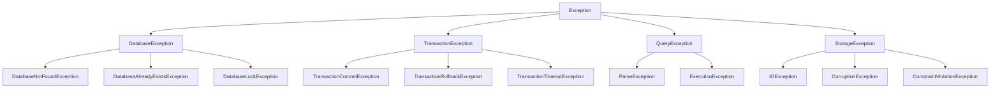

# Error Handling

ZYX provides comprehensive error handling through exceptions and error codes. This guide covers error handling best practices and the complete error API.

## Exception Hierarchy

ZYX uses a hierarchical exception system:



## Base Exception Class

All ZYX exceptions inherit from the base `Exception` class:

```cpp
#include <zyx/zyx.hpp>

try {
    // ZYX operations
} catch (const zyx::Exception& e) {
    std::cerr << "Error: " << e.what() << std::endl;
    std::cerr << "Error code: " << e.getErrorCode() << std::endl;
}
```

### Exception Methods

```cpp
class Exception {
public:
    virtual const char* what() const noexcept;
    ErrorCode getErrorCode() const;
    std::string getMessage() const;
    std::string getDetails() const;
};
```

## Database Exceptions

### DatabaseNotFoundException

Thrown when attempting to open a non-existent database.

```cpp
try {
    auto db = zyx::Database::open("/nonexistent/path");
} catch (const zyx::DatabaseNotFoundException& e) {
    std::cerr << "Database not found: " << e.what() << std::endl;
    std::cerr << "Path: " << e.getPath() << std::endl;
}
```

### DatabaseAlreadyExistsException

Thrown when attempting to create a database that already exists.

```cpp
try {
    auto db = zyx::Database::create("/existing/path");
} catch (const zyx::DatabaseAlreadyExistsException& e) {
    std::cerr << "Database already exists: " << e.what() << std::endl;
}
```

### DatabaseLockException

Thrown when the database is locked by another process.

```cpp
try {
    auto db = zyx::Database::open("/locked/path");
} catch (const zyx::DatabaseLockException& e) {
    std::cerr << "Database is locked: " << e.what() << std::endl;
    std::cerr << "Lock holder: " << e.getLockHolder() << std::endl;
}
```

## Transaction Exceptions

### TransactionCommitException

Thrown when a transaction commit fails.

```cpp
auto tx = db->beginTransaction();

try {
    tx->execute("CREATE (p:Person {name: 'Alice'})");
    tx->commit();
} catch (const zyx::TransactionCommitException& e) {
    tx->rollback();
    std::cerr << "Commit failed: " << e.what() << std::endl;
}
```

### TransactionRollbackException

Thrown when a transaction rollback fails.

```cpp
try {
    tx->rollback();
} catch (const zyx::TransactionRollbackException& e) {
    std::cerr << "Rollback failed: " << e.what() << std::endl;
    // Manual cleanup may be needed
}
```

### TransactionTimeoutException

Thrown when a transaction exceeds its timeout.

```cpp
auto tx = db->beginTransaction();
tx->setTimeout(zyx::Duration::seconds(30));

try {
    // Long-running operation
    while (condition) {
        tx->execute("MATCH (n:Node) RETURN n");
    }
} catch (const zyx::TransactionTimeoutException& e) {
    std::cerr << "Transaction timeout: " << e.what() << std::endl;
    std::cerr << "Timeout duration: " << e.getTimeout().toSeconds() << "s"
              << std::endl;
}
```

## Query Exceptions

### ParseException

Thrown when Cypher query parsing fails.

```cpp
try {
    auto result = db->execute("INVALID CYPHER QUERY");
} catch (const zyx::ParseException& e) {
    std::cerr << "Parse error: " << e.what() << std::endl;
    std::cerr << "Position: " << e.getErrorPosition() << std::endl;
    std::cerr << "Query: " << e.getQuery() << std::endl;
}
```

### ExecutionException

Thrown when query execution fails.

```cpp
try {
    auto result = db->execute("MATCH (n:NonExistentLabel) RETURN n");
} catch (const zyx::ExecutionException& e) {
    std::cerr << "Execution error: " << e.what() << std::endl;
    std::cerr << "Query: " << e.getQuery() << std::endl;
}
```

## Storage Exceptions

### IOException

Thrown for I/O related errors.

```cpp
try {
    auto db = zyx::Database::open("/path/to/db");
} catch (const zyx::IOException& e) {
    std::cerr << "I/O error: " << e.what() << std::endl;
    std::cerr << "Path: " << e.getPath() << std::endl;
    std::cerr << "System error: " << e.getSystemError() << std::endl;
}
```

### CorruptionException

Thrown when database corruption is detected.

```cpp
try {
    auto db = zyx::Database::open("/corrupted/db");
} catch (const zyx::CorruptionException& e) {
    std::cerr << "Database corrupted: " << e.what() << std::endl;
    std::cerr << "Affected segment: " << e.getSegmentId() << std::endl;
}
```

### ConstraintViolationException

Thrown when a constraint violation occurs.

```cpp
try {
    db->execute("CREATE (p:Person {email: 'alice@example.com'})");
    db->execute("CREATE (p:Person {email: 'alice@example.com'})");
} catch (const zyx::ConstraintViolationException& e) {
    std::cerr << "Constraint violated: " << e.what() << std::endl;
    std::cerr << "Constraint: " << e.getConstraintName() << std::endl;
}
```

## Error Handling Patterns

### Comprehensive Error Handling

```cpp
#include <zyx/zyx.hpp>

using namespace zyx;

int main() {
    try {
        // Open database
        auto db = Database::open("/path/to/database");

        // Execute query
        auto result = db->execute(
            "MATCH (p:Person) RETURN p.name, p.age"
        );

        // Process results
        for (const auto& row : result) {
            std::cout << row["p.name"].asString() << std::endl;
        }

    } catch (const DatabaseNotFoundException& e) {
        std::cerr << "Database not found: " << e.what() << std::endl;
        return 1;

    } catch (const DatabaseLockException& e) {
        std::cerr << "Database locked: " << e.what() << std::endl;
        return 2;

    } catch (const ParseException& e) {
        std::cerr << "Query parse error: " << e.what() << std::endl;
        return 3;

    } catch (const ExecutionException& e) {
        std::cerr << "Query execution error: " << e.what() << std::endl;
        return 4;

    } catch (const ConstraintViolationException& e) {
        std::cerr << "Constraint violation: " << e.what() << std::endl;
        return 5;

    } catch (const IOException& e) {
        std::cerr << "I/O error: " << e.what() << std::endl;
        return 6;

    } catch (const Exception& e) {
        std::cerr << "General error: " << e.what() << std::endl;
        return 7;
    }

    return 0;
}
```

### Transaction Error Handling

```cpp
auto tx = db->beginTransaction();

try {
    // Execute multiple operations
    tx->execute("CREATE (p:Person {name: 'Alice', email: 'alice@example.com'})");
    tx->execute("CREATE (p:Person {name: 'Bob', email: 'bob@example.com'})");

    // Validate
    auto result = tx->execute(
        "MATCH (p:Person) WHERE p.email IN ['alice@example.com', 'bob@example.com'] "
        "RETURN count(p) AS count"
    );

    auto count = result.peek()["count"].asInteger();
    if (count != 2) {
        throw std::runtime_error("Validation failed: expected 2 persons");
    }

    // Commit if successful
    tx->commit();

} catch (const ConstraintViolationException& e) {
    tx->rollback();
    std::cerr << "Constraint violation: " << e.what() << std::endl;
    // Handle duplicate data

} catch (const TransactionTimeoutException& e) {
    tx->rollback();
    std::cerr << "Transaction timeout: " << e.what() << std::endl;
    // Retry with longer timeout

} catch (const Exception& e) {
    tx->rollback();
    std::cerr << "Transaction failed: " << e.what() << std::endl;
    // General error handling
}
```

### Retry with Exponential Backoff

```cpp
template<typename Func>
auto retryWithBackoff(Func&& func, int maxRetries = 3) -> decltype(func()) {
    int retries = 0;
    std::chrono::milliseconds delay(100);

    while (true) {
        try {
            return func();
        } catch (const TransactionException& e) {
            if (++retries >= maxRetries) {
                throw;
            }

            std::cerr << "Retry " << retries << "/" << maxRetries
                      << " after error: " << e.what() << std::endl;

            std::this_thread::sleep_for(delay);
            delay *= 2; // Exponential backoff
        }
    }
}

// Usage
auto result = retryWithBackoff([&]() {
    auto tx = db->beginTransaction();
    auto r = tx->execute("MATCH (n:Node) RETURN count(n)");
    tx->commit();
    return r;
});
```

## Error Codes

ZYX uses error codes for programmatic error handling:

```cpp
enum class ErrorCode {
    // Database errors (1-99)
    DATABASE_NOT_FOUND = 1,
    DATABASE_ALREADY_EXISTS = 2,
    DATABASE_LOCKED = 3,
    DATABASE_CORRUPTED = 4,

    // Transaction errors (100-199)
    TRANSACTION_NOT_ACTIVE = 100,
    TRANSACTION_COMMIT_FAILED = 101,
    TRANSACTION_ROLLBACK_FAILED = 102,
    TRANSACTION_TIMEOUT = 103,

    // Query errors (200-299)
    QUERY_PARSE_ERROR = 200,
    QUERY_EXECUTION_ERROR = 201,
    INVALID_PARAMETERS = 202,

    // Constraint errors (300-399)
    CONSTRAINT_VIOLATION = 300,
    UNIQUE_CONSTRAINT_VIOLATION = 301,
    NODE_NOT_FOUND = 302,

    // Storage errors (400-499)
    IO_ERROR = 400,
    OUT_OF_MEMORY = 401,
    DISK_FULL = 402
};
```

### Using Error Codes

```cpp
try {
    db->execute("CREATE (p:Person {email: 'alice@example.com'})");
} catch (const zyx::Exception& e) {
    auto code = e.getErrorCode();

    if (code == zyx::ErrorCode::UNIQUE_CONSTRAINT_VIOLATION) {
        std::cerr << "Duplicate email address" << std::endl;
    } else if (code == zyx::ErrorCode::IO_ERROR) {
        std::cerr << "I/O error occurred" << std::endl;
    } else {
        std::cerr << "Unknown error: " << e.what() << std::endl;
    }
}
```

## Error Recovery

### Recovery Strategies

```cpp
// 1. Retry on transient errors
auto maxRetries = 3;
for (int i = 0; i < maxRetries; ++i) {
    try {
        db->execute(query);
        break;
    } catch (const zyx::TransactionException& e) {
        if (i == maxRetries - 1) throw;
        std::this_thread::sleep_for(std::chrono::milliseconds(100 * (i + 1)));
    }
}

// 2. Fallback to alternative operation
try {
    db->execute("MATCH (n:Node) DELETE n");
} catch (const zyx::ConstraintViolationException& e) {
    // Fallback: Delete in smaller batches
    db->execute("MATCH (n:Node) WITH n LIMIT 1000 DELETE n");
}

// 3. Graceful degradation
try {
    auto result = db->execute("MATCH (n:Node) RETURN n");
    // Process result
} catch (const zyx::ExecutionException& e) {
    // Return cached data or partial result
    return getCachedData();
}
```

### Data Recovery

```cpp
// Recover from corruption
try {
    auto db = zyx::Database::open("/path/to/db");
} catch (const zyx::CorruptionException& e) {
    std::cerr << "Database corrupted, attempting recovery..." << std::endl;

    // Try to recover
    try {
        auto recovered = zyx::Database::recover("/path/to/db");
        std::cerr << "Recovery successful" << std::endl;
        db = recovered;
    } catch (const zyx::Exception& recoveryError) {
        std::cerr << "Recovery failed: " << recoveryError.what() << std::endl;
        // Restore from backup
        restoreFromBackup();
    }
}
```

## Best Practices

1. **Catch specific exceptions**: Handle different error types appropriately
2. **Use RAII**: Ensure resources are cleaned up on exceptions
3. **Log errors**: Maintain detailed error logs for debugging
4. **Provide context**: Include relevant information in error messages
5. **Implement retries**: Handle transient failures with retries
6. **Validate input**: Check parameters before executing operations
7. **Monitor errors**: Track error rates and patterns
8. **Plan recovery**: Have strategies for common error scenarios

## Logging Errors

```cpp
#include <zyx/zyx.hpp>
#include <spdlog/spdlog.h>

void executeWithErrorLogging(zyx::Database* db, const std::string& query) {
    try {
        auto result = db->execute(query);
        spdlog::info("Query executed successfully: {}", query);
    } catch (const zyx::Exception& e) {
        spdlog::error("Query failed: {}", query);
        spdlog::error("Error: {} (Code: {})", e.what(), static_cast<int>(e.getErrorCode()));
        throw;
    }
}
```

## See Also

- [Transaction Class](/en/api/transaction) - Transaction error handling
- [Database Class](/en/api/cpp-api) - Database error handling
- [Value Types](/en/api/types) - Type-related errors
