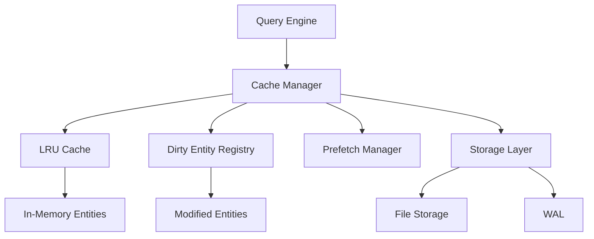

# Cache Management

ZYX implements a sophisticated multi-level caching system to optimize performance for both read and write operations.

## Overview

The cache manager handles:

- **Hot data caching**: Keep frequently accessed entities in memory
- **Dirty tracking**: Track modified entities for efficient persistence
- **LRU eviction**: Automatically evict cold data when cache is full
- **Prefetching**: Anticipate and load data before it's needed



## LRU Cache

### Cache Structure

```cpp
template<typename K, typename V>
class LRUCache {
public:
    explicit LRUCache(size_t capacity)
        : capacity_(capacity) {}

    std::optional<V> get(const K& key) {
        auto it = cache_.find(key);
        if (it == cache_.end()) {
            return std::nullopt;
        }

        // Move to front (most recently used)
        lruList_.splice(lruList_.begin(), lruList_, it->second);
        return it->second->second;
    }

    void put(const K& key, const V& value) {
        auto it = cache_.find(key);

        if (it != cache_.end()) {
            // Update existing
            it->second->second = value;
            lruList_.splice(lruList_.begin(), lruList_, it->second);
        } else {
            // Add new
            if (cache_.size() >= capacity_) {
                // Evict least recently used
                auto last = lruList_.back();
                cache_.erase(last.first);
                lruList_.pop_back();
            }

            lruList_.push_front({key, value});
            cache_[key] = lruList_.begin();
        }
    }

    size_t size() const { return cache_.size(); }
    size_t capacity() const { return capacity_; }

private:
    size_t capacity_;
    std::list<std::pair<K, V>> lruList_;
    std::unordered_map<K, typename std::list<std::pair<K, V>>::iterator> cache_;
};
```

### Entity Cache

```cpp
class EntityCache {
public:
    explicit EntityCache(size_t maxSize)
        : cache_(maxSize) {}

    Entity* getEntity(uint64_t entityId) {
        auto entity = cache_.get(entityId);
        if (entity) {
            cacheHits_++;
            return *entity;
        }

        cacheMisses_++;
        return nullptr;
    }

    void putEntity(uint64_t entityId, Entity* entity) {
        cache_.put(entityId, entity);
    }

    void invalidate(uint64_t entityId) {
        cache_.remove(entityId);
    }

    void clear() {
        cache_.clear();
    }

    double getHitRate() const {
        double total = cacheHits_ + cacheMisses_;
        return total > 0 ? cacheHits_ / total : 0.0;
    }

private:
    LRUCache<uint64_t, Entity*> cache_;
    uint64_t cacheHits_ = 0;
    uint64_t cacheMisses_ = 0;
};
```

## Dirty Entity Tracking

### Dirty Registry

```cpp
class DirtyEntityRegistry {
public:
    void markDirty(uint64_t entityId, EntityType type) {
        std::lock_guard<std::mutex> lock(mutex_);

        dirtyEntities_[type].insert(entityId);
    }

    void markClean(uint64_t entityId, EntityType type) {
        std::lock_guard<std::mutex> lock(mutex_);
        dirtyEntities_[type].erase(entityId);
    }

    std::vector<uint64_t> getDirtyEntities(EntityType type) const {
        std::lock_guard<std::mutex> lock(mutex_);

        std::vector<uint64_t> result;
        auto it = dirtyEntities_.find(type);
        if (it != dirtyEntities_.end()) {
            result.assign(it->second.begin(), it->second.end());
        }
        return result;
    }

    std::vector<uint64_t> getAllDirtyEntities() const {
        std::lock_guard<std::mutex> lock(mutex_);

        std::vector<uint64_t> result;
        for (const auto& [type, entities] : dirtyEntities_) {
            result.insert(result.end(), entities.begin(), entities.end());
        }
        return result;
    }

    bool isDirty(uint64_t entityId) const {
        std::lock_guard<std::mutex> lock(mutex_);

        for (const auto& [type, entities] : dirtyEntities_) {
            if (entities.count(entityId) > 0) {
                return true;
            }
        }
        return false;
    }

    void clear() {
        std::lock_guard<std::mutex> lock(mutex_);
        dirtyEntities_.clear();
    }

private:
    mutable std::mutex mutex_;
    std::unordered_map<EntityType, std::unordered_set<uint64_t>> dirtyEntities_;
};
```

### Persistence Integration

```cpp
class CacheManager {
public:
    void flushDirtyEntities() {
        // Get all dirty entities
        auto dirtyEntities = dirtyRegistry_.getAllDirtyEntities();

        // Group by segment
        std::map<uint64_t, std::vector<Entity*>> segmentEntities;
        for (uint64_t entityId : dirtyEntities) {
            Entity* entity = cache_.getEntity(entityId);
            if (entity) {
                uint64_t segmentId = getSegmentId(entityId);
                segmentEntities[segmentId].push_back(entity);
            }
        }

        // Write by segment
        for (const auto& [segmentId, entities] : segmentEntities) {
            // Update segment
            storage_->updateSegment(segmentId, entities);

            // Mark clean
            for (auto* entity : entities) {
                dirtyRegistry_.markClean(entity->id, entity->type);
            }
        }
    }
};
```

## Prefetching

### Access Pattern Detection

```cpp
class AccessPatternDetector {
public:
    void recordAccess(uint64_t entityId) {
        std::lock_guard<std::mutex> lock(mutex_);

        auto& info = accessHistory_[entityId];
        info.count++;
        info.lastAccess = getCurrentTimestamp();

        // Detect sequential access
        if (lastAccessedEntity_ && entityId == *lastAccessedEntity_ + 1) {
            sequentialCount_++;

            if (sequentialCount_ >= prefetchThreshold_) {
                // Trigger prefetch
                triggerPrefetch(entityId + 1);
            }
        } else {
            sequentialCount_ = 1;
        }

        lastAccessedEntity_ = entityId;
    }

private:
    struct AccessInfo {
        uint64_t count;
        Timestamp lastAccess;
    };

    void triggerPrefetch(uint64_t startEntityId) {
        // Prefetch next N entities
        size_t prefetchCount = 10;
        for (size_t i = 0; i < prefetchCount; ++i) {
            uint64_t entityId = startEntityId + i;
            if (!cache_.getEntity(entityId)) {
                Entity* entity = storage_->loadEntity(entityId);
                if (entity) {
                    cache_.putEntity(entityId, entity);
                }
            }
        }
    }

    std::unordered_map<uint64_t, AccessInfo> accessHistory_;
    std::optional<uint64_t> lastAccessedEntity_;
    size_t sequentialCount_ = 0;
    size_t prefetchThreshold_ = 3;
    std::mutex mutex_;
};
```

### Relationship Prefetching

```cpp
class RelationshipPrefetcher {
public:
    void prefetchNeighbors(uint64_t nodeId) {
        // Load all relationships for node
        auto relationships = storage_->getRelationships(nodeId);

        // Cache related nodes
        for (const auto& rel : relationships) {
            uint64_t otherNodeId = rel.getOtherNodeId(nodeId);

            if (!cache_.getEntity(otherNodeId)) {
                Entity* entity = storage_->loadEntity(otherNodeId);
                if (entity) {
                    cache_.putEntity(otherNodeId, entity);
                }
            }
        }
    }
};
```

## Cache Statistics

### Metrics

```cpp
struct CacheStats {
    uint64_t hits;
    uint64_t misses;
    uint64_t evictions;
    uint64_t size;
    uint64_t capacity;
    double   hitRate;
    uint64_t dirtyCount;
};

CacheStats getCacheStats() const {
    CacheStats stats;
    stats.hits = cache_.getHits();
    stats.misses = cache_.getMisses();
    stats.evictions = cache_.getEvictions();
    stats.size = cache_.size();
    stats.capacity = cache_.capacity();
    stats.hitRate = cache_.getHitRate();
    stats.dirtyCount = dirtyRegistry_.getDirtyCount();
    return stats;
}
```

### Monitoring

```cpp
void logCacheStats() {
    auto stats = cacheManager_->getCacheStats();

    LOG_INFO("Cache Statistics:");
    LOG_INFO("  Size: " << stats.size << " / " << stats.capacity);
    LOG_INFO("  Hit Rate: " << (stats.hitRate * 100) << "%");
    LOG_INFO("  Hits: " << stats.hits);
    LOG_INFO("  Misses: " << stats.misses);
    LOG_INFO("  Evictions: " << stats.evictions);
    LOG_INFO("  Dirty Entities: " << stats.dirtyCount);
}
```

## Configuration

```cpp
struct CacheConfig {
    size_t maxCacheSize      = 100 * 1024 * 1024; // 100 MB
    size_t maxEntities       = 100000;
    bool   enablePrefetch    = true;
    size_t prefetchThreshold = 3;
    size_t prefetchCount     = 10;
    bool   enablePatternDetection = true;
};
```

## Best Practices

1. **Monitor hit rate**: Target >80% for most workloads
2. **Tune cache size**: Balance memory usage and performance
3. **Use prefetching**: For predictable access patterns
4. **Flush regularly**: Don't let dirty entities accumulate
5. **Profile access patterns**: Understand your workload

## See Also

- [Storage System](/en/architecture/storage) - Overall storage architecture
- [Segment Format](/en/architecture/segment-format) - Data storage format
- [Performance Optimization](/en/architecture/optimization) - Performance tuning
