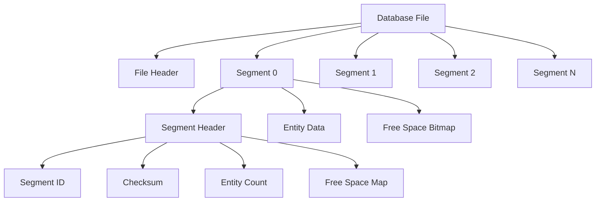

# Segment Format

Metrix uses a custom segment-based storage format that provides efficient space management, fast access, and ACID compliance. This document describes the segment format in detail.

## Overview

The database file is divided into fixed-size segments, each managed independently. This design enables:

- **Efficient space allocation**: Bitmap-based free space tracking
- **Fast access**: Direct segment offset calculation
- **Concurrent operations**: Segment-level locking
- **Easy recovery**: Segment-level checksums and metadata



## File Header

The file header contains database-wide metadata:

```cpp
struct FileHeader {
    // Magic number for validation
    static constexpr uint64_t MAGIC_NUMBER = 0x4D45545258585A00; // "METRIXXZ"

    uint64_t magic;              // Magic number
    uint32_t version;            // File format version
    uint32_t pageSize;           // System page size
    uint64_t segmentSize;        // Size of each segment
    uint64_t segmentCount;       // Total number of segments
    uint64_t firstFreeSegment;   // First segment with free space
    uint64_t walOffset;          // Offset to WAL file location
    uint32_t checksum;           // Header checksum
    uint8_t  compressionType;    // Compression algorithm
    uint8_t  encryptionType;     // Encryption algorithm (0 = none)
    uint8_t  reserved[64];       // Reserved for future use
    char     databaseName[256];  // Database identifier
    uint64_t createdAt;          // Creation timestamp
    uint64_t lastModified;       // Last modification timestamp
};
```

### Header Validation

```cpp
bool validateFileHeader(const FileHeader* header) {
    // Check magic number
    if (header->magic != FileHeader::MAGIC_NUMBER) {
        return false;
    }

    // Check version compatibility
    if (header->version < MIN_SUPPORTED_VERSION ||
        header->version > CURRENT_VERSION) {
        return false;
    }

    // Verify checksum
    uint32_t computed = computeChecksum(header, offsetof(FileHeader, checksum));
    if (computed != header->checksum) {
        return false;
    }

    return true;
}
```

## Segment Structure

Each segment has a fixed size (default: 1MB) and contains:

```cpp
struct Segment {
    SegmentHeader header;
    uint8_t       data[SEGMENT_SIZE - sizeof(SegmentHeader)];
};

struct SegmentHeader {
    uint64_t segmentId;          // Unique segment identifier
    uint32_t entityCount;        // Number of entities in segment
    uint32_t freeBytes;          // Free bytes available
    uint64_t firstFreeOffset;    // First free byte offset
    uint32_t checksum;           // Segment data checksum
    uint32_t flags;              // Segment flags (compressed, encrypted, etc.)
    uint8_t  bitmap[BITMAP_SIZE];// Free space bitmap
};
```

### Segment Header Layout

```
Offset  Size  Field          Description
------- ----- ------------- ----------------------------------------
0       8     segmentId     Unique segment identifier
8       4     entityCount   Number of entities stored
12      4     freeBytes     Available free space
16      8     firstFreeOff  First free byte offset
24      4     checksum      CRC32 of segment data
28      4     flags         Segment flags
32      N     bitmap        Free space bitmap (1 bit per 64 bytes)
```

## Entity Storage

Entities are stored within segments with the following structure:

```cpp
struct EntityHeader {
    uint64_t entityId;          // Unique entity ID
    uint32_t size;              // Entity data size
    uint32_t flags;             // Entity flags (deleted, dirty, etc.)
    uint32_t checksum;          // Entity checksum
    uint16_t type;              // Entity type (node, edge, property)
    uint16_t version;           // Entity version for MVCC
};

struct Entity {
    EntityHeader header;
    uint8_t       data[];       // Variable-length entity data
};
```

### Entity Types

```cpp
enum class EntityType : uint16_t {
    NODE            = 0x0001,
    EDGE            = 0x0002,
    PROPERTY        = 0x0003,
    LABEL_INDEX     = 0x0004,
    PROPERTY_INDEX  = 0x0005,
    VECTOR_INDEX    = 0x0006
};
```

## Free Space Management

### Bitmap Allocation

The free space bitmap uses 1 bit per 64-byte block:

```cpp
class BitmapAllocator {
public:
    static constexpr size_t BLOCK_SIZE = 64;

    bool isFree(size_t blockIndex) const {
        size_t byteIndex = blockIndex / 8;
        size_t bitIndex = blockIndex % 8;
        return (bitmap_[byteIndex] & (1 << bitIndex)) == 0;
    }

    void markUsed(size_t blockIndex) {
        size_t byteIndex = blockIndex / 8;
        size_t bitIndex = blockIndex % 8;
        bitmap_[byteIndex] |= (1 << bitIndex);
    }

    void markFree(size_t blockIndex) {
        size_t byteIndex = blockIndex / 8;
        size_t bitIndex = blockIndex % 8;
        bitmap_[byteIndex] &= ~(1 << bitIndex);
    }

    size_t findFreeBlocks(size_t requiredBlocks) const {
        // Find contiguous free blocks
        size_t contiguous = 0;
        for (size_t i = 0; i < totalBlocks_; ++i) {
            if (isFree(i)) {
                if (++contiguous >= requiredBlocks) {
                    return i - requiredBlocks + 1;
                }
            } else {
                contiguous = 0;
            }
        }
        return SIZE_MAX; // Not found
    }

private:
    uint8_t* bitmap_;
    size_t   totalBlocks_;
};
```

### Space Calculation

```cpp
size_t calculateRequiredBlocks(size_t entitySize) {
    size_t totalSize = sizeof(EntityHeader) + entitySize;
    size_t blocks = totalSize / BitmapAllocator::BLOCK_SIZE;
    if (totalSize % BitmapAllocator::BLOCK_SIZE != 0) {
        blocks++;
    }
    return blocks;
}
```

## Checksums

### Entity Checksum

Each entity has a CRC32 checksum for data integrity:

```cpp
uint32_t computeEntityChecksum(const Entity* entity) {
    size_t dataSize = entity->header.size;
    return crc32(entity->data, dataSize);
}

bool validateEntity(const Entity* entity) {
    uint32_t computed = computeEntityChecksum(entity);
    return computed == entity->header.checksum;
}
```

### Segment Checksum

Segments have checksums for corruption detection:

```cpp
uint32_t computeSegmentChecksum(const Segment* segment) {
    // Exclude the checksum field itself
    size_t dataSize = sizeof(SegmentHeader) - offsetof(SegmentHeader, checksum);
    dataSize += segment->header.entityCount * sizeof(Entity);
    return crc32(segment->data, dataSize);
}
```

## Compression

### Segment Compression

Segments can be compressed to save space:

```cpp
enum class CompressionType : uint8_t {
    NONE       = 0,
    ZLIB       = 1,
    LZ4        = 2,
    ZSTD       = 3
};

struct CompressedSegment {
    uint32_t   originalSize;
    uint32_t   compressedSize;
    uint8_t    compressionType;
    uint8_t    data[];
};

bool compressSegment(Segment* segment, CompressionType type) {
    size_t originalSize = segment->header.freeBytes;
    size_t maxCompressed = compressBound(originalSize);

    std::vector<uint8_t> compressed(maxCompressed);
    size_t compressedSize;

    switch (type) {
        case CompressionType::ZLIB:
            compressedSize = compressZLIB(segment->data, originalSize,
                                         compressed.data(), maxCompressed);
            break;
        case CompressionType::LZ4:
            compressedSize = compressLZ4(segment->data, originalSize,
                                        compressed.data(), maxCompressed);
            break;
        case CompressionType::ZSTD:
            compressedSize = compressZSTD(segment->data, originalSize,
                                        compressed.data(), maxCompressed);
            break;
        default:
            return false;
    }

    if (compressedSize >= originalSize) {
        return false; // Compression didn't help
    }

    // Update segment
    segment->header.flags |= SEGMENT_FLAG_COMPRESSED;
    segment->header.compressionType = static_cast<uint8_t>(type);

    return true;
}
```

## Segment Operations

### Allocation

```cpp
Segment* allocateSegment(Database* db) {
    // Find segment with free space
    uint64_t segmentId = db->segmentTracker.findFreeSegment();

    if (segmentId == INVALID_SEGMENT_ID) {
        // Allocate new segment
        segmentId = db->segmentTracker.allocateNewSegment();
    }

    // Load segment
    Segment* segment = db->segmentCache.loadSegment(segmentId);

    // Initialize if new
    if (segment->header.entityCount == 0) {
        segment->header.segmentId = segmentId;
        segment->header.entityCount = 0;
        segment->header.freeBytes = SEGMENT_DATA_SIZE;
        segment->header.firstFreeOffset = 0;
        std::memset(segment->header.bitmap, 0, BITMAP_SIZE);
    }

    return segment;
}
```

### Entity Allocation

```cpp
Entity* allocateEntity(Segment* segment, size_t size, EntityType type) {
    // Calculate required blocks
    size_t blocks = calculateRequiredBlocks(size);

    // Find free space
    size_t startBlock = segment->bitmap.findFreeBlocks(blocks);
    if (startBlock == SIZE_MAX) {
        return nullptr; // No space
    }

    // Mark blocks as used
    for (size_t i = 0; i < blocks; ++i) {
        segment->bitmap.markUsed(startBlock + i);
    }

    // Calculate offset
    size_t offset = startBlock * BitmapAllocator::BLOCK_SIZE;

    // Initialize entity header
    Entity* entity = reinterpret_cast<Entity*>(segment->data + offset);
    entity->header.entityId = generateEntityId();
    entity->header.size = size;
    entity->header.type = static_cast<uint16_t>(type);
    entity->header.version = 1;
    entity->header.checksum = 0; // Will be set when data is written

    // Update segment metadata
    segment->header.entityCount++;
    segment->header.freeBytes -= blocks * BitmapAllocator::BLOCK_SIZE;

    return entity;
}
```

### Deletion

```cpp
void deleteEntity(Segment* segment, Entity* entity) {
    // Mark as deleted (tombstone)
    entity->header.flags |= ENTITY_FLAG_DELETED;

    // Free space in bitmap
    size_t offset = reinterpret_cast<uint8_t*>(entity) - segment->data;
    size_t startBlock = offset / BitmapAllocator::BLOCK_SIZE;
    size_t blocks = calculateRequiredBlocks(entity->header.size);

    for (size_t i = 0; i < blocks; ++i) {
        segment->bitmap.markFree(startBlock + i);
    }

    // Update segment metadata
    segment->header.entityCount--;
    segment->header.freeBytes += blocks * BitmapAllocator::BLOCK_SIZE;
}
```

## Performance Considerations

### Sequential Access

Segments are optimized for sequential access:

```cpp
// Sequential scan is efficient
for (uint64_t segmentId = 0; segmentId < segmentCount; ++segmentId) {
    Segment* segment = loadSegment(segmentId);

    for (size_t i = 0; i < segment->header.entityCount; ++i) {
        Entity* entity = getEntity(segment, i);
        if (!(entity->header.flags & ENTITY_FLAG_DELETED)) {
            processEntity(entity);
        }
    }
}
```

### Random Access

Direct entity access via ID:

```cpp
Entity* getEntityById(uint64_t entityId) {
    // Calculate segment from entity ID
    uint64_t segmentId = entityId / ENTITIES_PER_SEGMENT;
    uint64_t entityIndex = entityId % ENTITIES_PER_SEGMENT;

    Segment* segment = loadSegment(segmentId);
    return getEntity(segment, entityIndex);
}
```

## Best Practices

1. **Batch operations**: Group multiple entity operations
2. **Use appropriate segment size**: Tune to workload
3. **Monitor fragmentation**: Reclaim space periodically
4. **Compress strategically**: Compress segments with low write frequency
5. **Validate checksums**: Check data integrity regularly
6. **Prefer sequential access**: More efficient than random access

## See Also

- [Storage System](/en/architecture/storage) - Overall storage architecture
- [WAL Implementation](/en/architecture/wal) - Write-ahead logging
- [Cache Management](/en/architecture/cache) - Segment caching
