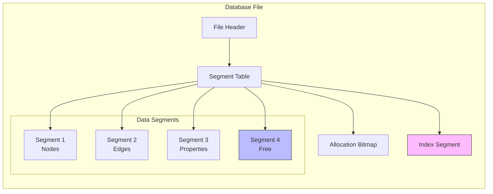
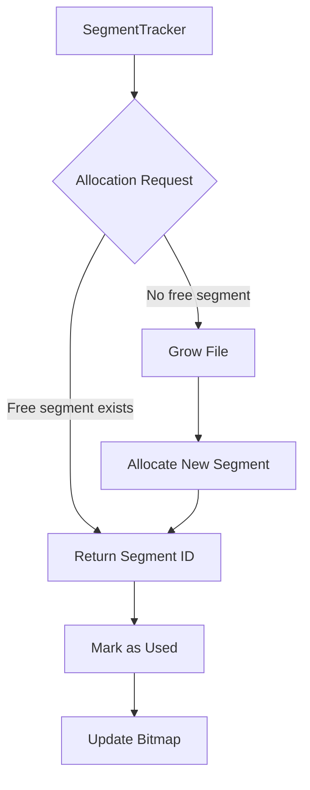
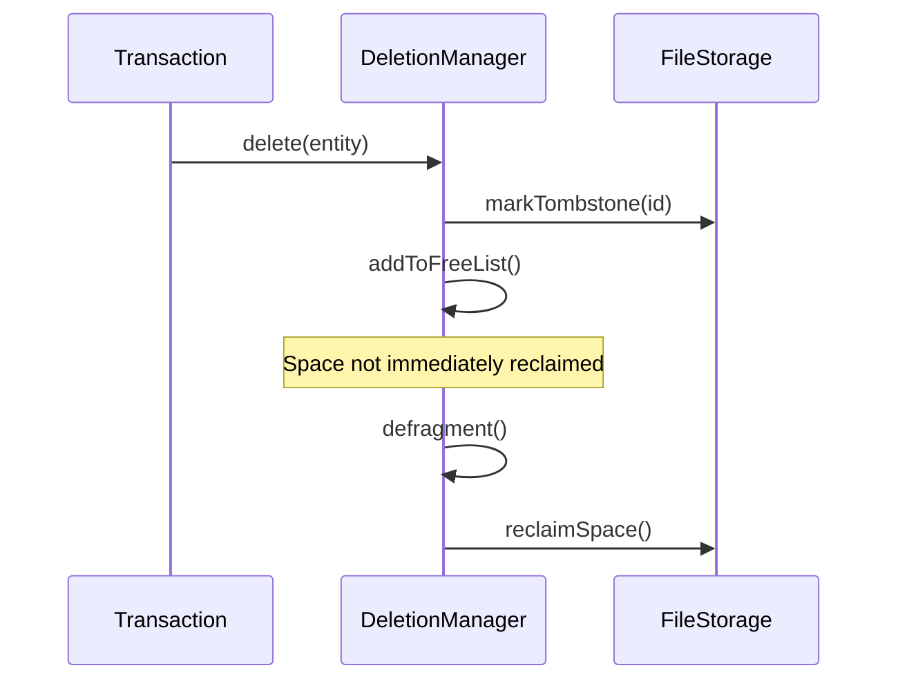
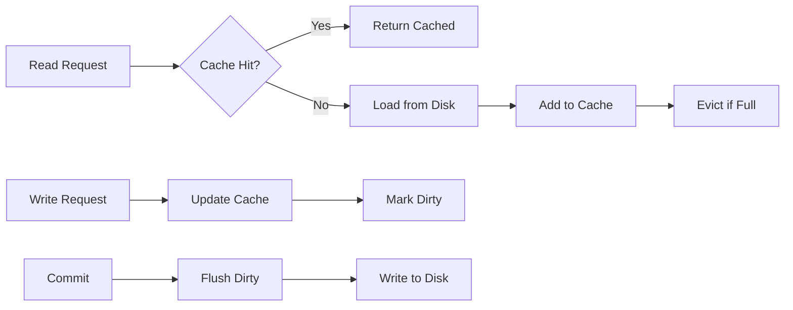
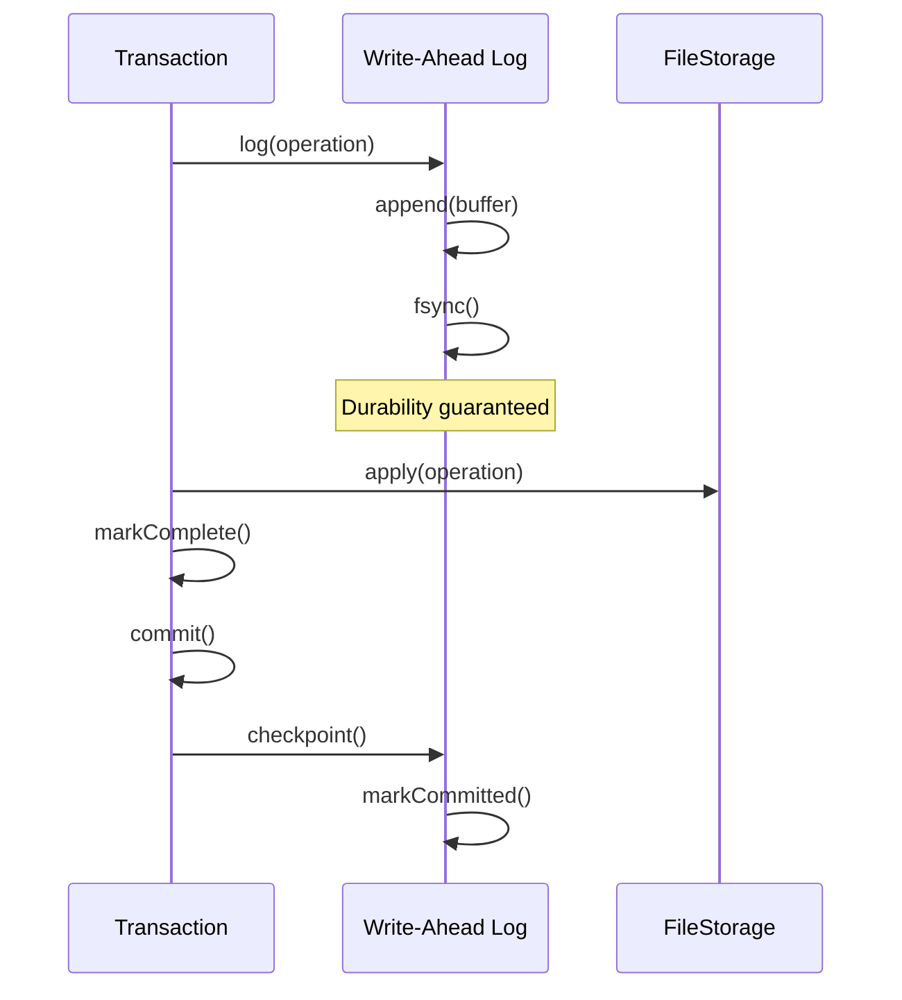
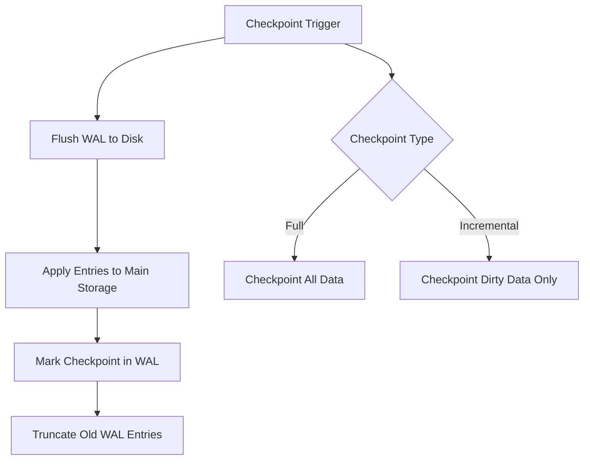
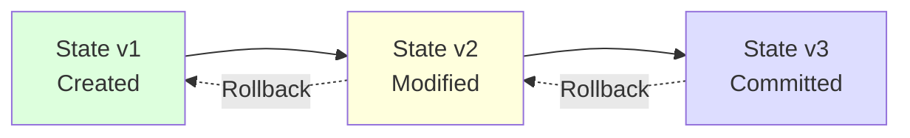
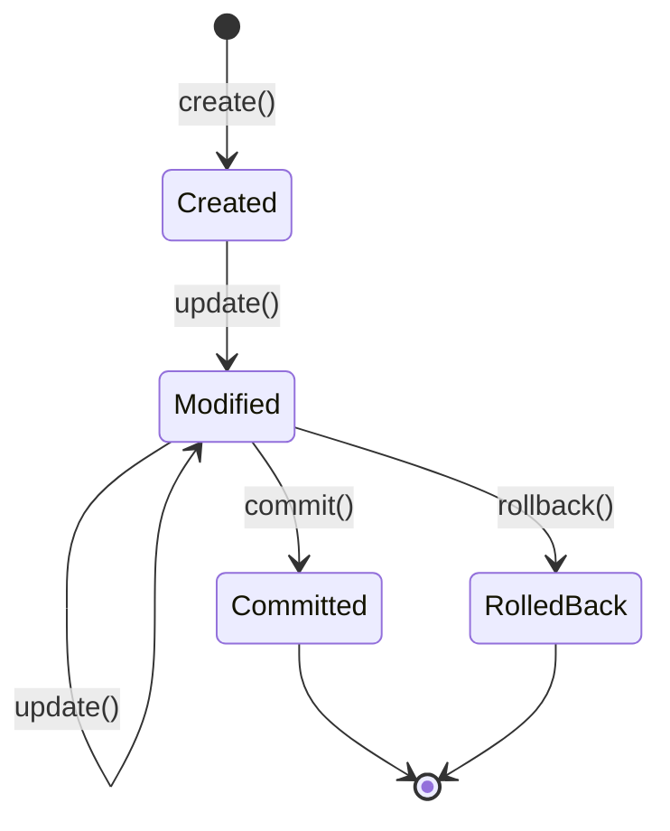
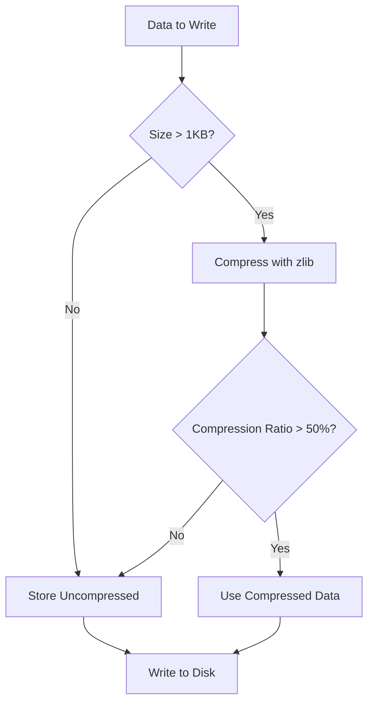
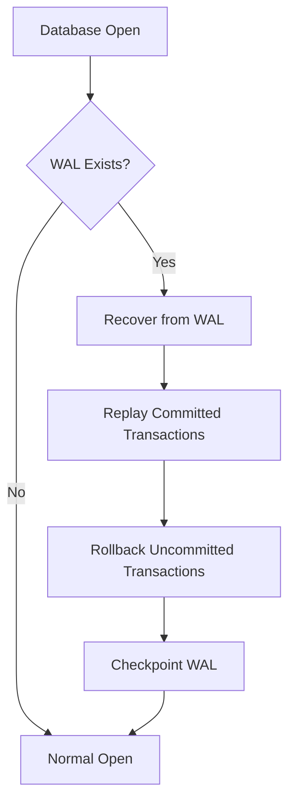

# Storage System

Metrix uses a custom **segment-based storage engine** optimized for graph workloads with efficient space management and fast access patterns.

## Segment Architecture

The storage is organized into fixed-size **segments** - contiguous blocks of disk space that can be allocated to different entity types.



### Segment Structure

Each segment contains:

```
┌─────────────────────────────────┐
│ Segment Header                  │
│ - Segment ID                    │
│ - Type (Node/Edge/Property)     │
│ - Capacity                      │
│ - Used Count                    │
├─────────────────────────────────┤
│ Free Space Bitmap               │
│ - Tracks available slots        │
├─────────────────────────────────┤
│ Data Pages                      │
│ - Fixed-size records            │
│ - Compressed if enabled         │
└─────────────────────────────────┘
```

### Key Benefits

1. **Fast Allocation**: O(1) allocation using bitmap lookup
2. **Efficient Scans**: Sequential reads within segments
3. **Space Reclamation**: Entire segments can be freed
4. **Cache Friendly**: Predictable access patterns

## Storage Components

### FileHeaderManager

Manages file-level metadata:

- **Database Version**: Format identifier for compatibility
- **Segment Size**: Configurable segment size (default: 4MB)
- **Checksum**: Validates file integrity
- **Creation Time**: Database creation timestamp

### SegmentTracker

Tracks segment allocation:



**Responsibilities**:
- Track which segments are free/used
- Allocate new segments when needed
- Mark segments as free after deletion
- Maintain segment metadata

### DataManager

Handles node and edge storage:

#### Node Storage
- **Label Index**: Fast lookup of nodes by label
- **Properties**: Key-value pairs with type information
- **Relationships**: Links to incoming/outgoing edges

#### Edge Storage
- **Start Node**: Reference to source node
- **End Node**: Reference to target node
- **Type**: Relationship type label
- **Properties**: Key-value pairs

#### Property Storage
- **Type Codes**: Integer, String, Boolean, Float, etc.
- **Compression**: zlib compression for large values
- **Inline Storage**: Small values stored directly in record

### IndexManager

Manages two types of indexes:

#### Label Index
- **Structure**: Hash table mapping labels to node IDs
- **Lookup**: O(1) complexity for label-based queries
- **Updates**: Incremental updates on node creation/deletion

#### Property Index
- **B-Tree Index**: Ordered index for range queries
- **Hash Index**: Fast equality lookups
- **Composite Index**: Multi-column indexes (planned)

### DeletionManager

Tombstone-based deletion:



**Process**:
1. **Mark Tombstone**: Entity marked as deleted
2. **Free List**: Space added to reclamation list
3. **Defragmentation**: Background process reclaims space
4. **Reuse**: Reclaimed space available for new entities

### CacheManager

LRU cache with dirty tracking:



**Features**:
- **LRU Eviction**: Least recently used entities evicted first
- **Dirty Tracking**: Modified entities tracked for persistence
- **Write-Back**: Dirty entities flushed on commit
- **Configurable Size**: Cache size limit in bytes

## Write-Ahead Log (WAL)

All modifications are logged before being applied to the main storage.

### WAL Flow



### WAL Structure

```
┌─────────────────────────────────┐
│ WAL Header                      │
│ - Checkpoint ID                 │
│ - Log Sequence Number           │
├─────────────────────────────────┤
│ Log Entries                     │
│ ┌─────────────────────────────┐ │
│ │ Entry 1: CreateNode         │ │
│ │ - Transaction ID            │ │
│ │ - Node ID                   │ │
│ │ - Label                     │ │
│ │ - Properties                │ │
│ └─────────────────────────────┘ │
│ ┌─────────────────────────────┐ │
│ │ Entry 2: CreateRelationship │ │
│ │ - Transaction ID            │ │
│ │ - Edge ID                   │ │
│ │ - Start/End Nodes           │ │
│ └─────────────────────────────┘ │
├─────────────────────────────────┤
│ Checkpoint Marker               │
│ - Committed LSN                 │
│ - Timestamp                     │
└─────────────────────────────────┘
```

### WAL Benefits

1. **Atomicity**: Entire transaction can be replayed
2. **Durability**: Committed changes survive crashes
3. **Rollback**: Undo operations by reversing WAL entries
4. **Recovery**: Rebuild state after crash

### Checkpoint Process



## State Management

### State Chains

Each entity maintains a chain of states for versioning:



### State Chain Benefits

- **MVCC**: Read operations don't block writes
- **Time Travel**: Query historical states
- **Rollback**: Undo without data loss
- **Conflict Detection**: Detect concurrent modifications

### State Transitions



## File Format

### Database File Layout

```
┌─────────────────────────────────┐
│ File Header (512 bytes)         │
│ - Magic Number                  │
│ - Version                       │
│ - Segment Size                  │
│ - Checksum                      │
├─────────────────────────────────┤
│ Segment Table                   │
│ - Segment Metadata              │
│ - Allocation Bitmaps            │
├─────────────────────────────────┤
│ Segment 0: Node Data            │
├─────────────────────────────────┤
│ Segment 1: Edge Data            │
├─────────────────────────────────┤
│ Segment 2: Property Data        │
├─────────────────────────────────┤
│ ... more segments ...           │
├─────────────────────────────────┤
│ Segment N: Index Data           │
└─────────────────────────────────┘
```

### WAL File Layout

```
┌─────────────────────────────────┐
│ WAL Header                      │
│ - Checkpoint ID                 │
│ - Start LSN                     │
├─────────────────────────────────┤
│ Log Record 1                    │
│ - Transaction ID                │
│ - Operation Type                │
│ - Operation Data                │
├─────────────────────────────────┤
│ Log Record 2                    │
├─────────────────────────────────┤
│ ... more records ...            │
├─────────────────────────────────┤
│ Checkpoint Marker               │
└─────────────────────────────────┘
```

## Compression

Metrix uses zlib compression for:

1. **Large Properties**: String and binary data > 1KB
2. **Segments**: Compress entire segments when idle
3. **WAL**: Compress old WAL entries

### Compression Strategy



## Performance Characteristics

| Operation | Complexity | Notes |
|-----------|------------|-------|
| Create Node | O(1) | Direct segment allocation |
| Create Edge | O(1) | Link to existing nodes |
| Lookup by ID | O(1) | Direct offset calculation |
| Label Scan | O(n) | Scan all nodes with label |
| Property Query | O(1) | With index |
| Property Query | O(n) | Without index |
| Delete Node | O(1) | Tombstone marking |
| Compact Storage | O(n) | Background defragmentation |

## Recovery

### Crash Recovery



### Recovery Steps

1. **Check WAL**: Determine if crash occurred
2. **Replay Log**: Apply committed transactions from WAL
3. **Rollback**: Undo uncommitted transactions
4. **Checkpoint**: Persist all changes to main storage
5. **Truncate**: Clear processed WAL entries

## Configuration

### Storage Parameters

```cpp
struct StorageConfig {
    size_t segmentSize = 4 * 1024 * 1024;  // 4MB segments
    size_t cacheSize = 256 * 1024 * 1024;  // 256MB cache
    bool compressionEnabled = true;
    size_t compressionThreshold = 1024;    // 1KB
    size_t walMaxSize = 100 * 1024 * 1024; // 100MB
};
```

### Tuning Guidelines

- **Segment Size**: Larger segments = less fragmentation
- **Cache Size**: More memory = faster reads
- **Compression**: Trade CPU for disk space
- **WAL Size**: Balance durability and disk usage

## Next Steps

- [Query Engine](/en/architecture/query-engine) - How queries are executed
- [Transactions](/en/architecture/transactions) - Transaction management details
- [API Reference](/en/api/cpp-api) - Storage API usage
