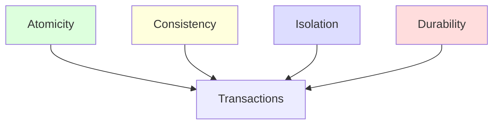
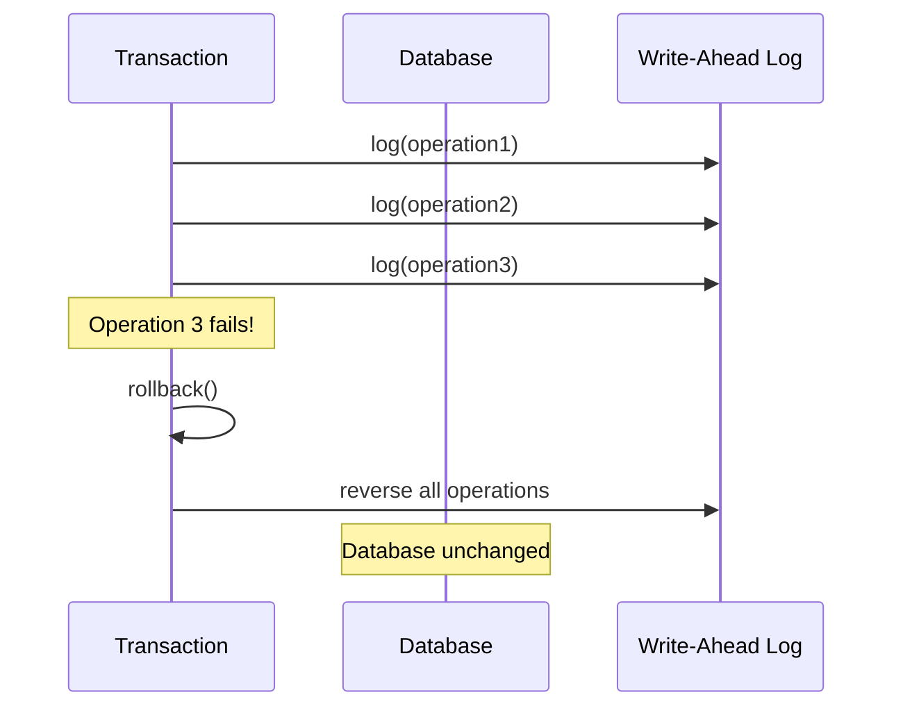
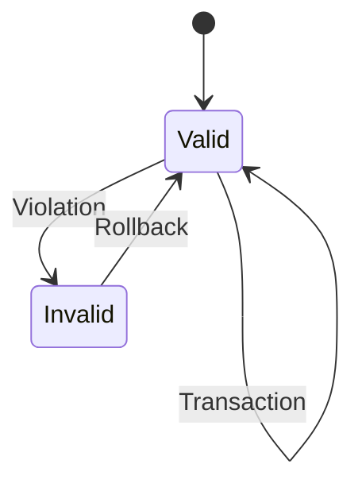
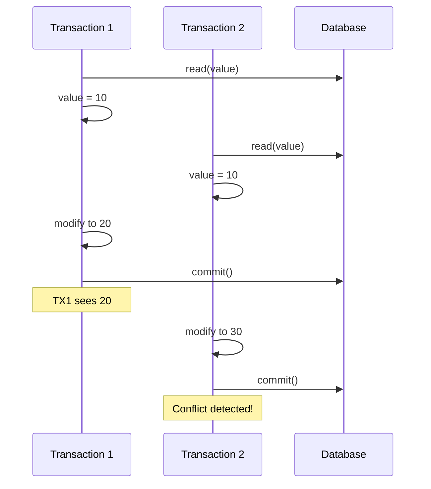
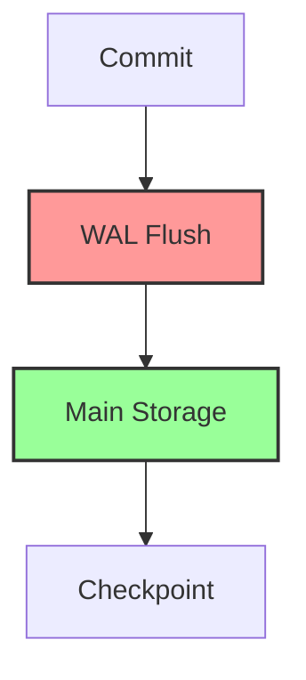
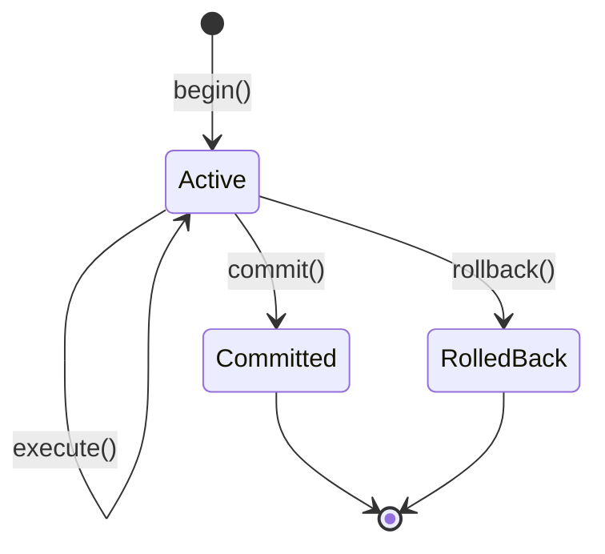
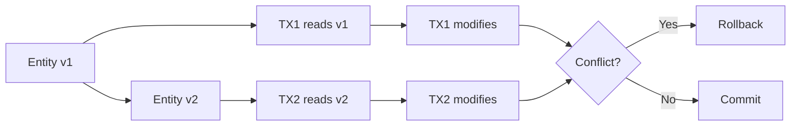
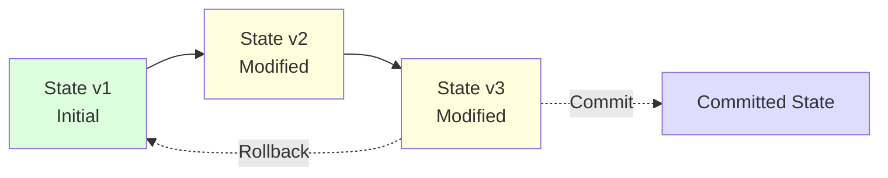
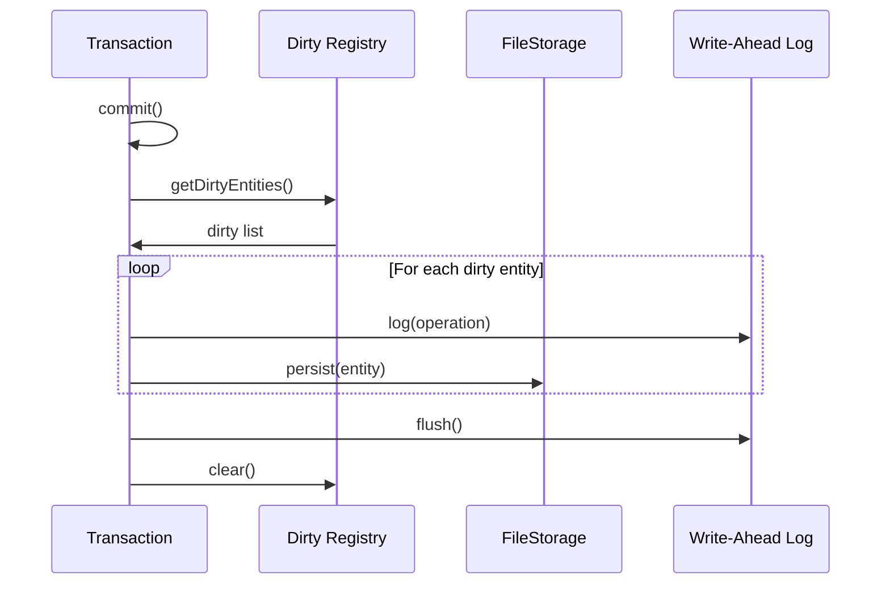

# Transaction Management

Metrix provides full ACID transaction support with optimistic concurrency control and comprehensive rollback capabilities.

## ACID Properties



### Atomicity

All operations in a transaction succeed or fail together.



**Implementation**:
- WAL records all operations before execution
- On failure, reverse operations from WAL
- Database remains consistent

### Consistency

Database always transitions from one valid state to another.



**Constraints**:
- **Type Constraints**: Property types must match
- **Uniqueness Constraints**: Unique property values (future)
- **Existence Constraints**: Required properties (future)

### Isolation

Concurrent transactions don't interfere with each other.



**Isolation Levels**:
- **Read Committed**: Default, see committed data
- **Serializable**: Full isolation (planned)
- **Snapshot Consistency**: Per-transaction views

### Durability

Committed changes survive failures.



**Guarantees**:
- WAL flushed to disk on commit
- Changes persist even if process crashes
- Recovery replays committed transactions

## Transaction Lifecycle



### Beginning a Transaction

```cpp
auto db = Database::open("./mydb");
auto tx = db->beginTransaction();
```

### Executing Operations

```cpp
tx->execute("CREATE (n:User {name: 'Alice'})");
tx->execute("CREATE (n:User {name: 'Bob'})");
```

### Committing

```cpp
tx->commit();
```

### Rolling Back

```cpp
tx->rollback();
```

## Optimistic Concurrency Control

Metrix uses optimistic concurrency control with versioning.

### Version Tracking



### Conflict Detection

```cpp
class Entity {
private:
    uint64_t version_;

public:
    bool detectConflict(const Entity& other) const {
        return version_ != other.version_;
    }
};
```

### Conflict Resolution

1. **Detect**: Version mismatch on commit
2. **Retry**: Automatic retry with exponential backoff
3. **Fail**: After max retries, throw error

## Transaction State Management

### State Chains

Each entity maintains a chain of states:



### Dirty Entity Tracking

```cpp
class DirtyEntityRegistry {
private:
    std::unordered_set<EntityId> dirty_;

public:
    void markDirty(EntityId id);
    bool isDirty(EntityId id) const;
    void clear();
};
```

### Flush on Commit



## Transaction Isolation

### Read Committed (Default)

```cpp
auto tx = db->beginTransaction(IsolationLevel::ReadCommitted);
```

**Behavior**:
- See only committed data
- Non-repeatable reads possible
- Phantom reads possible

### Serializable (Planned)

```cpp
auto tx = db->beginTransaction(IsolationLevel::Serializable);
```

**Behavior**:
- Full isolation
- No phantom reads
- Higher overhead

## Nested Transactions

Metrix supports savepoints for nested transactions:

```cpp
auto tx = db->beginTransaction();

tx->execute("CREATE (n:User {name: 'Alice'})");

auto savepoint = tx->createSavepoint("sp1");

tx->execute("CREATE (n:User {name: 'Bob'})");

// Rollback to savepoint
tx->rollbackToSavepoint("sp1");

tx->commit(); // Only Alice is committed
```

## Transaction Configuration

### Timeout Configuration

```cpp
struct TransactionConfig {
    std::chrono::milliseconds timeout = 30000ms;  // 30 seconds
    size_t maxRetries = 3;
    std::chrono::milliseconds retryDelay = 100ms;
};
```

### Isolation Level

```cpp
enum class IsolationLevel {
    ReadCommitted,
    Serializable
};
```

## Error Handling

### Transaction Errors

```cpp
try {
    auto tx = db->beginTransaction();
    tx->execute("CREATE (n:User {name: 'Alice'})");
    tx->commit();
} catch (const TransactionError& e) {
    // Transaction failed, already rolled back
    std::cerr << "Transaction failed: " << e.what() << std::endl;
} catch (const StorageError& e) {
    // Storage I/O error
    std::cerr << "Storage error: " << e.what() << std::endl;
}
```

### Automatic Rollback

Transactions are automatically rolled back on:
- Unhandled exceptions
- Timeout
- Database closure
- Conflict detection failure

## Performance Considerations

### Transaction Size

**Best Practices**:
- Keep transactions short
- Minimize operations per transaction
- Avoid long-running transactions

### Batch Operations

```cpp
// Good - Multiple small transactions
for (int i = 0; i < 1000; ++i) {
    auto tx = db->beginTransaction();
    tx->execute("CREATE (n:User {id: $id})", {{"id", i}});
    tx->commit();
}

// Better - Batch in single transaction (if acceptable)
auto tx = db->beginTransaction();
for (int i = 0; i < 1000; ++i) {
    tx->execute("CREATE (n:User {id: $id})", {{"id", i}});
}
tx->commit();
```

### WAL Management

- **Checkpoint Frequency**: Balance performance and durability
- **WAL Size**: Monitor and truncate old entries
- **Flush Strategy**: Group flushes for efficiency

## Monitoring and Debugging

### Transaction Statistics

```cpp
class TransactionStats {
public:
    size_t getActiveCount() const;
    size_t getCommittedCount() const;
    size_t getRolledBackCount() const;
    std::chrono::milliseconds getAverageDuration() const;
};
```

### Logging

Enable transaction logging for debugging:

```cpp
db->setLogLevel(LogLevel::Debug);
db->setLogTransaction(true);
```

## Best Practices

1. **Always commit or rollback**: Never leave transactions open
2. **Handle exceptions**: Catch and handle transaction errors
3. **Keep transactions short**: Minimize lock duration
4. **Use appropriate isolation**: Use lowest isolation level needed
5. **Monitor performance**: Track transaction duration and conflicts

## Next Steps

- [Storage System](/en/architecture/storage) - How transactions persist data
- [Query Engine](/en/architecture/query-engine) - Query execution in transactions
- [API Reference](/en/api/cpp-api) - Transaction API usage
