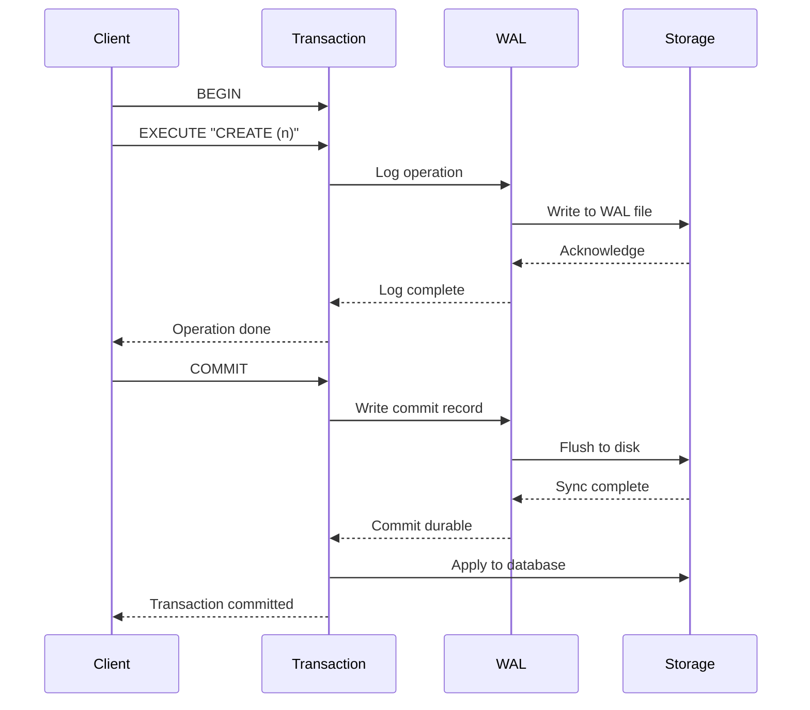

# WAL Implementation

ZYX uses Write-Ahead Logging (WAL) to ensure ACID transaction durability and enable crash recovery.

## Overview

The Write-Ahead Log records all changes before they are applied to the main database file. This ensures:

- **Atomicity**: All transaction changes are logged before commit
- **Durability**: Committed changes survive system crashes
- **Recovery**: Database can be recovered to a consistent state



## WAL Structure

### WAL File Layout

```cpp
struct WALHeader {
    static constexpr uint64_t WAL_MAGIC = 0x57414C4C4F474900; // "WALLOGI"

    uint64_t magic;              // Magic number
    uint64_t version;            // WAL format version
    uint64_t dbFileSize;         // Database file size at WAL start
    uint64_t checkpointSequence; // Last checkpoint sequence number
    uint64_t firstRecordOffset;  // First valid record offset
    uint64_t currentOffset;      // Current write position
    uint32_t pageSize;           // System page size
    uint32_t checksum;           // Header checksum
    uint64_t createdAt;          // WAL creation timestamp
};
```

### WAL Record Format

```cpp
enum class WALRecordType : uint8_t {
    BEGIN_TX       = 0x01,
    COMMIT_TX      = 0x02,
    ROLLBACK_TX    = 0x03,
    CREATE_NODE    = 0x10,
    CREATE_EDGE    = 0x11,
    UPDATE_NODE    = 0x12,
    UPDATE_EDGE    = 0x13,
    DELETE_NODE    = 0x14,
    DELETE_EDGE    = 0x15,
    CHECKPOINT     = 0x20
};

struct WALRecord {
    uint64_t       sequence;     // Record sequence number
    uint64_t       transactionId;// Transaction identifier
    uint32_t       size;         // Record size
    uint32_t       checksum;     // Record checksum
    uint64_t       timestamp;    // Record timestamp
    WALRecordType  type;         // Record type
    uint8_t        data[];       // Record-specific data
};
```

## Write Process

### Transaction Begin

```cpp
void beginTransaction(Transaction* tx) {
    WALRecord record;
    record.sequence = nextSequence();
    record.transactionId = tx->getId();
    record.type = WALRecordType::BEGIN_TX;
    record.size = 0;
    record.timestamp = getCurrentTimestamp();
    record.checksum = computeChecksum(&record);

    wal->writeRecord(&record);
    wal->flush(); // Ensure durable
}
```

### Logging Operations

```cpp
void logCreateNode(Transaction* tx, const Node& node) {
    // Serialize node data
    size_t dataSize = serializeNodeSize(node);
    std::vector<uint8_t> data(dataSize);
    serializeNode(node, data.data());

    // Create WAL record
    WALRecord record;
    record.sequence = nextSequence();
    record.transactionId = tx->getId();
    record.type = WALRecordType::CREATE_NODE;
    record.size = dataSize;
    record.timestamp = getCurrentTimestamp();

    // Write record
    wal->writeRecord(&record, data.data());
    // Note: Don't flush yet, batch writes
}
```

### Transaction Commit

```cpp
void commitTransaction(Transaction* tx) {
    // Write commit record
    WALRecord record;
    record.sequence = nextSequence();
    record.transactionId = tx->getId();
    record.type = WALRecordType::COMMIT_TX;
    record.size = 0;
    record.timestamp = getCurrentTimestamp();

    wal->writeRecord(&record);

    // Flush all buffered writes
    wal->flush();

    // Now apply to database
    tx->applyToDatabase();
}
```

## Recovery Process

### Recovery Algorithm

```cpp
void recoverFromWAL(Database* db) {
    WAL* wal = db->getWAL();

    // 1. Scan WAL records
    std::vector<WALRecord*> records = wal->scanRecords();

    // 2. Separate committed and uncommitted transactions
    std::map<uint64_t, std::vector<WALRecord*>> transactions;
    std::set<uint64_t> committedTransactions;

    for (auto* record : records) {
        switch (record->type) {
            case WALRecordType::BEGIN_TX:
                transactions[record->transactionId].push_back(record);
                break;
            case WALRecordType::COMMIT_TX:
                committedTransactions.insert(record->transactionId);
                break;
            default:
                transactions[record->transactionId].push_back(record);
                break;
        }
    }

    // 3. Replay committed transactions
    for (uint64_t txId : committedTransactions) {
        auto& txRecords = transactions[txId];

        // Apply operations in order
        for (auto* record : txRecords) {
            switch (record->type) {
                case WALRecordType::CREATE_NODE:
                    replayCreateNode(db, record);
                    break;
                case WALRecordType::CREATE_EDGE:
                    replayCreateEdge(db, record);
                    break;
                // ... other operations
            }
        }
    }

    // 4. Uncommitted transactions are ignored (rolled back)

    // 5. Checkpoint after recovery
    db->checkpoint();
}
```

## Checkpointing

### Checkpoint Algorithm

```cpp
void checkpoint(Database* db) {
    WAL* wal = db->getWAL();

    // 1. Write checkpoint record
    WALRecord checkpointRecord;
    checkpointRecord.type = WALRecordType::CHECKPOINT;
    checkpointRecord.sequence = nextSequence();
    wal->writeRecord(&checkpointRecord);
    wal->flush();

    // 2. Flush database file
    db->flush();

    // 3. Truncate WAL
    wal->truncate();

    // 4. Update WAL header
    wal->setCheckpointSequence(checkpointRecord.sequence);
}
```

### Checkpoint Triggers

```cpp
class WALManager {
public:
    void shouldCheckpoint() {
        // Checkpoint if WAL size exceeds threshold
        if (wal->getSize() > maxWalSize) {
            db->checkpoint();
        }

        // Checkpoint based on time
        auto now = getCurrentTime();
        if (now - lastCheckpointTime > checkpointInterval) {
            db->checkpoint();
            lastCheckpointTime = now;
        }

        // Checkpoint based on record count
        if (wal->getRecordCount() > maxRecords) {
            db->checkpoint();
        }
    }

private:
    size_t maxWalSize = 100 * 1024 * 1024; // 100 MB
    Duration checkpointInterval = Duration::minutes(5);
    size_t maxRecords = 100000;
};
```

## Performance Optimization

### Group Commit

```cpp
class GroupCommit {
public:
    void scheduleCommit(Transaction* tx) {
        std::lock_guard<std::mutex> lock(mutex_);
        pendingCommits_.push_back(tx);

        // Flush if too many pending
        if (pendingCommits_.size() >= groupSize) {
            flushGroup();
        }
    }

    void flushGroup() {
        // Write all commit records
        for (auto* tx : pendingCommits_) {
            writeCommitRecord(tx);
        }

        // Single flush for all
        wal->flush();

        // Notify all waiting transactions
        for (auto* tx : pendingCommits_) {
            tx->notifyCommitted();
        }

        pendingCommits_.clear();
    }

private:
    std::vector<Transaction*> pendingCommits_;
    size_t groupSize = 10;
    std::mutex mutex_;
};
```

### WAL Buffering

```cpp
class WALBuffer {
public:
    void writeRecord(const WALRecord* record, const uint8_t* data) {
        std::lock_guard<std::mutex> lock(mutex_);

        // Buffer record
        buffer_.insert(buffer_.end(),
                      reinterpret_cast<const uint8_t*>(record),
                      reinterpret_cast<const uint8_t*>(record) + sizeof(WALRecord));

        if (data && record->size > 0) {
            buffer_.insert(buffer_.end(), data, data + record->size);
        }

        // Flush if buffer full
        if (buffer_.size() >= bufferSize_) {
            flush();
        }
    }

    void flush() {
        if (buffer_.empty()) return;

        // Write to file
        walFile_.write(buffer_.data(), buffer_.size());

        // Sync if needed
        if (syncOnFlush_) {
            walFile_.sync();
        }

        buffer_.clear();
    }

private:
    std::vector<uint8_t> buffer_;
    size_t bufferSize_ = 64 * 1024; // 64 KB
    bool syncOnFlush_ = false;
    std::mutex mutex_;
};
```

## Configuration

```cpp
struct WALConfig {
    size_t    maxWalSize        = 100 * 1024 * 1024; // 100 MB
    Duration  checkpointInterval = Duration::minutes(5);
    size_t    maxRecords        = 100000;
    size_t    bufferSize        = 64 * 1024;          // 64 KB
    bool      fsyncOnCommit     = true;
    bool      enableCompression = false;
    uint32_t  flushInterval     = 1000;               // ms
};
```

## Best Practices

1. **Monitor WAL size**: Checkpoint before it grows too large
2. **Use group commit**: Batch commits for better throughput
3. **Tune buffer size**: Balance between memory and performance
4. **Regular checkpoints**: Prevent long recovery times
5. **Monitor recovery time**: Track how long recovery takes

## See Also

- [Storage System](/en/architecture/storage) - Overall storage architecture
- [Segment Format](/en/architecture/segment-format) - Data storage format
- [Transaction System](/en/architecture/transactions) - Transaction management
