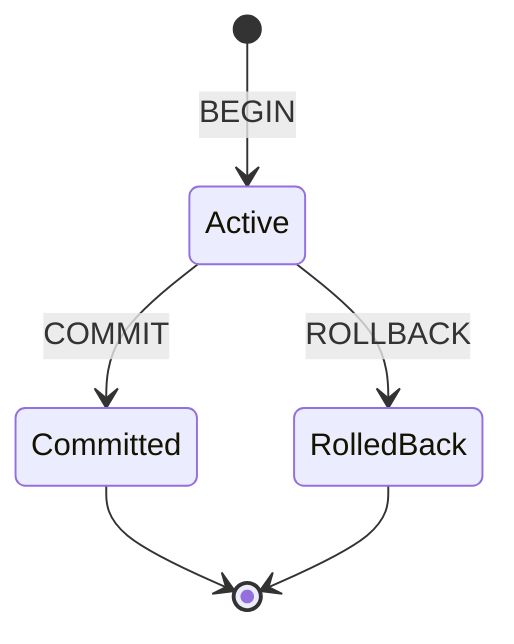
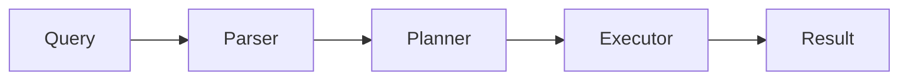

# Documentation Standards

Clear, comprehensive documentation is essential for Metrix's usability and maintainability. This guide outlines documentation standards.

## Documentation Types

### 1. Code Comments

#### File Headers

Every source file should have a descriptive header:

```cpp
/**
 * @file Database.cpp
 * @brief Implementation of the Database class
 *
 * This file implements the core Database class which provides
 * the main interface for database operations including opening,
 * closing, and transaction management.
 *
 * @author Metrix Contributors
 * @date 2024
 */
```

#### Class Documentation

```cpp
/**
 * @class Database
 * @brief Main database interface for graph operations
 *
 * The Database class provides the primary interface for working with
 * Metrix graph databases. It manages database lifecycle, coordinates
 * between storage and query engines, and provides transaction support.
 *
 * Example usage:
 * @code
 * auto db = Database::open("/path/to/database");
 * auto result = db->execute("MATCH (n) RETURN n");
 * db->close();
 * @endcode
 */
class Database {
    // ...
};
```

#### Method Documentation

```cpp
/**
 * @brief Opens an existing database
 *
 * Opens the database at the specified path. The database must already
 * exist or a DatabaseNotFoundException will be thrown.
 *
 * @param path Filesystem path to the database directory
 * @return Unique pointer to the opened Database instance
 *
 * @throws DatabaseNotFoundException if database doesn't exist
 * @throws DatabaseLockException if database is locked by another process
 * @throws IOException if filesystem error occurs
 *
 * @par Example
 * @code
 * try {
 *     auto db = Database::open("/data/mydb");
 *     // Use database
 * } catch (const DatabaseNotFoundException& e) {
 *     std::cerr << "Database not found" << std::endl;
 * }
 * @endcode
 */
static std::unique_ptr<Database> open(const std::string& path);
```

### 2. API Documentation

#### Public API Headers

Public API documentation should be comprehensive and include:

- **Purpose**: What the API does
- **Parameters**: Input parameters with types and constraints
- **Return values**: What is returned and possible values
- **Exceptions**: What errors can be thrown
- **Examples**: Usage examples
- **Thread safety**: Whether operations are thread-safe
- **Performance**: Performance characteristics

```cpp
/**
 * @brief Execute a Cypher query
 *
 * Executes the given Cypher query string and returns the result.
 * The query is executed in a new auto-commit transaction.
 *
 * @param cypher Cypher query string to execute
 * @return Result object containing query results
 *
 * @throws ParseException if query syntax is invalid
 * @throws ExecutionException if query execution fails
 * @throws ConstraintViolationException if constraints are violated
 *
 * @par Thread Safety
 * This method is thread-safe. Multiple threads can execute queries
 * concurrently.
 *
 * @par Performance
 * Query execution time depends on query complexity. Simple lookups
 * typically complete in < 1ms. Complex pattern matching may take
 * longer.
 *
 * @par Example
 * @code
 * auto result = db->execute("MATCH (n:Person) RETURN n.name");
 * for (const auto& row : result) {
 *     std::cout << row["n.name"].asString() << std::endl;
 * }
 * @endcode
 */
Result execute(const std::string& cypher);
```

### 3. User Documentation

#### Tutorial Style

User documentation should be tutorial and example-driven:

```markdown
# Quick Start Guide

## Creating a Database

To create a new database, use the `Database::create()` method:

```cpp
#include <metrix/metrix.hpp>

using namespace metrix;

// Create database at specified path
auto db = Database::create("/path/to/database");
```

## Adding Data

Add nodes using Cypher queries:

```cpp
// Create a person node
db->execute("CREATE (p:Person {name: 'Alice', age: 30})");
```

## Querying Data

Query data using the MATCH clause:

```cpp
// Find all people
auto result = db->execute("MATCH (p:Person) RETURN p.name, p.age");

// Process results
for (const auto& row : result) {
    std::cout << row["p.name"].asString() << std::endl;
}
```
```

#### Conceptual Documentation

Explain concepts clearly with diagrams:

```markdown
## Transaction System

Metrix provides ACID transactions through a Write-Ahead Log (WAL).

### Transaction States



### Transaction Isolation

Metrix uses snapshot isolation to ensure transaction consistency...
```

### 4. Architecture Documentation

#### Component Overviews

```markdown
# Query Engine Architecture

The query engine is responsible for parsing, planning, and executing
Cypher queries.

## Components

### Parser

The parser converts Cypher text into an Abstract Syntax Tree (AST).

**Key responsibilities:**
- Lexical analysis
- Syntax parsing
- AST construction

**Implementation:** ANTLR4-based parser in `src/query/parser/cypher/`

### Planner

The planner transforms the AST into an executable query plan.

**Key responsibilities:**
- Logical plan generation
- Optimization rule application
- Cost estimation

**Implementation:** `src/query/planner/QueryPlanner.cpp`
```

## Documentation Structure

### Directory Organization

```
docs/
├── user-guide/           # User-facing documentation
│   ├── installation.md
│   ├── quick-start.md
│   └── advanced-queries.md
├── api/                  # API reference
│   ├── cpp-api.md
│   ├── transaction.md
│   └── types.md
├── architecture/         # Architecture documentation
│   ├── overview.md
│   ├── storage.md
│   └── query-engine.md
└── contributing/         # Contributor documentation
    ├── development-setup.md
    ├── testing.md
    └── doc-standards.md
```

## Writing Guidelines

### Style Guidelines

1. **Use clear, simple language**: Avoid jargon when possible
2. **Be concise**: Get to the point quickly
3. **Use active voice**: "Create a database" not "A database can be created"
4. **Break into sections**: Use headings to organize content
5. **Include examples**: Show, don't just tell

### Formatting

#### Code Blocks

Use syntax-highlighted code blocks:

````markdown
```cpp
auto db = Database::open("/path/to/db");
```
````

#### Admonitions

Use callouts for important information:

```markdown
::: tip Best Practice
Always close databases when done to release resources.
:::

::: warning Warning
Deleting nodes also deletes all connected relationships.
:::

::: danger Critical
Never modify the database files directly while the database is open.
:::
```

#### Tables

Use tables for structured information:

| Method | Description | Thread-Safe |
|--------|-------------|-------------|
| `open()` | Opens existing database | No |
| `create()` | Creates new database | No |
| `execute()` | Executes query | Yes |

### Diagrams

Use Mermaid for diagrams:

```markdown

```

## Review Process

### Documentation Review Checklist

- [ ] All public APIs documented
- [ ] Examples are accurate and tested
- [ ] Code blocks are syntax-highlighted
- [ ] Diagrams are clear and accurate
- [ ] Spelling and grammar checked
- [ ] Links are valid
- [ ] Formatting is consistent

### Updating Documentation

When making code changes:

1. **Update code comments**: Keep them in sync with code
2. **Update API docs**: Document new APIs or changes
3. **Update examples**: Ensure examples still work
4. **Update diagrams**: Reflect architectural changes

## Tools

### Documentation Generator

- **Doxygen**: For API documentation from code comments
- **VitePress**: For user and architecture documentation

### Diagram Tools

- **Mermaid**: For text-based diagrams
- **PlantUML**: For complex UML diagrams

### Spell Checking

```bash
# Check spelling in documentation
scripts/check_spelling.sh docs/
```

### Link Checking

```bash
# Check for broken links
scripts/check_links.sh docs/
```

## Best Practices

### 1. Document as You Code

Write documentation alongside code, not as an afterthought.

### 2. Keep Examples Working

Test all code examples to ensure they work as documented.

### 3. Use Version-Specific Docs

Maintain documentation for different versions when needed.

### 4. Get Feedback

Have users review documentation for clarity and completeness.

### 5. Document Decisions

Record important architectural decisions and their rationale.

## Metrics

Track documentation quality:

- **Coverage**: Percentage of APIs documented
- **Accuracy**: Percentage of examples that work
- **Completeness**: All concepts documented
- **Clarity**: User comprehension scores

## See Also

- [Development Setup](/en/contributing/development-setup) - Getting started
- [Code Style](/en/contributing/code-style) - Coding standards
- [Writing Tests](/en/contributing/writing-tests) - Test documentation
