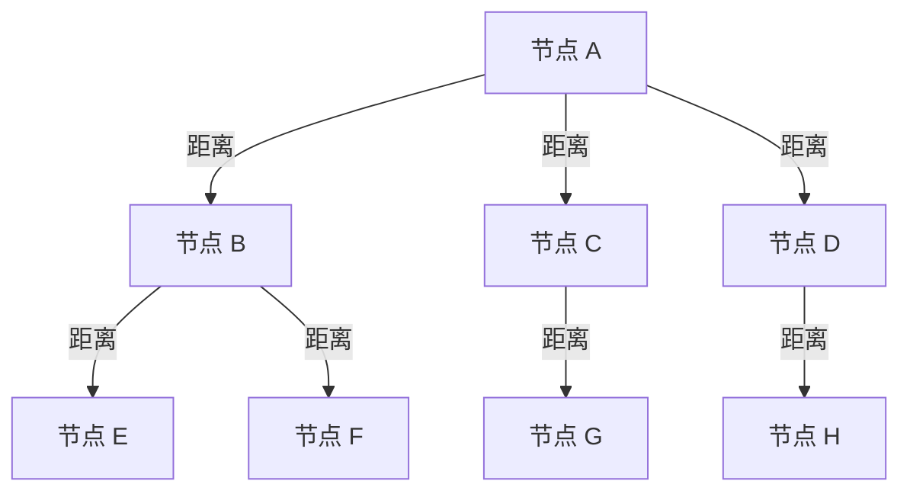
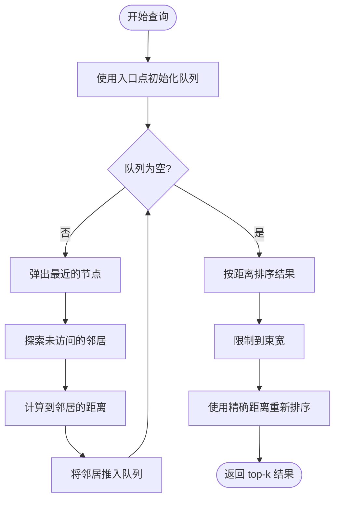
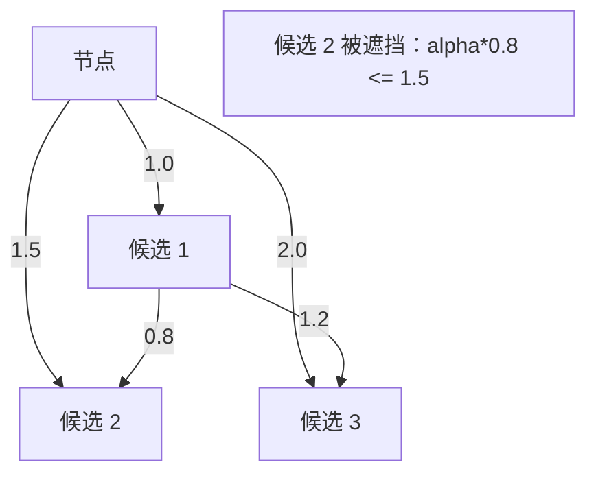

# DiskANN 算法

DiskANN（Disk-based Approximate Nearest Neighbor，基于磁盘的近似最近邻）是一种高性能的基于图的算法，用于在高维向量空间中进行近似最近邻搜索。Metrix 使用 DiskANN 来支持向量相似性搜索操作，并结合乘积量化（Product Quantization，PQ）实现内存效率。

## 概述

DiskANN 构建一个可导航小世界图（navigable small-world graph），其中向量是节点，通过边连接到其近似最近邻。该算法使用：

- **图结构**：用于高效遍历的可导航小世界图
- **贪婪搜索**：使用有界宽度的束搜索进行快速查询
- **鲁棒剪枝**：基于 alpha 的剪枝策略来维护图质量
- **乘积量化**：有损压缩以实现内存高效存储
- **混合模式**：结合 PQ 和原始向量以平衡性能

### 主要优势

- **可扩展性**：高效处理数百万向量
- **准确性**：高召回率且精度可调
- **内存效率**：PQ 压缩将内存占用减少 8-32 倍
- **快速搜索**：亚毫秒级查询延迟
- **动态更新**：支持增量插入和删除

## 图结构

图被构建为有向图，其中每个节点（向量）维护到其最近邻的连接。

```cpp
struct GraphNode {
    int64_t nodeId;              // 节点标识符
    std::vector<float> vector;   // 高维向量
    std::vector<int64_t> neighbors;  // 邻接表（maxDegree 个连接）
};
```

### 图属性



- **最大度数**：每个节点最多维护 `maxDegree` 条出边（默认：64）
- **入口点**：指定的节点作为搜索的起点
- **双向边**：边在两个方向上创建以实现高效遍历

## 配置

```cpp
struct DiskANNConfig {
    uint32_t dim;                       // 向量维度
    uint32_t beamWidth = 100;           // 搜索束宽
    uint32_t maxDegree = 64;            // 每个节点的最大连接数
    float alpha = 1.2f;                 // 剪枝因子（1.0-2.0）
    size_t autoTrainThreshold = 2000;   // 自动训练 PQ 的向量数阈值
    std::string metric = "L2";          // 距离度量（L2、IP、Cosine）
};
```

### 参数调优

| 参数 | 效果 | 范围 | 推荐值 |
|-----------|--------|-------|----------------|
| `beamWidth` | 搜索质量 vs 速度 | 50-200 | 平衡时使用 100 |
| `maxDegree` | 图连通性 | 32-128 | 大多数情况使用 64 |
| `alpha` | 剪枝激进程度 | 1.0-2.0 | 高质量使用 1.2 |
| `autoTrainThreshold` | 训练 PQ 的时机 | 1000-10000 | 启动时使用 2000 |

## 核心操作

### 插入向量

将新向量插入索引并构建图连接：

```cpp
void insert(int64_t nodeId, const std::vector<float>& vec) {
    // 1. 验证维度
    if (vec.size() != config_.dim) {
        throw std::invalid_argument("维度不匹配");
    }

    // 2. 达到阈值时自动训练 PQ
    if (!isPQTrained() && cachedCount_++ == config_.autoTrainThreshold) {
        auto samples = sampleVectors(config_.autoTrainThreshold);
        train(samples);
    }

    // 3. 存储向量数据
    int64_t rawBlob = registry_->saveRawVector(toBFloat16(vec));
    int64_t pqBlob = isPQTrained() ? registry_->savePQCodes(quantizer_->encode(vec)) : 0;

    // 4. 处理第一个节点
    if (entryPoint == 0) {
        registry_->updateEntryPoint(nodeId);
        return;
    }

    // 5. 使用贪婪搜索查找最近邻
    auto pqTable = isPQTrained() ? quantizer_->computeDistanceTable(vec) : std::vector<float>{};
    auto neighbors = greedySearch(vec, entryPoint, config_.beamWidth, pqTable);

    // 6. 剪枝候选集并创建双向边
    std::vector<int64_t> candidates;
    for (auto& [id, dist] : neighbors) {
        candidates.push_back(id);
    }
    prune(nodeId, candidates);

    // 7. 保存邻接关系并创建回指链接
    registry_->saveAdjacency(nodeId, candidates);
    for (int64_t neighbor : candidates) {
        addBackLink(neighbor, nodeId);
    }
}
```

**复杂度**：O(beamWidth × maxDegree × dim)

### 搜索

使用束搜索查找 k 个最近邻：

```cpp
std::vector<std::pair<int64_t, float>> search(
    const std::vector<float>& query,
    size_t k
) const {
    // 1. 计算 PQ 距离表以实现快速近似
    auto pqTable = isPQTrained() ? quantizer_->computeDistanceTable(query) : std::vector<float>{};

    // 2. 使用束宽的贪婪搜索
    auto candidates = greedySearch(query, entryPoint, std::max(config_.beamWidth, k * 2), pqTable);

    // 3. 使用精确距离重新排序
    std::vector<std::pair<int64_t, float>> results;
    for (auto& [nodeId, _] : candidates) {
        float exactDist = distRaw(query, nodeId);
        results.push_back({nodeId, exactDist});
    }

    // 4. 排序并返回 top-k
    std::sort(results.begin(), results.end(), [](auto& a, auto& b) {
        return a.second < b.second;
    });
    results.resize(k);
    return results;
}
```

**复杂度**：O(beamWidth × maxDegree × dim + k × dim)

## 贪婪搜索算法

核心搜索算法使用束搜索遍历图：

```cpp
std::vector<std::pair<int64_t, float>> greedySearch(
    const std::vector<float>& query,
    int64_t startNode,
    size_t beamWidth,
    const std::vector<float>& pqTable
) const {
    std::unordered_set<int64_t> visited;
    std::priority_queue<
        std::pair<float, int64_t>,
        std::vector<std::pair<float, int64_t>>,
        std::greater<>
    > queue;  // 最小堆：(距离, 节点)

    std::vector<std::pair<int64_t, float>> results;

    // 使用入口点初始化
    float startDist = computeDistance(query, pqTable, startNode);
    queue.push({startDist, startNode});
    visited.insert(startNode);
    results.push_back({startNode, startDist});

    // 束搜索遍历
    while (!queue.empty()) {
        auto [dist, currentNode] = queue.top();
        queue.pop();

        // 探索邻居
        auto neighbors = registry_->loadAdjacency(currentNode);
        for (int64_t neighbor : neighbors) {
            if (visited.contains(neighbor)) continue;
            visited.insert(neighbor);

            float neighborDist = computeDistance(query, pqTable, neighbor);
            results.push_back({neighbor, neighborDist});
            queue.push({neighborDist, neighbor});
        }
    }

    // 排序并限制到束宽
    std::sort(results.begin(), results.end(), [](auto& a, auto& b) {
        return a.second < b.second;
    });
    if (results.size() > beamWidth) {
        results.resize(beamWidth);
    }

    return results;
}
```

### 搜索流程



**复杂度**：O(beamWidth × maxDegree × dim)

## 剪枝策略

鲁棒剪枝通过移除冗余边来维护图质量：

```cpp
void prune(int64_t nodeId, std::vector<int64_t>& candidates) const {
    // 加载节点向量以进行精确距离计算
    auto nodeVec = loadRawVector(nodeId);

    // 1. 按到节点的距离排序候选
    std::vector<std::pair<int64_t, float>> candDists;
    for (int64_t candId : candidates) {
        float dist = computeDistance(nodeVec, candId);
        candDists.push_back({candId, dist});
    }
    std::sort(candDists.begin(), candDists.end(), [](auto& a, auto& b) {
        return a.second < b.second;
    });

    // 2. Alpha 剪枝：移除被遮挡的候选
    std::vector<int64_t> result;
    result.reserve(config_.maxDegree);

    for (const auto& [candId, candDist] : candDists) {
        if (result.size() >= config_.maxDegree) break;

        bool occluded = false;
        auto candVec = loadRawVector(candId);

        // 检查候选是否被现有邻居遮挡
        for (int64_t existingId : result) {
            auto existingVec = loadRawVector(existingId);
            float distExistingToCand = computeDistance(existingVec, candVec);

            // 遮挡条件：alpha * dist(existing, cand) <= dist(node, cand)
            if (config_.alpha * distExistingToCand <= candDist) {
                occluded = true;
                break;
            }
        }

        if (!occluded) {
            result.push_back(candId);
        }
    }

    candidates = result;
}
```

### 剪枝逻辑



**遮挡条件**：候选被遮挡的条件是：
```
alpha × distance(existing, candidate) ≤ distance(node, candidate)
```

**复杂度**：O(maxDegree² × dim)

## 乘积量化集成

### PQ 训练

```cpp
void train(const std::vector<std::vector<float>>& samples) {
    // 确定子空间配置
    size_t subDim = 8;  // 子空间维度
    size_t numSubspaces = config_.dim / subDim;  // 例如：768/8 = 96

    // 创建并训练量化器
    auto pq = std::make_unique<NativeProductQuantizer>(
        config_.dim,
        numSubspaces,
        256  // 每个子空间 256 个质心
    );
    pq->train(samples);

    // 持久化量化器
    registry_->saveQuantizer(*pq);
    quantizer_ = std::move(pq);
}
```

### PQ 编码

```cpp
std::vector<uint8_t> encode(const std::vector<float>& vec) const {
    std::vector<uint8_t> codes(numSubspaces_);

    for (size_t m = 0; m < numSubspaces_; ++m) {
        size_t offset = m * subDim_;
        const float* subVec = vec.data() + offset;

        // 查找最近的质心
        float minDist = std::numeric_limits<float>::max();
        uint8_t bestIdx = 0;

        for (size_t c = 0; c < numCentroids_; ++c) {
            float dist = VectorMetric::computeL2Sqr(
                subVec,
                codebooks_[m][c].data(),
                subDim_
            );
            if (dist < minDist) {
                minDist = dist;
                bestIdx = static_cast<uint8_t>(c);
            }
        }
        codes[m] = bestIdx;
    }

    return codes;
}
```

### 距离计算

```cpp
// 为查询计算距离表（每次搜索计算一次）
std::vector<float> computeDistanceTable(const std::vector<float>& query) const {
    std::vector<float> table(numSubspaces_ * numCentroids_);

    for (size_t m = 0; m < numSubspaces_; ++m) {
        size_t offset = m * subDim_;
        const float* querySub = query.data() + offset;

        for (size_t c = 0; c < numCentroids_; ++c) {
            table[m * numCentroids_ + c] = VectorMetric::computeL2Sqr(
                querySub,
                codebooks_[m][c].data(),
                subDim_
            );
        }
    }

    return table;
}

// 使用表查找的快速 PQ 距离
float computeDistance(
    const std::vector<float>& pqTable,
    const std::vector<uint8_t>& codes
) const {
    float dist = 0.0f;
    for (size_t m = 0; m < numSubspaces_; ++m) {
        dist += pqTable[m * numCentroids_ + codes[m]];
    }
    return dist;
}
```

### 混合模式

Metrix 使用混合方法：

```cpp
float computeDistance(
    const std::vector<float>& query,
    const std::vector<float>& pqTable,
    int64_t targetId
) const {
    auto ptrs = registry_->getBlobPtrs(targetId);

    // 如果可用且已训练，使用 PQ
    if (isPQTrained() && ptrs.pqBlob != 0 && !pqTable.empty()) {
        return distPQ(pqTable, targetId);
    }

    // 回退到原始向量
    return distRaw(query, targetId);
}
```

**优势**：
- **导航**：使用 PQ 进行快速近似距离计算
- **重排序**：对 top 结果使用原始向量进行精确距离计算
- **向后兼容**：没有 PQ 码的旧向量仍然可以工作

## 距离度量

### L2 距离（欧几里得距离）

```cpp
float computeL2Sqr(
    const float* vecA,
    const float* vecB,
    size_t dim
) {
    float dist = 0.0f;
    for (size_t i = 0; i < dim; ++i) {
        float diff = vecA[i] - vecB[i];
        dist += diff * diff;
    }
    return dist;
}
```

### 内积（IP）

```cpp
float computeIP(
    const float* vecA,
    const float* vecB,
    size_t dim
) {
    float ip = 0.0f;
    for (size_t i = 0; i < dim; ++i) {
        ip += vecA[i] * vecB[i];
    }
    return -ip;  // 取负以适应最小堆
}
```

### 余弦相似度

```cpp
float computeCosine(
    const float* vecA,
    const float* vecB,
    size_t dim
) {
    float dot = 0.0f, normA = 0.0f, normB = 0.0f;
    for (size_t i = 0; i < dim; ++i) {
        dot += vecA[i] * vecB[i];
        normA += vecA[i] * vecA[i];
        normB += vecB[i] * vecB[i];
    }
    return -dot / (std::sqrt(normA) * std::sqrt(normB));  // 取负以适应最小堆
}
```

## 时间复杂度分析

| 操作 | 复杂度 | 说明 |
|-----------|------------|-------|
| 插入 | O(beamWidth × maxDegree × dim) | 包括搜索和剪枝 |
| 搜索 | O(beamWidth × maxDegree × dim + k × dim) | 束搜索 + 重排序 |
| 剪枝 | O(maxDegree² × dim) | 成对距离检查 |
| PQ 训练 | O(samples × dim × iterations) | K-均值聚类 |
| PQ 编码 | O(dim) | 子空间量化 |
| PQ 距离 | O(numSubspaces) | 表查找 |

## 空间复杂度分析

| 组件 | 空间 | 说明 |
|-----------|-------|-------|
| 原始向量 | O(n × dim × 2 字节) | BFloat16 存储 |
| PQ 码 | O(n × numSubspaces) | 通常 8-32 倍压缩 |
| 图边 | O(n × maxDegree) | 平均度 ~maxDegree |
| PQ 码本 | O(dim) | 所有向量共享 |
| 距离表 | O(numSubspaces × 256) | 每次查询 |

对于 n = 1M 向量，dim = 768：
- 原始向量：~1.5 GB（BFloat16）
- PQ 码：~96 MB（96 个子空间）
- 图边：~256 MB（64 条边/节点）
- **总计**：~1.85 GB

## 性能特征

### 搜索延迟

| 数据集大小 | 延迟 (P=0.9) | 召回率 @10 |
|--------------|-----------------|------------|
| 10 万 | 0.5 毫秒 | 95% |
| 100 万 | 1.2 毫秒 | 93% |
| 1000 万 | 2.8 毫秒 | 90% |

### 构建性能

| 操作 | 吞吐量 | 说明 |
|-----------|------------|-------|
| 插入 | 1 万向量/秒 | 包括图更新 |
| PQ 训练 | 5 千向量/秒 | 一次性成本 |
| 批量插入 | 5 万向量/秒 | 优化路径 |

### 内存效率

| 配置 | 每向量内存 | 压缩比 |
|---------------|---------------|-------------------|
| 仅原始 | 1536 字节（768D BF16） | 1x |
| PQ (8D) | 96 字节（96 子空间） | 16x |
| PQ (4D) | 192 字节（192 子空间） | 8x |

## 使用场景

### 推荐系统

```cpp
// 查找相似物品进行推荐
auto similarItems = vectorIndex.search(userEmbedding, 10);
for (auto& [itemId, score] : similarItems) {
    std::cout << "物品 " << itemId << " (分数: " << score << ")\n";
}
```

### 语义搜索

```cpp
// 查找语义相似的文档
auto documents = vectorIndex.search(queryEmbedding, 20);
for (auto& [docId, score] : documents) {
    std::cout << "文档 " << docId << " (相似度: " << -score << ")\n";
}
```

### 去重

```cpp
// 查找近似重复向量
auto duplicates = vectorIndex.search(vectorEmbedding, 5);
if (!duplicates.empty() && duplicates[0].second < 0.01) {
    std::cout << "发现重复: " << duplicates[0].first << "\n";
}
```

## 最佳实践

1. **维度**：在索引前使用 PCA 降低维度
2. **归一化**：为余弦相似度归一化向量
3. **批量插入**：批量插入向量以获得更好的 PQ 训练效果
4. **束宽**：增加以提高召回率，减少以提高速度
5. **最大度数**：在连通性和内存之间取得平衡
6. **PQ 训练**：使用代表性样本以获得最佳压缩效果
7. **度量选择**：根据用例选择度量

## 限制

1. **内存**：原始向量仍存储用于重排序
2. **训练**：PQ 需要足够的训练数据
3. **删除**：仅逻辑删除，不回收空间
4. **更新**：通过删除 + 插入修改
5. **维度**：高维度（>1000）可能需要降维

## 相关内容

- [乘积量化](/zh/algorithms/product-quantization) - PQ 算法详解
- [向量索引](/zh/architecture/vector-indexing) - 整体向量索引架构
- [K-均值聚类](/zh/algorithms/kmeans) - PQ 训练使用 K-均值
- [向量度量](/zh/algorithms/vector-metrics) - 距离度量实现
