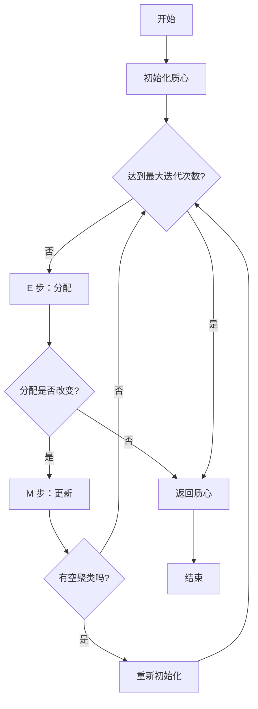

# K-Means 聚类算法

K-Means 是一种基础的无监督机器学习算法，用于根据相似性将数据点分组到聚类中。在 ZYX 中，K-Means 专门用于训练乘积量化（Product Quantization，PQ）码本，这对于高效的向量相似性搜索和压缩至关重要。

## 概述

K-Means 将 n 个数据点集合划分为 k 个聚类，其中每个数据点都属于具有最近均值（质心）的聚类。该算法通过迭代优化聚类分配，以最小化簇内平方和（WCSS），也称为惯性。

### 关键特性

- **划分聚类**：将数据划分为不重叠的聚类
- **基于质心**：每个聚类由其均值点表示
- **迭代优化**：通过 EM 算法收敛到局部最小值
- **L2 距离**：使用平方欧几里得距离作为相似性度量

## 数学基础

### 目标函数

K-Means 优化以下目标函数：

```
J = Σ(i=1 to n) Σ(j=1 to k) ||x_i - μ_j||²
```

其中：
- `J` = 目标函数（簇内平方和）
- `n` = 数据点数量
- `k` = 聚类数量
- `x_i` = 第 i 个数据点
- `μ_j` = 聚类 j 的质心
- `||·||` = L2 范数（欧几里得距离）

### 收敛性质

- **单调收敛**：目标函数永不增加
- **局部最小值**：收敛到局部而非全局最优
- **有限收敛**：保证在有限迭代内收敛
- **线性收敛**：通常在 O(log n) 次迭代内收敛

## 算法步骤

K-Means 算法遵循迭代的期望最大化（EM）方法：

### 1. 初始化

从数据中选择初始质心：

```cpp
std::vector centroids(k, std::vector<float>(dim));
std::mt19937 rng(42);  // 固定种子以保证可重复性
std::uniform_int_distribution<size_t> dist(0, n - 1);

for (size_t i = 0; i < k; ++i) {
    centroids[i] = data[dist(rng)];  // 随机选择
}
```

### 2. E 步（期望）

将每个点分配到最近的质心：

```cpp
for (size_t i = 0; i < n; ++i) {
    float min_dist = std::numeric_limits<float>::max();
    int best_c = 0;

    for (size_t c = 0; c < k; ++c) {
        float dist_val = VectorMetric::computeL2Sqr(
            data[i].data(),
            centroids[c].data(),
            dim
        );

        if (dist_val < min_dist) {
            min_dist = dist_val;
            best_c = c;
        }
    }
    assignment[i] = best_c;
}
```

### 3. M 步（最大化）

更新质心为分配点的均值：

```cpp
for (size_t c = 0; c < k; ++c) {
    if (counts[c] > 0) {
        float inv_count = 1.0f / static_cast<float>(counts[c]);
        for (size_t d = 0; d < dim; ++d) {
            centroids[c][d] = sums[c][d] * inv_count;
        }
    } else {
        // 重新初始化空聚类
        centroids[c] = data[dist(rng)];
    }
}
```

### 4. 收敛检查

当分配不再变化或达到最大迭代次数时停止：

```cpp
if (!changed) {
    break;  // 已收敛
}
```

## 算法流程图



**K-Means 算法流程：**
- 初始化：从数据中随机选择 k 个质心
- E 步：将每个点分配到最近的质心
- M 步：重新计算质心为分配点的均值
- 检查收敛或达到最大迭代次数
- 通过重新初始化处理空聚类

## 质心初始化策略

### 随机初始化（默认）

选择 k 个随机数据点作为初始质心：

```cpp
std::uniform_int_distribution<size_t> dist(0, n - 1);
for (size_t i = 0; i < k; ++i) {
    centroids[i] = data[dist(rng)];
}
```

**优点**：简单、快速
**缺点**：初始化不当可能导致收敛缓慢或次优结果

### K-Means++ 初始化

概率性地选择质心使其相距较远：

```cpp
// 第一个质心：随机选择
centroids[0] = data[dist(rng)];

// 后续质心：概率与距离成正比
for (size_t i = 1; i < k; ++i) {
    std::vector<float> distances(n);
    float total_dist = 0.0f;

    // 计算到最近质心的距离
    for (size_t j = 0; j < n; ++j) {
        float min_dist = std::numeric_limits<float>::max();
        for (size_t c = 0; c < i; ++c) {
            float d = VectorMetric::computeL2Sqr(
                data[j].data(), centroids[c].data(), dim
            );
            min_dist = std::min(min_dist, d);
        }
        distances[j] = min_dist;
        total_dist += min_dist;
    }

    // 按与距离平方成正比的概率选择
    std::uniform_real_distribution<float> prob_dist(0, total_dist);
    float threshold = prob_dist(rng);
    float cumulative = 0.0f;

    for (size_t j = 0; j < n; ++j) {
        cumulative += distances[j];
        if (cumulative >= threshold) {
            centroids[i] = data[j];
            break;
        }
    }
}
```

**优点**：初始质心分布更好，收敛更快
**缺点**：初始化开销更大

## 处理空聚类

当聚类变为空（没有分配的点）时，有几种策略：

### 1. 重新初始化策略（ZYX 使用）

```cpp
if (counts[c] == 0) {
    centroids[c] = data[dist(rng)];  // 新的随机点
}
```

### 2. 分割最大聚类

从最大的聚类移动一个点到空聚类。

### 3. 忽略空聚类

减少有效聚类数量（不推荐）。

## 完整实现

ZYX 中使用的完整 K-Means 实现：

```cpp
#include <limits>
#include <random>
#include <vector>
#include "graph/vector/core/VectorMetric.hpp"

namespace graph::vector {
    class KMeans {
    public:
        static std::vector<std::vector<float>> run(
            const std::vector<std::vector<float>>& data,
            size_t k,
            size_t max_iter = 15
        ) {
            if (data.empty())
                return {};

            size_t dim = data[0].size();
            size_t n = data.size();

            // 初始化质心
            std::vector centroids(k, std::vector<float>(dim));
            std::vector<int> assignment(n);
            std::mt19937 rng(42);  // 固定种子以保证可重复性
            std::uniform_int_distribution<size_t> dist(0, n - 1);

            for (size_t i = 0; i < k; ++i) {
                centroids[i] = data[dist(rng)];
            }

            // 主迭代循环
            for (size_t it = 0; it < max_iter; ++it) {
                bool changed = false;
                std::vector sums(k, std::vector(dim, 0.0f));
                std::vector<size_t> counts(k, 0);

                // E 步：将点分配到最近的质心
                for (size_t i = 0; i < n; ++i) {
                    float min_dist = std::numeric_limits<float>::max();
                    int best_c = 0;

                    for (size_t c = 0; c < k; ++c) {
                        float dist_val = VectorMetric::computeL2Sqr(
                            data[i].data(),
                            centroids[c].data(),
                            dim
                        );

                        if (dist_val < min_dist) {
                            min_dist = dist_val;
                            best_c = c;
                        }
                    }

                    if (assignment[i] != best_c)
                        changed = true;
                    assignment[i] = best_c;

                    // 为 M 步累加
                    for (size_t d = 0; d < dim; ++d)
                        sums[best_c][d] += data[i][d];
                    counts[best_c]++;
                }

                // 检查收敛
                if (!changed)
                    break;

                // M 步：更新质心
                for (size_t c = 0; c < k; ++c) {
                    if (counts[c] > 0) {
                        float inv_count = 1.0f / static_cast<float>(counts[c]);
                        for (size_t d = 0; d < dim; ++d)
                            centroids[c][d] = sums[c][d] * inv_count;
                    } else {
                        // 重新初始化空聚类
                        centroids[c] = data[dist(rng)];
                    }
                }
            }

            return centroids;
        }
    };
} // namespace graph::vector
```

## 时间和空间复杂度

### 时间复杂度

**每次迭代：**
- 分配步骤：O(n × k × d)
  - n 个数据点
  - k 个质心
  - d 维度
- 更新步骤：O(n × d)
- **每次迭代总计**：O(n × k × d)

**总体：**
- **最坏情况**：O(n × k × d × I)
  - I = 迭代次数（通常 10-50）
- **平均情况**：O(n × k × d × log I)
- **典型情况**：O(n × k × d × 15) [默认最大迭代次数]

### 空间复杂度

- **质心**：O(k × d)
- **分配**：O(n)
- **累加器**：O(k × d)
- **总计**：O(k × d + n)

### 复杂度比较

| 组件 | 空间 | 时间（每次迭代） |
|------|------|-----------------|
| 质心 | O(k×d) | - |
| 分配 | O(n) | - |
| E 步 | - | O(n×k×d) |
| M 步 | - | O(n×d) |
| **总计** | **O(n + k×d)** | **O(n×k×d)** |

## 与乘积量化的集成

K-Means 用于训练乘积量化中的码本：

### 码本训练过程

```cpp
// 将向量分割为子向量
size_t num_subspaces = 8;
size_t sub_dim = dim / num_subspaces;

// 为每个子空间训练码本
for (size_t s = 0; s < num_subspaces; ++s) {
    // 提取子向量
    std::vector<std::vector<float>> sub_data(n, std::vector<float>(sub_dim));
    for (size_t i = 0; i < n; ++i) {
        std::copy(
            data[i].begin() + s * sub_dim,
            data[i].begin() + (s + 1) * sub_dim,
            sub_data[i].begin()
        );
    }

    // 运行 K-Means 获得码本
    size_t k = 256;  // 256 个码字（8 位）
    auto codebook = KMeans::run(sub_data, k);

    // 存储该子空间的码本
    codebooks[s] = codebook;
}
```

### PQ 编码

每个向量被编码为码字索引序列：

```cpp
std::vector<uint8_t> encode(const std::vector<float>& vec) {
    std::vector<uint8_t> codes(num_subspaces);

    for (size_t s = 0; s < num_subspaces; ++s) {
        // 在子空间中找到最近的码字
        float min_dist = std::numeric_limits<float>::max();
        uint8_t best_code = 0;

        for (size_t k = 0; k < 256; ++k) {
            float dist = VectorMetric::computeL2Sqr(
                vec.data() + s * sub_dim,
                codebooks[s][k].data(),
                sub_dim
            );

            if (dist < min_dist) {
                min_dist = dist;
                best_code = static_cast<uint8_t>(k);
            }
        }

        codes[s] = best_code;
    }

    return codes;
}
```

## L2 距离计算

K-Means 使用 L2 平方距离以提高效率：

```cpp
static float computeL2Sqr(const float* a, const float* b, size_t dim) {
    float sum = 0.0f;
    size_t i = 0;

    // 4 路展开以实现向量化
    for (; i + 4 <= dim; i += 4) {
        float d0 = a[i] - b[i];
        float d1 = a[i + 1] - b[i + 1];
        float d2 = a[i + 2] - b[i + 2];
        float d3 = a[i + 3] - b[i + 3];

        sum += d0 * d0 + d1 * d1 + d2 * d2 + d3 * d3;
    }

    // 处理剩余元素
    for (; i < dim; ++i) {
        float d = a[i] - b[i];
        sum += d * d;
    }

    return sum;
}
```

**为什么使用平方距离？**
- 避免昂贵的 sqrt 操作
- 保持顺序（相同的 argmin）
- 更快的计算
- 足以用于比较

## 配置参数

### 关键参数

| 参数 | 默认值 | 范围 | 描述 |
|------|--------|------|------|
| `k` | 必需 | 2-√n | 聚类数量 |
| `max_iter` | 15 | 1-1000 | 最大迭代次数 |
| `seed` | 42 | 任意 | 初始化的随机种子 |

### 参数选择指南

**选择 k：**
- 对于 PQ：k = 256（8 位码）
- 对于压缩：k = 16-128
- 肘部法则：绘制 WCSS 与 k 的关系图
- 轮廓分析：测量聚类质量

**选择 max_iter：**
- 默认 15 适用于大多数情况
- 对于高维数据增加
- 为了更快训练减少
- 监控收敛率

## 性能优化

### 使用的优化技术

1. **固定种子**：确定性初始化以保证可重复性
2. **循环展开**：距离计算中的 4 路展开
3. **累加**：M 步中的高效求和计算
4. **早期收敛**：当分配稳定时停止

### 内存效率

- **就地更新**：质心更新无需分配
- **连续存储**：向量的向量以提高缓存局部性
- **最小开销**：仅必要的数据结构

### 并行化机会

```cpp
// 并行 E 步（未来增强）
#pragma omp parallel for
for (size_t i = 0; i < n; ++i) {
    // 分配计算
}

// 并行距离计算
for (size_t c = 0; c < k; ++c) {
    #pragma omp parallel for
    for (size_t i = 0; i < n; ++i) {
        // 到质心 c 的距离
    }
}
```

## 在 ZYX 中的应用

### 1. 乘积量化训练

训练向量压缩的码本：

```cpp
// 训练 PQ 码本
auto codebooks = trainPQCodebooks(vectors, num_subspaces=8, k=256);
```

### 2. 向量聚类

将相似向量分组用于分析：

```cpp
auto clusters = KMeans::run(vectors, k=10);
```

### 3. 数据压缩

通过量化减少存储：

```cpp
auto compressed = encodeWithPQ(vectors, codebooks);
```

## 优缺点

### 优点

- **简单**：易于理解和实现
- **高效**：随数据规模线性扩展
- **有效**：适用于许多应用
- **快速收敛**：通常 10-20 次迭代

### 缺点

- **局部最优**：对初始化敏感
- **固定 k**：需要知道聚类数量
- **球形聚类**：假设各向同性聚类
- **离群值敏感**：均值对离群值敏感

## 最佳实践

1. **归一化**：将特征缩放到相似范围
2. **初始化**：使用 K-Means++ 获得更好的结果
3. **多次运行**：尝试不同的初始化
4. **收敛**：监控目标函数
5. **空聚类**：适当处理
6. **离群值**：考虑预处理或鲁棒变体

## 相关内容

- [乘积量化](/zh/algorithms/product-quantization) - 使用 K-Means 的向量压缩
- [向量度量](/zh/algorithms/vector-metrics) - 距离计算细节
- [DiskANN](/zh/algorithms/diskann) - 基于图的向量搜索算法
