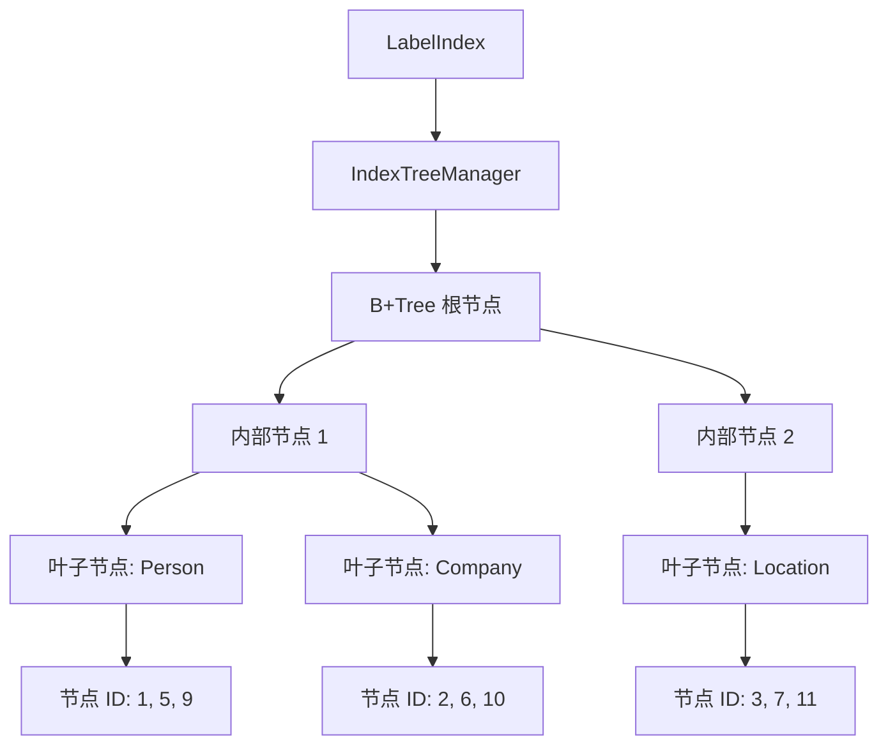
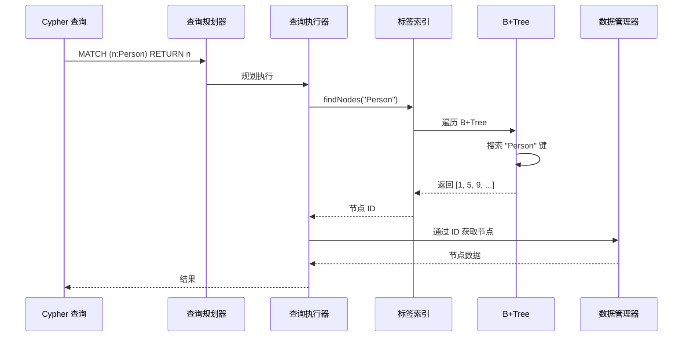

# 标签索引

Metrix 使用基于 B+Tree 结构的高性能标签索引，实现节点标签到节点 ID 的高效映射。这为 Cypher 查询如 `MATCH (n:Person) RETURN n` 提供了快速的标签过滤能力。

## 概述

标签索引提供以下功能：

- **基于 B+Tree 的索引**：使用 B+Tree 结构实现高效的标签 → 节点 ID 映射
- **多标签支持**：节点可以同时拥有多个被索引的标签
- **批量操作**：优化的批量插入，用于高效构建索引
- **并发访问**：使用共享互斥锁实现线程安全操作
- **状态持久化**：跨重启自动持久化索引状态
- **动态启用/禁用**：运行时索引管理，不丢失数据

## 架构

### 标签索引结构



### 查询流程



## 实现

### 类定义

```cpp
class LabelIndex {
public:
    LabelIndex(std::shared_ptr<storage::DataManager> dataManager,
               std::shared_ptr<storage::state::SystemStateManager> systemStateManager,
               uint32_t indexType,
               std::string stateKey);

    // 核心操作
    void addNode(int64_t nodeId, const std::string &label);
    void addNodesBatch(const std::unordered_map<std::string, std::vector<int64_t>> &nodesByLabel);
    void removeNode(int64_t nodeId, const std::string &label);
    std::vector<int64_t> findNodes(const std::string &label) const;
    bool hasLabel(int64_t entityId, const std::string &label) const;

    // 生命周期管理
    void initialize();
    void createIndex();
    void clear();
    void drop();
    void flush() const;
    void saveState() const;

    // 状态查询
    bool isEmpty() const;
    bool isEnabled() const;
    bool hasPhysicalData() const;

private:
    std::shared_ptr<storage::DataManager> dataManager_;
    std::shared_ptr<storage::state::SystemStateManager> systemStateManager_;
    std::shared_ptr<IndexTreeManager> treeManager_;
    mutable std::shared_mutex mutex_;
    int64_t rootId_ = 0;
    bool enabled_ = false;
    const std::string stateKey_;
};
```

## 核心操作

### 初始化

标签索引在启动时从持久化状态初始化：

```cpp
void LabelIndex::initialize() {
    std::unique_lock lock(mutex_);

    // 1. 从持久化状态加载根 ID
    rootId_ = systemStateManager_->get<int64_t>(
        stateKey_,
        storage::state::keys::Fields::ROOT_ID,
        0
    );

    // 2. 加载启用配置
    std::string configKey = stateKey_ + storage::state::keys::SUFFIX_CONFIG;
    enabled_ = systemStateManager_->get<bool>(
        configKey,
        storage::state::keys::Fields::ENABLED,
        false
    );

    // 回退：如果有物理数据，强制启用
    if (!enabled_ && rootId_ != 0) {
        enabled_ = true;
    }
}
```

**关键点**：
- 根 ID 保存在系统状态中
- 启用标志控制索引是否活跃
- 物理数据（rootId_ != 0）强制启用以防止数据漂移

### 添加节点

将单个节点添加到标签索引：

```cpp
void LabelIndex::addNode(int64_t entityId, const std::string &label) {
    std::unique_lock lock(mutex_);

    // 如需要，初始化 B+Tree
    if (rootId_ == 0) {
        rootId_ = treeManager_->initialize();
    }

    // 插入 B+Tree（标签 → 节点 ID 映射）
    int64_t newRootId = treeManager_->insert(rootId_, label, entityId);

    // 如果树发生分裂，更新根节点
    if (newRootId != rootId_) {
        rootId_ = newRootId;
    }
}
```

**特性**：
- **时间复杂度**：O(log n)，其中 n 是唯一标签的数量
- **空间复杂度**：O(1) 摊销（B+Tree 增长）
- **并发性**：独占锁确保线程安全

### 批量添加节点

优化的批量插入多个节点：

```cpp
void LabelIndex::addNodesBatch(
    const std::unordered_map<std::string, std::vector<int64_t>> &nodesByLabel
) {
    // 整个批次只获取一次锁
    std::unique_lock lock(mutex_);

    if (rootId_ == 0) {
        rootId_ = treeManager_->initialize();
    }

    // 处理每个标签组
    for (const auto &[label, entityIds]: nodesByLabel) {
        if (entityIds.empty())
            continue;

        // 准备批量条目
        std::vector<std::pair<PropertyValue, int64_t>> batchEntries;
        batchEntries.reserve(entityIds.size());

        for (int64_t id: entityIds) {
            batchEntries.emplace_back(PropertyValue(label), id);
        }

        // 执行批量插入
        int64_t newRootId = treeManager_->insertBatch(rootId_, batchEntries);

        if (newRootId != rootId_) {
            rootId_ = newRootId;
        }
    }
}
```

**优化**：
- **单次锁获取**：相比单独插入减少争用
- **批量准备**：最小化内存分配
- **按标签分组**：优化 B+Tree 结构

**性能**：
- **吞吐量**：大批量操作比单独插入快约 10 倍
- **使用场景**：数据库启动或批量导入期间的索引构建

### 移除节点

从标签索引中移除节点：

```cpp
void LabelIndex::removeNode(int64_t entityId, const std::string &label) {
    std::unique_lock lock(mutex_);

    if (rootId_ == 0) {
        return;
    }

    // 从 B+Tree 移除
    bool success = treeManager_->remove(rootId_, label, entityId);

    // 注意：下溢处理在 IndexTreeManager 中自动完成
    (void) success;
}
```

**特性**：
- **时间复杂度**：O(log n)
- **自动重平衡**：B+Tree 通过合并/重分发处理下溢

### 查找节点

检索具有特定标签的所有节点：

```cpp
std::vector<int64_t> LabelIndex::findNodes(const std::string &label) const {
    std::shared_lock lock(mutex_);

    if (rootId_ == 0) {
        return {};
    }

    return treeManager_->find(rootId_, label);
}
```

**特性**：
- **时间复杂度**：O(log n + k)，其中 k 是具有该标签的节点数
- **并发性**：共享锁允许并发读取
- **返回**：节点 ID 向量（标签不存在时为空）

### 检查标签

检查特定节点是否有标签：

```cpp
bool LabelIndex::hasLabel(int64_t entityId, const std::string &label) const {
    std::shared_lock lock(mutex_);

    if (rootId_ == 0) {
        return false;
    }

    auto nodes = treeManager_->find(rootId_, label);
    return std::ranges::find(nodes, entityId) != nodes.end();
}
```

**使用场景**：快速标签存在性检查，无需获取所有节点

## 索引生命周期

### 创建索引

显式启用标签索引：

```cpp
void LabelIndex::createIndex() {
    std::unique_lock lock(mutex_);
    enabled_ = true;

    // 持久化启用状态
    std::string configKey = stateKey_ + storage::state::keys::SUFFIX_CONFIG;
    systemStateManager_->set<bool>(
        configKey,
        storage::state::keys::Fields::ENABLED,
        true
    );
}
```

**行为**：
- 设置启用标志为 true
- 将配置持久化到系统状态
- 后续重启将加载索引为已启用状态

### 清除索引

移除所有索引数据，同时保持启用状态：

```cpp
void LabelIndex::clear() {
    std::unique_lock lock(mutex_);
    if (rootId_ != 0) {
        treeManager_->clear(rootId_);
        rootId_ = 0;
    }
}
```

**使用场景**：索引重建或重新索引场景

### 删除索引

完全删除索引：

```cpp
void LabelIndex::drop() {
    clear();  // 移除所有数据

    std::unique_lock lock(mutex_);
    enabled_ = false;

    // 移除配置键
    std::string configKey = stateKey_ + storage::state::keys::SUFFIX_CONFIG;
    systemStateManager_->remove(configKey);
    systemStateManager_->remove(stateKey_);
}
```

**行为**：
- 清除所有索引数据
- 禁用索引
- 移除持久化状态
- 恢复"干净"状态（就像索引从未存在过）

### 保存状态

将索引状态持久化到磁盘：

```cpp
void LabelIndex::saveState() const {
    std::shared_lock lock(mutex_);

    // 如果数据存在，保存根 ID
    if (rootId_ != 0) {
        systemStateManager_->set<int64_t>(
            stateKey_,
            storage::state::keys::Fields::ROOT_ID,
            rootId_
        );
    }

    // 保存启用配置（仅当为 true 时）
    if (enabled_) {
        std::string configKey = stateKey_ + storage::state::keys::SUFFIX_CONFIG;
        systemStateManager_->set<bool>(
            configKey,
            storage::state::keys::Fields::ENABLED,
            true
        );
    }
}
```

**持久化策略**：
- 仅持久化非零值（稀疏状态）
- Enabled = false 是隐式的（不存储）
- 最小化状态存储开销

## B+Tree 集成

### IndexTreeManager

标签索引将 B+Tree 操作委托给 `IndexTreeManager`：

```cpp
class IndexTreeManager {
public:
    // 初始化 B+Tree
    int64_t initialize() const;

    // 插入操作
    int64_t insert(int64_t rootId, const PropertyValue &key, int64_t value);
    int64_t insertBatch(int64_t rootId,
                       const std::vector<std::pair<PropertyValue, int64_t>> &entries);

    // 移除操作
    bool remove(int64_t &rootId, const PropertyValue &key, int64_t value);

    // 查询操作
    std::vector<int64_t> find(int64_t rootId, const PropertyValue &key) const;

    // 树管理
    void clear(int64_t rootId) const;
    int64_t findLeafNode(int64_t rootId, const PropertyValue &key) const;

private:
    std::shared_ptr<storage::DataManager> dataManager_;
    mutable std::shared_mutex mutex_;
    uint32_t indexType_;
    PropertyType keyDataType_;
    std::function<bool(const PropertyValue &, const PropertyValue &)> keyComparator_;
};
```

### 关键特性

1. **重复键支持**：多个节点 ID 可以共享同一个标签
2. **自动重平衡**：分裂/合并操作保持平衡
3. **Blob 存储**：大型键/值列表外部存储
4. **类型安全**：标签使用字符串键，节点 ID 使用 int64_t 值

## 并发控制

### 共享互斥锁

标签索引使用 `std::shared_mutex` 实现并发访问：

```cpp
mutable std::shared_mutex mutex_;
```

**锁类型**：
- **共享锁**（`std::shared_lock`）：允许并发读取
- **独占锁**（`std::unique_lock`）：写入需要独占访问

**锁策略**：
- 读操作（`findNodes`、`hasLabel`）：共享锁
- 写操作（`addNode`、`removeNode`）：独占锁
- 状态查询（`isEmpty`、`isEnabled`）：共享锁

### 性能影响

- **高读并发**：多个线程可以同时查询
- **写序列化**：同一时间只有一个写入者
- **无读写饥饿**：公平调度

## 多标签支持

节点可以同时拥有多个被索引的标签：

```cpp
// 具有多个标签的节点
labelIndex.addNode(1, "Person");
labelIndex.addNode(1, "Employee");
labelIndex.addNode(1, "Manager");

// 通过任何标签查询
auto persons = labelIndex.findNodes("Person");    // 返回 [1, ...]
auto employees = labelIndex.findNodes("Employee"); // 返回 [1, ...]
auto managers = labelIndex.findNodes("Manager");   // 返回 [1, ...]
```

**特性**：
- 每个标签 → 节点 ID 映射是独立的
- 从一个标签移除节点不影响其他标签
- B+Tree 结构自然支持多值键

## 与 Cypher 查询的集成

### 查询规划

查询规划器使用标签索引进行优化：

```cypher
-- 带标签过滤的查询
MATCH (n:Person) RETURN n;

-- 规划器优化
1. 检查 "Person" 的标签索引是否存在
2. 如果存在：使用 LabelIndex.findNodes("Person")
3. 如果不存在：全节点扫描 + 标签过滤
```

### 查询执行

```cpp
// 查询执行的伪代码
std::vector<Node> executeLabelScan(const std::string &label) {
    // 如果可用，使用标签索引
    if (indexManager->hasLabelIndex("Node")) {
        auto nodeIds = labelIndex.findNodes(label);
        return fetchNodesByIds(nodeIds);
    }

    // 回退到全扫描
    return fullScanWithLabelFilter(label);
}
```

**性能比较**：
- **有索引**：O(log n + k)，其中 k = 具有该标签的节点数
- **无索引**：O(N)，其中 N = 总节点数

## 性能特征

### 时间复杂度

| 操作 | 平均情况 | 最坏情况 |
|------|---------|---------|
| addNode | O(log n) | O(log n) |
| addNodesBatch | O(m log n) | O(m log n) |
| removeNode | O(log n) | O(log n) |
| findNodes | O(log n + k) | O(log n + k) |
| hasLabel | O(log n + k) | O(log n + k) |

其中：
- n = 唯一标签的数量
- m = 批次中的节点数
- k = 具有指定标签的节点数

### 空间复杂度

| 组件 | 空间 | 描述 |
|------|------|------|
| B+Tree 节点 | O(n × b) | n 个标签，b = 分支因子 |
| 叶子条目 | O(N) | 所有节点 ID 引用 |
| 状态元数据 | O(1) | 根 ID + 启用标志 |

总计：**O(N)**，其中 N = 节点-标签关联的总数

### 内存开销

```
对于 100 万个节点，每个节点有 2 个标签：

B+Tree 结构：
- 内部节点：约 100 个节点 × 256 字节 = 25.6 KB
- 叶子节点：约 500 个节点 × 256 字节 = 128 KB
- 节点 ID 引用：200 万 × 8 字节 = 16 MB

总索引大小：约 16.15 MB
每个节点-标签的开销：约 8 字节

状态存储：
- 根 ID：8 字节
- 启用标志：1 字节（如果为 true）
```

## 使用示例

### 基本操作

```cpp
// 创建标签索引
LabelIndex labelIndex(dataManager, systemStateManager,
                      IndexTypes::NODE_LABEL_TYPE,
                      StateKeys::NODE_LABEL_ROOT);

// 添加带标签的节点
labelIndex.addNode(1, "Person");
labelIndex.addNode(2, "Company");
labelIndex.addNode(3, "Person");

// 查找具有某个标签的所有节点
auto persons = labelIndex.findNodes("Person");     // [1, 3]
auto companies = labelIndex.findNodes("Company");  // [2]

// 检查节点是否有标签
bool isPerson = labelIndex.hasLabel(1, "Person");   // true
bool isCompany = labelIndex.hasLabel(1, "Company"); // false

// 从标签中移除节点
labelIndex.removeNode(1, "Person");
```

### 批量导入

```cpp
// 批量导入以提高性能
std::unordered_map<std::string, std::vector<int64_t>> nodesByLabel;

nodesByLabel["Person"] = {1, 2, 3, 4, 5};
nodesByLabel["Company"] = {10, 20, 30, 40, 50};
nodesByLabel["Location"] = {100, 200, 300};

// 单个高效操作
labelIndex.addNodesBatch(nodesByLabel);
```

### 索引管理

```cpp
// 创建（启用）索引
labelIndex.createIndex();

// 检查状态
if (labelIndex.isEnabled()) {
    std::cout << "索引已激活" << std::endl;
}

// 重建索引
labelIndex.clear();
// ... 使用当前数据重新填充 ...

// 完全删除索引
labelIndex.drop();

// 持久化状态
labelIndex.flush();
```

## 最佳实践

1. **提前启用**：在添加数据之前创建标签索引以获得最佳性能
2. **批量导入**：对批量操作使用 `addNodesBatch`
3. **监控状态**：检查 `isEnabled()` 和 `hasPhysicalData()` 状态
4. **定期持久化**：在关键操作后调用 `flush()`
5. **清理**：当不再需要索引时使用 `drop()`

## 限制

1. **无部分匹配**：标签必须完全匹配（无通配符）
2. **无范围查询**：标签是分类的，不是有序的
3. **内存受限**：整个索引结构必须适合内存
4. **写序列化**：同时只能有一个并发写入者

## 未来增强

标签索引的潜在改进：

1. **压缩标签**：常见标签的字典编码
2. **标签统计**：跟踪标签频率以进行查询优化
3. **混合索引**：与属性索引结合用于复合查询
4. **增量更新**：优化增量标签更改
5. **分布式索引**：跨多个节点分片标签

## 参见

- [B+Tree 索引](/zh/algorithms/btree-indexing) - B+Tree 结构详情
- [属性索引](/zh/algorithms/property-index) - 基于属性的索引
- [查询优化](/zh/algorithms/query-optimization) - 索引在查询中的使用
- [存储系统](/zh/architecture/storage) - 整体存储架构
