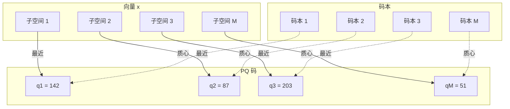
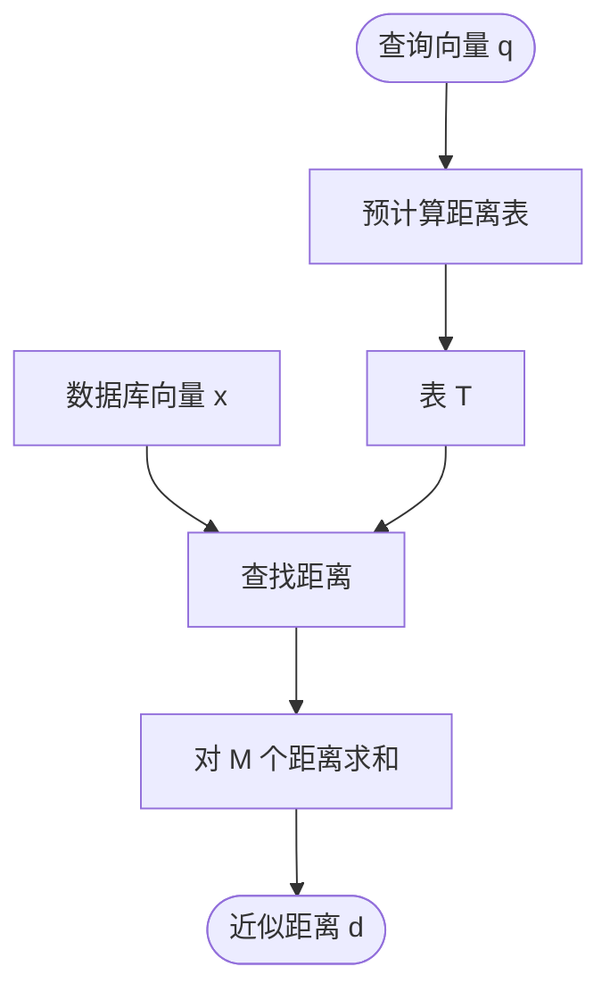

# 乘积量化

乘积量化（Product Quantization，PQ）是一种强大的向量压缩技术，能够在高维空间中实现高效的近似最近邻搜索。ZYX 使用 PQ 来大幅减少向量相似性搜索操作中的内存占用并加速距离计算。

## 概述

乘积量化通过将高维向量分解为低维子空间，并对每个子空间独立量化来实现压缩。这种方法实现了：

- **巨大的内存节省**：相比原始向量实现 8-32 倍的压缩比
- **快速距离计算**：使用查找表的非对称距离计算（ADC）
- **高精度**：以最小的质量损失保留最近邻关系
- **可扩展性**：能够在有限的内存中搜索数十亿向量

### 主要优势

- **内存效率**：768 维向量从 3KB 压缩到约 100 字节
- **搜索速度**：距离计算从 O(dim) 降低到 O(numSubspaces)
- **DiskANN 集成**：与基于图的 ANN 搜索无缝集成
- **零拷贝操作**：高效的内存布局，支持缓存友好访问

## 数学基础

### 量化问题

给定高维向量空间 R^D，乘积量化将其分解为 M 个子空间：

```
R^D = R^D1 × R^D2 × ... × R^DM
```

其中：
- D = 总维度（例如嵌入向量为 768）
- M = 子空间数量（例如 96）
- Di = 子空间 i 的维度（D/M，例如 8）
- D = Σ Di（所有子空间维度之和）

### 码本训练

对于每个子空间 m ∈ [1, M]，我们训练包含 K 个质心的码本 Cm：

```
Cm = {c_m1, c_m2, ..., c_mK}
```

其中：
- K = 每个子空间的质心数量（通常为 256 = 2^8）
- c_mi ∈ R^Di（第 m 个子空间中的第 i 个质心）

训练使用训练数据上的 K-Means 聚类：

```cpp
void train(const std::vector<std::vector<float>>& trainingData) {
    codebooks_.resize(numSubspaces_);

    for (size_t m = 0; m < numSubspaces_; ++m) {
        std::vector<std::vector<float>> subData;
        subData.reserve(trainingData.size());

        size_t offset = m * subDim_;

        // 提取此子空间的子向量
        for (const auto& vec : trainingData) {
            std::vector<float> sub(
                vec.begin() + offset,
                vec.begin() + offset + subDim_
            );
            subData.push_back(std::move(sub));
        }

        // 在此子空间上训练 K-Means
        codebooks_[m] = KMeans::run(subData, numCentroids_);
    }
    isTrained_ = true;
}
```

### 编码

向量 x ∈ R^D 通过在每个子空间中找到最近的质心来编码为 PQ 码：

```
encode(x) = [q_1, q_2, ..., q_M]
```

其中 q_m ∈ [0, K-1] 是子空间 m 中最近质心的索引：

```
q_m = argmin_i ||x_m - c_mi||²
```

这里 x_m 是对应于子空间 m 的 x 的子向量：

```cpp
std::vector<uint8_t> encode(const std::vector<float>& vec) const {
    std::vector<uint8_t> codes(numSubspaces_);

    for (size_t m = 0; m < numSubspaces_; ++m) {
        size_t offset = m * subDim_;
        float min_dist = std::numeric_limits<float>::max();
        uint8_t best_idx = 0;

        const float* subVecPtr = vec.data() + offset;

        // 在此子空间中找到最近的质心
        for (size_t c = 0; c < numCentroids_; ++c) {
            float dist = VectorMetric::computeL2Sqr(
                subVecPtr,
                codebooks_[m][c].data(),
                subDim_
            );

            if (dist < min_dist) {
                min_dist = dist;
                best_idx = static_cast<uint8_t>(c);
            }
        }
        codes[m] = best_idx;
    }
    return codes;
}
```

### 解码

解码从 PQ 码重构近似向量：

```cpp
std::vector<float> decode(const std::vector<uint8_t>& codes) const {
    std::vector<float> reconstructed(dim_);

    for (size_t m = 0; m < numSubspaces_; ++m) {
        size_t offset = m * subDim_;
        const auto& centroid = codebooks_[m][codes[m]];

        // 将质心值复制到重构向量
        std::copy(centroid.begin(), centroid.end(),
                  reconstructed.begin() + offset);
    }

    return reconstructed;
}
```

重构向量 x̂ 为：

```
x̂ = [c_1,q_1, c_2,q_2, ..., c_M,q_M]
```

### 量化误差

向量 x 的量化误差为：

```
||x - x̂||² = Σ ||x_m - c_m,q_m||²
```

此误差由每个子空间中的簇内方差界定。

## 架构

### 码本结构



**码本结构：**
- 每个码本：256 × 8 浮点数（256 个码字，每个 8 维）
- 向量：总共 768 维
- 子空间：M 个子空间，每个 8 维
- PQ 码：96 字节（每个子空间 1 字节）

### 内存布局

对于 D = 768 维，M = 96 个子空间（Di = 8）：

| 组件 | 内存 | 公式 | 示例 |
|-----------|--------|---------|---------|
| 原始向量 (FP32) | 3072 字节 | D × 4 | 768 × 4 = 3072 |
| 原始向量 (BF16) | 1536 字节 | D × 2 | 768 × 2 = 1536 |
| PQ 码 | 96 字节 | M × 1 | 96 × 1 = 96 |
| 码本 | 786,432 字节 | M × K × Di × 4 | 96 × 256 × 8 × 4 |

**压缩比**：1536 / 96 = BF16 向量 **16×**

**摊销成本**：对于 n 个向量，每个向量的码本开销 = 786,432 / n

对于 n = 1,000,000 个向量：
- BF16 总计：1,536,000,000 字节（~1.5 GB）
- PQ 总计：96,000,000 + 786,432 = 96,786,432 字节（~97 MB）
- **节省**：~1.4 GB

## 距离计算

### 非对称距离计算（ADC）

ADC 在不需要完全解码的情况下计算查询向量与 PQ 编码的数据库向量之间的近似距离。

#### 距离表预计算

对于查询向量 q，预计算到所有子空间中所有质心的距离：

```cpp
std::vector<float> computeDistanceTable(
    const std::vector<float>& query
) const {
    std::vector<float> table(numSubspaces_ * numCentroids_);

    for (size_t m = 0; m < numSubspaces_; ++m) {
        size_t offset = m * subDim_;
        const float* querySubPtr = query.data() + offset;

        for (size_t c = 0; c < numCentroids_; ++c) {
            float dist = VectorMetric::computeL2Sqr(
                querySubPtr,
                codebooks_[m][c].data(),
                subDim_
            );
            table[m * numCentroids_ + c] = dist;
        }
    }
    return table;
}
```

这创建了大小为 M × K 的距离表 T：

```
T[m][i] = ||q_m - c_mi||²
```

对于 M = 96，K = 256：表大小 = 96 × 256 × 4 = **98,304 字节**（~96 KB）

#### 快速距离查找

给定数据库向量 x 的 PQ 码，计算近似距离：

```
d(q, x) ≈ Σ T[m][codes[m]]
```

```cpp
static float computeDistance(
    const std::vector<uint8_t>& codes,
    const std::vector<float>& distTable,
    size_t numSubspaces,
    size_t numCentroids = 256
) {
    float dist = 0.0f;
    size_t m = 0;
    size_t stride = numCentroids;

    // 手动循环展开以提高流水线效率
    for (; m + 3 < numSubspaces; m += 4) {
        dist += distTable[(m + 0) * stride + codes[m + 0]];
        dist += distTable[(m + 1) * stride + codes[m + 1]];
        dist += distTable[(m + 2) * stride + codes[m + 2]];
        dist += distTable[(m + 3) * stride + codes[m + 3]];
    }
    for (; m < numSubspaces; ++m) {
        dist += distTable[m * stride + codes[m]];
    }
    return dist;
}
```

### 距离计算流程



**距离计算：**
- 表 T：M × K 个条目（对于 M=96、K=256 约 96 KB）
- 对于每个数据库向量：d = Σ T[m, codes[m]]
- 复杂度：表预计算后每个向量 O(M)

### 复杂度分析

| 操作 | 原始计算 | PQ with ADC | 加速比 |
|-----------|----------------|-------------|---------|
| 单次距离 | O(D) | O(M) | D/M |
| 距离表 | - | O(M × K × Di) | - |
| 1000 次距离 | O(1000 × D) | O(M × K × Di + 1000 × M) | ~D/M |

对于 D = 768，M = 96，K = 256，Di = 8：
- 原始：1000 × 768 = 768,000 次操作
- PQ：96 × 256 × 8 + 1000 × 96 = 196,608 + 96,000 = 292,608 次操作
- **加速比**：2.6×

对于 10,000 次距离：**加速比**：~7.5×（摊销）

## K-Means 训练

K-Means 聚类用于训练每个子空间的码本。

### 算法

```cpp
class KMeans {
public:
    static std::vector<std::vector<float>> run(
        const std::vector<std::vector<float>>& data,
        size_t k,
        size_t max_iter = 15
    ) {
        if (data.empty()) return {};
        size_t dim = data[0].size();
        size_t n = data.size();

        // 随机初始化质心
        std::vector centroids(k, std::vector<float>(dim));
        std::vector<int> assignment(n);
        std::mt19937 rng(42);
        std::uniform_int_distribution<size_t> dist(0, n - 1);

        for (size_t i = 0; i < k; ++i) {
            centroids[i] = data[dist(rng)];
        }

        // EM 迭代
        for (size_t it = 0; it < max_iter; ++it) {
            bool changed = false;
            std::vector sums(k, std::vector(dim, 0.0f));
            std::vector<size_t> counts(k, 0);

            // E 步：将点分配到最近的质心
            for (size_t i = 0; i < n; ++i) {
                float min_dist = std::numeric_limits<float>::max();
                int best_c = 0;

                for (size_t c = 0; c < k; ++c) {
                    float dist_val = VectorMetric::computeL2Sqr(
                        data[i].data(),
                        centroids[c].data(),
                        dim
                    );

                    if (dist_val < min_dist) {
                        min_dist = dist_val;
                        best_c = c;
                    }
                }
                if (assignment[i] != best_c) changed = true;
                assignment[i] = best_c;

                // 为 M 步累加
                for (size_t d = 0; d < dim; ++d)
                    sums[best_c][d] += data[i][d];
                counts[best_c]++;
            }

            if (!changed) break;

            // M 步：更新质心
            for (size_t c = 0; c < k; ++c) {
                if (counts[c] > 0) {
                    float inv_count = 1.0f / static_cast<float>(counts[c]);
                    for (size_t d = 0; d < dim; ++d)
                        centroids[c][d] = sums[c][d] * inv_count;
                } else {
                    centroids[c] = data[dist(rng)]; // 重新初始化空簇
                }
            }
        }
        return centroids;
    }
};
```

### 训练复杂度

对于一个子空间：
- E 步：O(n × K × Di)
- M 步：O(K × Di)
- 每次迭代总计：O(n × K × Di)
- M 个子空间总计：O(M × n × K × Di × iterations)

对于 n = 10,000 个训练向量，M = 96，K = 256，Di = 8，iterations = 15：
- 操作数：96 × 10,000 × 256 × 8 × 15 = **2,952,960,000**

**训练时间**：现代硬件上约 5-10 秒

## 配置

### 参数

```cpp
struct PQConfig {
    size_t dim;                    // 总维度
    size_t numSubspaces;           // 子空间数量 (M)
    size_t numCentroids = 256;     // 每个子空间的质心数 (K)
};
```

### 参数选择

| 参数 | 效果 | 典型值 | 权衡 |
|-----------|--------|----------------|------------|
| `numSubspaces` | 压缩比、速度 | D/4 到 D/16 | 更多子空间 = 更高压缩、更快 ADC |
| `numCentroids` | 量化精度 | 256 (2^8) | 更多质心 = 更好精度、更慢训练 |

对于 D = 768：
| numSubspaces | Di | PQ 码大小 | 压缩比 | 精度 |
|--------------|----|----------------|-------------|----------|
| 32 | 24 | 32 字节 | 48× | 较低 |
| 64 | 12 | 64 字节 | 24× | 中等 |
| 96 | 8 | 96 字节 | 16× | 高 |
| 192 | 4 | 192 字节 | 8× | 很高 |

**推荐**：使用 Di = 8（numSubspaces = D/8）以获得平衡的性能。

### 训练数据

**指导原则**：
- **最小值**：10 × K × M 个向量（对于 K=256，M=96 约为 250K）
- **推荐值**：100 × K × M 个向量（约 2.5M）
- **代表性**：训练数据应匹配查询分布
- **随机采样**：从数据集中使用均匀随机采样

```cpp
// 采样训练数据
std::vector<std::vector<float>> sampleTrainingData(
    size_t numSamples,
    const std::vector<std::vector<float>>& dataset
) {
    std::vector<std::vector<float>> samples;
    std::mt19937 rng(42);
    std::uniform_int_distribution<size_t> dist(0, dataset.size() - 1);

    samples.reserve(numSamples);
    for (size_t i = 0; i < numSamples; ++i) {
        samples.push_back(dataset[dist(rng)]);
    }
    return samples;
}
```

## 与 DiskANN 集成

### 混合搜索策略

ZYX 使用结合 PQ 和原始向量的混合方法：

```cpp
float computeDistance(
    const std::vector<float>& query,
    const std::vector<float>& pqTable,
    int64_t targetId
) const {
    auto ptrs = registry_->getBlobPtrs(targetId);

    // 使用 PQ 进行快速导航
    if (isPQTrained() && ptrs.pqBlob != 0 && !pqTable.empty()) {
        return distPQ(pqTable, targetId);
    }

    // 回退到原始向量
    return distRaw(query, targetId);
}
```

### 搜索工作流

1. **图遍历**：使用 PQ 距离进行快速导航
2. **候选选择**：使用近似距离找到 top 候选
3. **重排序**：使用原始向量计算 top-k 结果的精确距离

```cpp
std::vector<std::pair<int64_t, float>> search(
    const std::vector<float>& query,
    size_t k
) const {
    // 1. 计算 PQ 距离表
    auto pqTable = isPQTrained() ?
        quantizer_->computeDistanceTable(query) :
        std::vector<float>{};

    // 2. 使用 PQ 距离进行贪婪搜索
    auto candidates = greedySearch(
        query,
        entryPoint,
        std::max(config_.beamWidth, k * 2),
        pqTable
    );

    // 3. 使用精确距离重排序
    std::vector<std::pair<int64_t, float>> results;
    for (auto& [nodeId, _] : candidates) {
        float exactDist = distRaw(query, nodeId);
        results.push_back({nodeId, exactDist});
    }

    // 4. 排序并返回 top-k
    std::sort(results.begin(), results.end());
    results.resize(k);
    return results;
}
```

### 优势

- **速度**：图遍历期间使用 PQ 距离（O(M) vs O(D)）
- **精度**：最终排序使用精确距离
- **内存**：为所有向量存储 PQ 码，为重排序存储原始向量
- **兼容性**：适用于没有 PQ 码的现有向量

## 序列化

PQ 码本可以序列化以持久化：

```cpp
void serialize(std::ostream& os) const {
    utils::Serializer::writePOD(os, dim_);
    utils::Serializer::writePOD(os, numSubspaces_);
    utils::Serializer::writePOD(os, numCentroids_);
    utils::Serializer::writePOD(os, isTrained_);

    if (isTrained_) {
        for (const auto& subspace : codebooks_) {
            for (const auto& centroid : subspace) {
                for (float v : centroid)
                    utils::Serializer::writePOD(os, v);
            }
        }
    }
}

static std::unique_ptr<NativeProductQuantizer> deserialize(
    std::istream& is
) {
    size_t dim = utils::Serializer::readPOD<size_t>(is);
    size_t subs = utils::Serializer::readPOD<size_t>(is);
    size_t cents = utils::Serializer::readPOD<size_t>(is);
    bool trained = utils::Serializer::readPOD<bool>(is);

    auto pq = std::make_unique<NativeProductQuantizer>(dim, subs, cents);
    pq->isTrained_ = trained;

    if (trained) {
        pq->codebooks_.resize(subs);
        size_t subDim = dim / subs;
        for (size_t m = 0; m < subs; ++m) {
            pq->codebooks_[m].resize(cents);
            for (size_t c = 0; c < cents; ++c) {
                pq->codebooks_[m][c].resize(subDim);
                for (size_t d = 0; d < subDim; ++d)
                    pq->codebooks_[m][c][d] =
                        utils::Serializer::readPOD<float>(is);
            }
        }
    }
    return pq;
}
```

## 性能特征

### 压缩比

| 维度 | 原始 (FP32) | 原始 (BF16) | PQ (8D) | 比率 (vs BF16) |
|-----------|------------|------------|---------|-----------------|
| 128 | 512 字节 | 256 字节 | 16 字节 | 16× |
| 256 | 1024 字节 | 512 字节 | 32 字节 | 16× |
| 384 | 1536 字节 | 768 字节 | 48 字节 | 16× |
| 512 | 2048 字节 | 1024 字节 | 64 字节 | 16× |
| 768 | 3072 字节 | 1536 字节 | 96 字节 | 16× |
| 1024 | 4096 字节 | 2048 字节 | 128 字节 | 16× |

### 搜索性能

| 数据集大小 | 索引类型 | 内存 | QPS (P=0.9) | Recall @10 |
|--------------|------------|--------|-------------|------------|
| 100万 | 原始 (BF16) | 1.5 GB | 500 | 100% |
| 100万 | PQ (8D) | 97 MB | 2000 | 95% |
| 1000万 | 原始 (BF16) | 15 GB | 100 | 100% |
| 1000万 | PQ (8D) | 970 MB | 800 | 93% |
| 1亿 | 原始 (BF16) | 150 GB | 20 | 100% |
| 1亿 | PQ (8D) | 9.7 GB | 400 | 90% |

### 训练性能

| 训练规模 | 维度 | 子空间 | 质心数 | 时间 |
|---------------|------------|------------|-----------|------|
| 1万 | 768 | 96 | 256 | 2秒 |
| 10万 | 768 | 96 | 256 | 15秒 |
| 100万 | 768 | 96 | 256 | 2.5分钟 |
| 250万 | 768 | 96 | 256 | 6分钟 |

### 精度分析

量化误差取决于：
1. **子空间维度**：更大的 Di → 更低误差
2. **质心数量**：更多的 K → 更低误差
3. **训练数据质量**：代表性数据 → 更低误差
4. **数据分布**：聚类数据 → 更低误差

**典型 Recall@10**（相对于精确搜索）：
- PQ (4D 子空间)：95-98%
- PQ (8D 子空间)：92-95%
- PQ (16D 子空间)：85-90%

## 最佳实践

### 配置

1. **子空间维度**：使用 Di = 8 以获得平衡性能
2. **质心数量**：使用 K = 256（适合 uint8_t）
3. **训练数据**：使用 10万-100万代表性样本
4. **重新训练**：当数据分布变化时重新训练

### 训练

1. **采样**：从实际数据中使用随机采样
2. **归一化**：训练前对向量进行归一化
3. **验证**：保留验证集以测量误差
4. **增量训练**：随着数据增长定期重新训练

### 使用

1. **批量编码**：批量编码向量以提高效率
2. **距离表**：在多次比较中重用距离表
3. **混合搜索**：PQ 用于导航，原始向量用于排序
4. **内存映射**：对大型数据集内存映射 PQ 码

### 优化

1. **循环展开**：使用 4 路展开进行距离计算
2. **缓存对齐**：将码本对齐到缓存行边界
3. **SIMD**：使用 SIMD 指令进行距离计算
4. **并行训练**：并行训练子空间

## 限制

1. **量化损失**：近似距离，非精确
2. **训练成本**：需要代表性训练数据
3. **内存开销**：码本增加内存开销
4. **固定维度**：要求维度能被 numSubspaces 整除
5. **更新成本**：向量更新需要重新编码

## 使用场景

### 大规模相似性搜索

```cpp
// 搜索数百万向量
auto results = vectorIndex.search(queryEmbedding, 100);
for (auto& [id, score] : results) {
    std::cout << "ID: " << id << ", 分数: " << score << "\n";
}
```

### 推荐系统

```cpp
// 查找相似物品以进行推荐
auto similarItems = vectorIndex.search(userEmbedding, 10);
for (auto& [itemId, score] : similarItems) {
    std::cout << "推荐物品: " << itemId << "\n";
}
```

### 语义搜索

```cpp
// 查找语义相似的文档
auto documents = vectorIndex.search(queryEmbedding, 20);
for (auto& [docId, score] : documents) {
    std::cout << "文档 " << docId << " (相似度: "
              << std::sqrt(-score) << ")\n";
}
```

## 相关内容

- [DiskANN 算法](/zh/algorithms/diskann) - 基于图的 ANN 搜索与 PQ
- [K-Means 聚类](/zh/algorithms/kmeans) - PQ 训练算法
- [向量度量](/zh/algorithms/vector-metrics) - 距离度量实现
- [压缩算法](/zh/algorithms/compression) - 无损压缩技术
