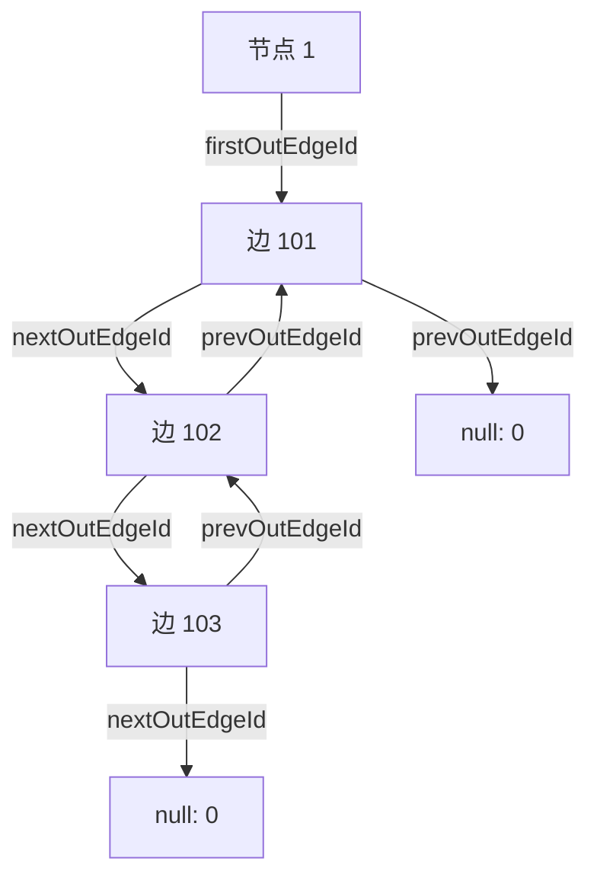
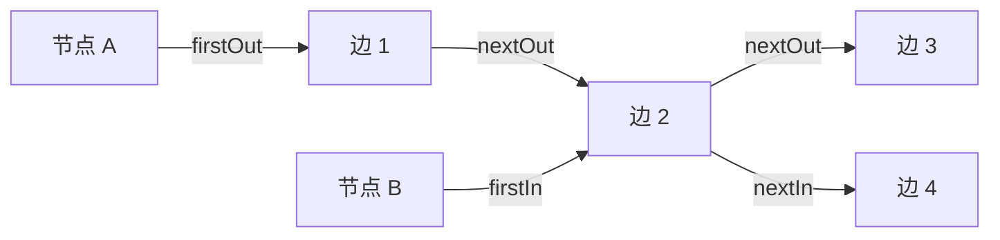
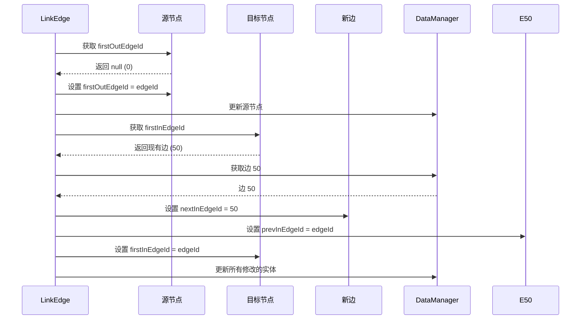
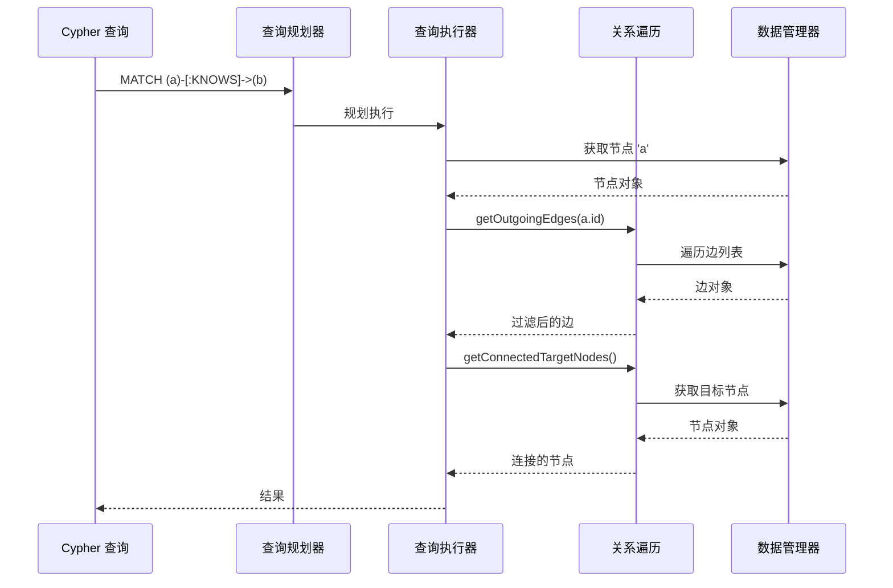

# 关系遍历

ZYX 使用基于链表的邻接结构实现高性能关系遍历系统。这为 Cypher 查询如 `MATCH (a)-[:KNOWS]->(b)` 提供了高效的图关系导航能力，并实现 O(1) 的连接节点和边访问。

## 概述

关系遍历提供以下功能：

- **基于链表的邻接结构**：使用双向链表实现高效边存储
- **双向遍历**：快速访问出边和入边
- **连接节点检索**：直接访问邻居节点而无需全图扫描
- **循环检测**：自动检测损坏的边链
- **活跃边过滤**：遍历期间自动跳过已删除/非活跃边
- **O(1) 边链接**：常量时间边插入和删除

## 架构

### 邻接结构

ZYX 使用基于链表的邻接结构，其中每个节点维护指向其第一条出边和入边的指针：



### 双向边链接

每条边维护四个指针用于双向遍历：



**双向边链接：**
- 节点 A（源节点）：出边列表
- 节点 B（目标节点）：入边列表
- 边 2 同时出现在两个列表中，实现高效双向遍历

**关键点**：同一条边（边 2）同时出现在节点 A 的出边列表和节点 B 的入边列表中，实现高效的双向遍历。

## 实现

### 类定义

```cpp
class RelationshipTraversal {
public:
    explicit RelationshipTraversal(const std::shared_ptr<storage::DataManager> &dataManager);

    // 边检索
    std::vector<Edge> getOutgoingEdges(int64_t nodeId) const;
    std::vector<Edge> getIncomingEdges(int64_t nodeId) const;
    std::vector<Edge> getAllConnectedEdges(int64_t nodeId) const;

    // 节点检索
    std::vector<Node> getConnectedTargetNodes(int64_t nodeId) const;
    std::vector<Node> getConnectedSourceNodes(int64_t nodeId) const;
    std::vector<Node> getAllConnectedNodes(int64_t nodeId) const;

    // 边管理
    void linkEdge(Edge &edge) const;
    void unlinkEdge(Edge &edge) const;

private:
    std::weak_ptr<storage::DataManager> dataManager_;
};
```

### 数据结构

#### 节点结构

每个节点维护指向其边列表头部的指针：

```cpp
struct Node::Metadata {
    int64_t id = 0;
    int64_t firstOutEdgeId = 0;  // 出边列表头部
    int64_t firstInEdgeId = 0;   // 入边列表头部
    int64_t propertyEntityId = 0;
    int64_t labelId = 0;
    uint32_t propertyStorageType = 0;
    bool isActive = true;
};
```

#### 边结构

每条边维护四个指针用于双向链表遍历：

```cpp
struct Edge::Metadata {
    int64_t id = 0;
    int64_t sourceNodeId = 0;     // 源节点
    int64_t targetNodeId = 0;     // 目标节点
    int64_t nextOutEdgeId = 0;    // 源节点的下一条出边
    int64_t prevOutEdgeId = 0;    // 源节点的上一条出边
    int64_t nextInEdgeId = 0;     // 目标节点的下一条入边
    int64_t prevInEdgeId = 0;     // 目标节点的上一条入边
    int64_t propertyEntityId = 0;
    int64_t labelId = 0;
    uint32_t propertyStorageType = 0;
    bool isActive = true;
};
```

## 核心操作

### 获取出边

通过遍历出边列表检索节点的所有出边：

```cpp
std::vector<Edge> RelationshipTraversal::getOutgoingEdges(int64_t nodeId) const {
    std::vector<Edge> outEdges;
    const auto dataManager = dataManager_.lock();
    if (!dataManager) {
        return outEdges;
    }

    const Node node = dataManager->getNode(nodeId);
    int64_t currentEdgeId = node.getFirstOutEdgeId();

    // 跟踪已访问的边 ID 以检测链表中的循环
    std::unordered_set<int64_t> visitedEdgeIds;

    while (currentEdgeId != 0) {
        // 在边链表中检测到循环。中止遍历。
        if (visitedEdgeIds.contains(currentEdgeId)) {
            throw std::runtime_error("Cycle detected in outgoing edges linked-list for node " +
                                     std::to_string(nodeId));
        }
        visitedEdgeIds.insert(currentEdgeId);

        Edge edge = dataManager->getEdge(currentEdgeId);
        if (edge.isActive()) {
            outEdges.push_back(edge);
        }
        currentEdgeId = edge.getNextOutEdgeId();
    }
    return outEdges;
}
```

**算法**：
1. 从节点的 `firstOutEdgeId` 开始
2. 使用 `nextOutEdgeId` 指针遍历链表
3. 跟踪已访问的边以检测循环（数据损坏）
4. 仅包含活跃边（跳过已删除边）
5. 当 `nextOutEdgeId` 为 0 时停止（列表末尾）

**特性**：
- **时间复杂度**：O(k)，其中 k = 出边数量
- **空间复杂度**：O(k) 用于结果向量 + O(k) 用于循环检测
- **循环检测**：防止数据损坏导致的无限循环
- **活跃过滤**：自动排除已删除的边

### 获取入边

通过遍历入边列表检索节点的所有入边：

```cpp
std::vector<Edge> RelationshipTraversal::getIncomingEdges(int64_t nodeId) const {
    std::vector<Edge> inEdges;
    const auto dataManager = dataManager_.lock();
    if (!dataManager) {
        return inEdges;
    }

    const Node node = dataManager->getNode(nodeId);
    int64_t currentEdgeId = node.getFirstInEdgeId();

    // 跟踪已访问的边 ID 以检测链表中的循环
    std::unordered_set<int64_t> visitedEdgeIds;

    while (currentEdgeId != 0) {
        // 在边链表中检测到循环。中止遍历。
        if (visitedEdgeIds.contains(currentEdgeId)) {
            throw std::runtime_error("Cycle detected in incoming edges linked-list for node " +
                                     std::to_string(nodeId));
        }
        visitedEdgeIds.insert(currentEdgeId);

        Edge edge = dataManager->getEdge(currentEdgeId);
        if (edge.isActive()) {
            inEdges.push_back(edge);
        }
        currentEdgeId = edge.getNextInEdgeId();
    }
    return inEdges;
}
```

**特性**：与 `getOutgoingEdges` 相同，但用于入边关系。

### 获取所有连接的边

合并出边和入边：

```cpp
std::vector<Edge> RelationshipTraversal::getAllConnectedEdges(int64_t nodeId) const {
    std::vector<Edge> outEdges = getOutgoingEdges(nodeId);
    std::vector<Edge> inEdges = getIncomingEdges(nodeId);

    // 合并两个向量
    outEdges.insert(outEdges.end(), inEdges.begin(), inEdges.end());
    return outEdges;
}
```

**使用场景**：查找连接到节点的所有关系，无论方向如何。

### 获取连接的目标节点

检索通过出边可达的所有节点：

```cpp
std::vector<Node> RelationshipTraversal::getConnectedTargetNodes(int64_t nodeId) const {
    std::vector<Node> targetNodes;
    std::vector<Edge> outEdges = getOutgoingEdges(nodeId);

    targetNodes.reserve(outEdges.size());
    const auto dataManager = dataManager_.lock();
    if (!dataManager) {
        return targetNodes;
    }

    for (const auto &edge: outEdges) {
        targetNodes.push_back(dataManager->getNode(edge.getTargetNodeId()));
    }
    return targetNodes;
}
```

**使用场景**：Cypher 查询如 `MATCH (a)-[:KNOWS]->(b) RETURN b`

### 获取连接的源节点

检索通过入边指向此节点的所有节点：

```cpp
std::vector<Node> RelationshipTraversal::getConnectedSourceNodes(int64_t nodeId) const {
    std::vector<Node> sourceNodes;
    std::vector<Edge> inEdges = getIncomingEdges(nodeId);

    sourceNodes.reserve(inEdges.size());
    const auto dataManager = dataManager_.lock();
    if (!dataManager) {
        return sourceNodes;
    }

    for (const auto &edge: inEdges) {
        sourceNodes.push_back(dataManager->getNode(edge.getSourceNodeId()));
    }
    return sourceNodes;
}
```

**使用场景**：Cypher 查询如 `MATCH (a)-[:KNOWS]->(b) RETURN a`，其中 `b` 是固定的。

### 获取所有连接的节点

检索所有邻居（源和目标）并去重：

```cpp
std::vector<Node> RelationshipTraversal::getAllConnectedNodes(int64_t nodeId) const {
    std::vector<Node> connectedNodes;

    const auto dataManager = dataManager_.lock();
    if (!dataManager) {
        return connectedNodes;
    }

    std::unordered_set<int64_t> nodeIds;
    for (const auto &edge: getOutgoingEdges(nodeId)) {
        int64_t targetId = edge.getTargetNodeId();
        if (nodeIds.insert(targetId).second) {
            connectedNodes.push_back(dataManager->getNode(targetId));
        }
    }

    for (const auto &edge: getIncomingEdges(nodeId)) {
        int64_t sourceId = edge.getSourceNodeId();
        if (nodeIds.insert(sourceId).second) {
            connectedNodes.push_back(dataManager->getNode(sourceId));
        }
    }
    return connectedNodes;
}
```

**关键特性**：使用 `std::unordered_set` 对通过入边和出边连接的节点进行去重。

**使用场景**：在无向遍历中查找节点的所有邻居。

## 边链接操作

### 链接边

将新边插入邻接结构：

```cpp
void RelationshipTraversal::linkEdge(Edge &edge) const {
    int64_t edgeId = edge.getId();
    int64_t sourceNodeId = edge.getSourceNodeId();
    int64_t targetNodeId = edge.getTargetNodeId();

    auto dataManager = dataManager_.lock();
    if (!dataManager) {
        return;
    }

    // 链接到源节点的出边列表
    Node sourceNode = dataManager->getNode(sourceNodeId);
    int64_t firstOutEdgeId = sourceNode.getFirstOutEdgeId();

    if (firstOutEdgeId == 0) {
        // 源节点还没有出边
        sourceNode.setFirstOutEdgeId(edgeId);
        dataManager->updateNode(sourceNode);
    } else {
        // 在源节点出边列表的头部插入
        Edge firstOutEdge = dataManager->getEdge(firstOutEdgeId);
        edge.setNextOutEdgeId(firstOutEdgeId);
        firstOutEdge.setPrevOutEdgeId(edgeId);

        sourceNode.setFirstOutEdgeId(edgeId);

        dataManager->updateEdge(firstOutEdge);
        dataManager->updateNode(sourceNode);
    }

    // 链接到目标节点的入边列表
    Node targetNode = dataManager->getNode(targetNodeId);
    int64_t firstInEdgeId = targetNode.getFirstInEdgeId();

    if (firstInEdgeId == 0) {
        // 目标节点还没有入边
        targetNode.setFirstInEdgeId(edgeId);
        dataManager->updateNode(targetNode);
    } else {
        // 在目标节点入边列表的头部插入
        Edge firstInEdge = dataManager->getEdge(firstInEdgeId);
        edge.setNextInEdgeId(firstInEdgeId);
        firstInEdge.setPrevInEdgeId(edgeId);

        targetNode.setFirstInEdgeId(edgeId);

        dataManager->updateEdge(firstInEdge);
        dataManager->updateNode(targetNode);
    }

    dataManager->updateEdge(edge);
}
```

**算法**：
1. **源节点链接**：
   - 如果源节点没有出边：设置 `firstOutEdgeId` 为新边
   - 否则：在出边列表的头部插入新边
2. **目标节点链接**：
   - 如果目标节点没有入边：设置 `firstInEdgeId` 为新边
   - 否则：在入边列表的头部插入新边
3. **持久化**：更新所有修改的节点和边

**特性**：
- **时间复杂度**：O(1) - 常量时间，与图大小无关
- **插入策略**：始终在列表头部插入（无需遍历）
- **双向链表**：维护 `next` 和 `prev` 指针以实现高效删除

**可视化示例**：



### 取消链接边

从邻接结构中移除边：

```cpp
void RelationshipTraversal::unlinkEdge(Edge &edge) const {
    auto dataManager = dataManager_.lock();
    if (!dataManager) {
        return;
    }

    int64_t sourceNodeId = edge.getSourceNodeId();
    int64_t targetNodeId = edge.getTargetNodeId();

    int64_t prevOutEdgeId = edge.getPrevOutEdgeId();
    int64_t nextOutEdgeId = edge.getNextOutEdgeId();

    // 从源节点的出边列表中移除
    if (prevOutEdgeId == 0) {
        // 边在源节点出边列表的头部
        Node sourceNode = dataManager->getNode(sourceNodeId);
        sourceNode.setFirstOutEdgeId(nextOutEdgeId);
        dataManager->updateNode(sourceNode);
    } else {
        // 在列表中间绕过边
        Edge prevOutEdge = dataManager->getEdge(prevOutEdgeId);
        prevOutEdge.setNextOutEdgeId(nextOutEdgeId);
        dataManager->updateEdge(prevOutEdge);
    }

    if (nextOutEdgeId != 0) {
        // 更新下一条边的 prev 指针
        Edge nextOutEdge = dataManager->getEdge(nextOutEdgeId);
        nextOutEdge.setPrevOutEdgeId(prevOutEdgeId);
        dataManager->updateEdge(nextOutEdge);
    }

    int64_t prevInEdgeId = edge.getPrevInEdgeId();
    int64_t nextInEdgeId = edge.getNextInEdgeId();

    // 从目标节点的入边列表中移除
    if (prevInEdgeId == 0) {
        // 边在目标节点入边列表的头部
        Node targetNode = dataManager->getNode(targetNodeId);
        targetNode.setFirstInEdgeId(nextInEdgeId);
        dataManager->updateNode(targetNode);
    } else {
        // 在列表中间绕过边
        Edge prevInEdge = dataManager->getEdge(prevInEdgeId);
        prevInEdge.setNextInEdgeId(nextInEdgeId);
        dataManager->updateEdge(prevInEdge);
    }

    if (nextInEdgeId != 0) {
        // 更新下一条边的 prev 指针
        Edge nextInEdge = dataManager->getEdge(nextInEdgeId);
        nextInEdge.setPrevInEdgeId(prevInEdgeId);
        dataManager->updateEdge(nextInEdge);
    }

    // 清除边指针
    edge.setNextOutEdgeId(0);
    edge.setPrevOutEdgeId(0);
    edge.setNextInEdgeId(0);
    edge.setPrevInEdgeId(0);
}
```

**算法**：
1. **源节点取消链接**：
   - 如果边在出边列表的头部：更新源节点的 `firstOutEdgeId`
   - 否则：更新前一条边的 `nextOutEdgeId` 以绕过
   - 如果下一条边存在：更新其 `prevOutEdgeId`
2. **目标节点取消链接**：
   - 如果边在入边列表的头部：更新目标节点的 `firstInEdgeId`
   - 否则：更新前一条边的 `nextInEdgeId` 以绕过
   - 如果下一条边存在：更新其 `prevInEdgeId`
3. **清理**：清除所有边指针

**特性**：
- **时间复杂度**：O(1) - 常量时间
- **双向链表优势**：无需遍历即可找到前一条边
- **安全取消链接**：正确处理头部、中间和尾部位置

**可视化示例**：


**边取消链接：**
- 通过连接前一条边和下一条边来绕过要移除的边
- 由于双向链表结构，这是 O(1) 操作

## 与 Cypher 查询的集成

### 模式匹配

关系遍历在 Cypher 查询执行中被广泛使用：

```cypher
-- 出边遍历
MATCH (a)-[:KNOWS]->(b) RETURN b

-- 实现为：
1. 获取节点 'a'
2. getOutgoingEdges(a.id)
3. 按类型 = KNOWS 过滤边
4. 为每个匹配的边 getConnectedTargetNodes()
```

```cypher
-- 入边遍历
MATCH (a)<-[:KNOWS]-(b) RETURN b

-- 实现为：
1. 获取节点 'a'
2. getIncomingEdges(a.id)
3. 按类型 = KNOWS 过滤边
4. 为每个匹配的边 getConnectedSourceNodes()
```

```cypher
-- 双向遍历
MATCH (a)-[:KNOWS]-(b) RETURN b

-- 实现为：
1. 获取节点 'a'
2. getAllConnectedEdges(a.id)
3. 按类型 = KNOWS 过滤边
4. 从两个方向提取连接的节点
```

### 查询执行流程



## 性能特征

### 时间复杂度

| 操作 | 时间复杂度 | 描述 |
|------|-----------|------|
| getOutgoingEdges | O(k) | k = 出边数量 |
| getIncomingEdges | O(k) | k = 入边数量 |
| getAllConnectedEdges | O(k₁ + k₂) | k₁ = 出边，k₂ = 入边 |
| getConnectedTargetNodes | O(k) | k = 出边数量 |
| getConnectedSourceNodes | O(k) | k = 入边数量 |
| getAllConnectedNodes | O(k₁ + k₂) | 带去重 |
| linkEdge | O(1) | 常量时间插入 |
| unlinkEdge | O(1) | 常量时间删除 |

### 空间复杂度

| 组件 | 空间 | 描述 |
|------|------|------|
| 节点元数据 | 2 × 8 字节 | `firstOutEdgeId`、`firstInEdgeId` |
| 边元数据 | 4 × 8 字节 | `nextOut`、`prevOut`、`nextIn`、`prevIn` |
| 循环检测 | O(k) | 遍历期间的 `std::unordered_set` |
| 结果向量 | O(k) | 输出边/节点集合 |

**每条边总计**：32 字节用于遍历指针（4 × int64_t）

### 内存开销

```
对于具有 100 万条边的图：

节点指针：
- 每个节点 2 个指针
- 对于 10 万个节点：10 万 × 2 × 8 字节 = 1.6 MB

边指针：
- 每条边 4 个指针
- 100 万 × 4 × 8 字节 = 32 MB

总遍历开销：约 33.6 MB
每条边平均：33.6 字节
```

### 性能特征

**优势**：
1. **O(1) 边操作**：插入和删除是常量时间
2. **无全局扫描**：直接访问连接的节点
3. **缓存友好**：边列表的顺序遍历
4. **内存高效**：每条边仅 32 字节用于遍历
5. **可扩展**：性能与总图大小无关

**权衡**：
1. **指针开销**：每条边 32 字节用于遍历指针
2. **解引用成本**：每次边访问需要指针追踪
3. **无类型索引**：必须扫描所有边以按类型过滤
4. **循环检测**：遍历期间添加运行时开销

### 与替代方案的比较

| 方法 | 边访问 | 内存 | 使用场景 |
|------|--------|------|---------|
| **链表** (ZYX) | O(k) 遍历 | 32 字节/边 | 通用图 |
| 邻接矩阵 | O(1) 查找 | O(V²) | 稠密图 |
| 邻接数组 | O(k) 扫描 | O(V + E) | 静态图 |
| 边类型索引 | O(log n + k) | 额外索引 | 类型过滤查询 |

## 最佳实践

1. **批量边创建**：先创建所有节点，然后链接边以最小化更新
2. **避免循环**：永远不要手动操作边指针（使用 `linkEdge`/`unlinkEdge`）
3. **提前过滤**：在获取连接节点之前应用边类型过滤器
4. **检查活跃状态**：使用 `edge.isActive()` 跳过已删除的边
5. **去重**：对无向遍历使用 `getAllConnectedNodes()`

## 限制

1. **无边类型索引**：必须扫描所有边以按关系类型过滤
2. **指针开销**：每条边 32 字节用于遍历元数据
3. **循环检测**：遍历期间添加运行时开销
4. **顺序访问**：无法随机访问特定边
5. **内存局部性**：边指针追踪可能导致缓存未命中

## 未来增强

关系遍历的潜在改进：

1. **边类型索引**：每个关系类型的 B+Tree 索引
2. **跳表**：常见遍历模式的物化路径
3. **边压缩**：稀疏图的可变长度编码
4. **并行遍历**：多线程边列表处理
5. **预取**：投机性边加载以提高缓存效率

## 参见

- [存储系统](/zh/architecture/storage) - 整体存储架构
- [标签索引](/zh/algorithms/label-index) - 节点标签索引
- [属性索引](/zh/algorithms/property-index) - 基于属性的索引
- [查询优化](/zh/algorithms/query-optimization) - 查询规划和优化
- [B+Tree 索引](/zh/algorithms/btree-indexing) - B+Tree 结构详情
