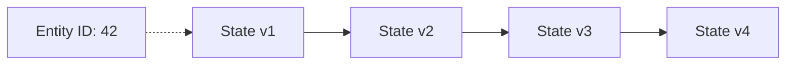
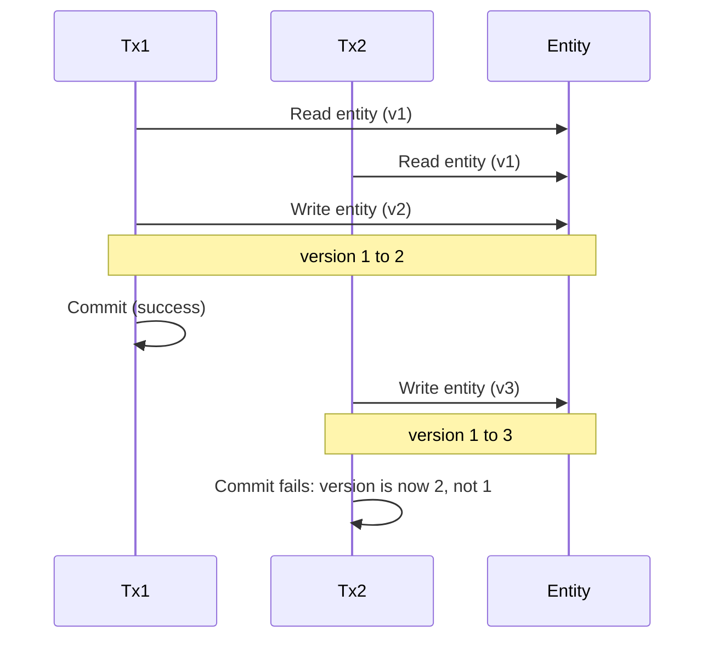
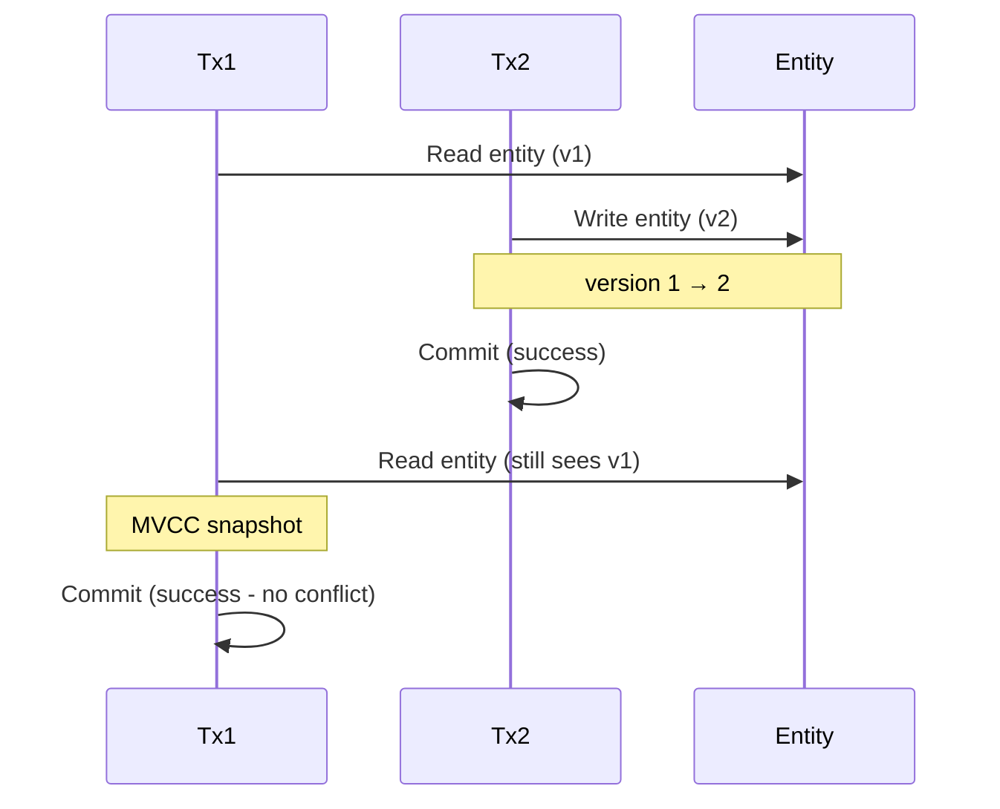

# State Chain & Optimistic Locking Algorithm

ZYX implements Multi-Version Concurrency Control (MVCC) using state chains and optimistic locking to provide high concurrency while maintaining data consistency.

## Overview

The system uses:

- **State Chains**: Linked list of entity versions
- **Optimistic Locking**: No locks during reads, conflict detection on writes
- **Version Numbers**: Track entity modifications

## State Chain Structure

### Entity Version

```cpp
struct EntityState {
    uint64_t version;
    uint64_t transactionId;
    timestamp_t timestamp;
    uint8_t data[];

    bool isCommitted() const {
        return transactionId == COMMITTED_TX_ID;
    }
};
```

### State Chain



**状态链演变：**
- v1：初始状态 (Tx: 100)
- v2：已修改 (Tx: 105)
- v3：已修改 (Tx: 110)
- v4：已提交 (Tx: 110)

## Optimistic Locking Algorithm

### Read Operation

No locks acquired during reads:

```cpp
Entity* readEntity(Transaction* tx, uint64_t entityId) {
    // 1. Load entity (no lock)
    Entity* entity = storage->loadEntity(entityId);

    // 2. Find appropriate version
    EntityState* state = findVersionForTransaction(entity, tx);

    // 3. Return snapshot
    return createSnapshot(state);
}
```

**Benefits**:
- Readers never block
- High concurrency for read-heavy workloads

### Write Operation

Detect conflicts on commit:

```cpp
bool writeEntity(Transaction* tx, uint64_t entityId, const Entity& newData) {
    // 1. Read current version
    Entity* entity = storage->loadEntity(entityId);
    uint64_t currentVersion = entity->getVersion();

    // 2. Create new version
    EntityState* newState = createNewVersion(tx, newData);
    newState->version = currentVersion + 1;

    // 3. Add to state chain
    entity->addState(newState);

    // 4. Track for commit
    tx->trackModifiedEntity(entityId, currentVersion);

    return true;
}
```

### Commit Phase

Validate no conflicts occurred:

```cpp
bool commitTransaction(Transaction* tx) {
    // 1. Validate all modified entities
    for (auto [entityId, readVersion] : tx->getModifiedEntities()) {
        Entity* entity = storage->loadEntity(entityId);

        // Check if version changed since we read it
        if (entity->getVersion() != readVersion) {
            // Conflict detected!
            rollbackTransaction(tx);
            return false;
        }
    }

    // 2. No conflicts, commit all changes
    for (auto [entityId, version] : tx->getModifiedEntities()) {
        Entity* entity = storage->loadEntity(entityId);
        entity->commitLatestState(tx->getId());
    }

    return true;
}
```

## State Chain Operations

### Add New Version

```cpp
void addState(Entity* entity, EntityState* newState) {
    // 1. Link to existing chain
    newState->previous = entity->latestState;

    // 2. Update latest pointer
    entity->latestState = newState;

    // 3. Increment version
    entity->version++;
}
```

### Find Version for Transaction

```cpp
EntityState* findVersionForTransaction(Entity* entity, Transaction* tx) {
    EntityState* state = entity->latestState;
    timestamp_t txStartTime = tx->getStartTime();

    // Traverse back to find version visible to transaction
    while (state != nullptr) {
        if (state->isCommitted() && state->timestamp <= txStartTime) {
            // This version is visible
            return state;
        }
        state = state->previous;
    }

    // No suitable version found
    return nullptr;
}
```

### Prune Old Versions

```cpp
void pruneOldVersions(Entity* entity) {
    EntityState* state = entity->latestState;
    timestamp_t oldestActiveTx = getOldestActiveTransactionTime();

    // Find oldest version still needed
    EntityState* oldestNeeded = nullptr;
    while (state != nullptr) {
        if (state->timestamp >= oldestActiveTx) {
            oldestNeeded = state;
            break;
        }
        state = state->previous;
    }

    // Free older versions
    if (oldestNeeded && oldestNeeded->previous) {
        freeVersions(oldestNeeded->previous);
        oldestNeeded->previous = nullptr;
    }
}
```

## Conflict Detection

### Write-Write Conflict

Two transactions modify same entity:



### Read-Write Conflict

Phantom reads prevented by MVCC:



## Version Management

### Version Numbering

```cpp
class VersionManager {
    std::atomic<uint64_t> nextVersion;

public:
    uint64_t getNextVersion() {
        return nextVersion.fetch_add(1);
    }
};
```

### Version Limits

Prevent unbounded state chains:

```cpp
struct VersionConfig {
    size_t maxVersionsPerEntity = 10;  // Soft limit
    size_t pruneThreshold = 15;        // Hard limit
};

void checkVersionLimit(Entity* entity) {
    if (entity->getVersionCount() > config.pruneThreshold) {
        pruneOldVersions(entity);
    }
}
```

## Performance Characteristics

### Read Performance

- **No locks**: O(1) read access
- **Version search**: O(n) where n is chain length (typically small)
- **Cache friendly**: Latest version cached

### Write Performance

- **No locks during write**: O(1) to add version
- **Conflict detection**: O(1) per entity on commit
- **Retry overhead**: Depends on contention

### Space Overhead

- **Per version**: O(1) metadata + data size
- **Per entity**: O(n) where n is versions kept
- **Typical**: 2-3 versions per entity

## Optimizations

### Version Caching

Cache frequently accessed versions:

```cpp
class VersionCache {
    std::unordered_map<uint64_t, EntityState*> cache;

public:
    EntityState* getVersion(uint64_t entityId, uint64_t version) {
        uint64_t key = (entityId << 32) | version;
        auto it = cache.find(key);
        if (it != cache.end()) {
            return it->second;
        }
        return nullptr;
    }

    void cacheVersion(uint64_t entityId, uint64_t version, EntityState* state) {
        uint64_t key = (entityId << 32) | version;
        cache[key] = state;
    }
};
```

### Incremental Pruning

Prune versions incrementally:

```cpp
void incrementalPrune(Entity* entity) {
    // Prune one old version per access
    if (entity->getVersionCount() > config.maxVersionsPerEntity) {
        EntityState* oldest = findOldestUnreferencedVersion(entity);
        if (oldest) {
            removeVersion(entity, oldest);
        }
    }
}
```

### Batch Conflict Detection

Detect conflicts in batch:

```cpp
bool batchConflictDetection(Transaction* tx) {
    auto modified = tx->getModifiedEntities();

    // Load all current versions in parallel
    std::vector<uint64_t> currentVersions;
    for (auto [entityId, _] : modified) {
        Entity* entity = storage->loadEntity(entityId);
        currentVersions.push_back(entity->getVersion());
    }

    // Validate all at once
    for (size_t i = 0; i < modified.size(); ++i) {
        auto [entityId, readVersion] = modified[i];
        if (currentVersions[i] != readVersion) {
            return false;  // Conflict
        }
    }

    return true;
}
```

## Retry Strategy

Exponential backoff for conflicts:

```cpp
bool retryOnConflict(Transaction* tx) {
    size_t maxRetries = 3;
    size_t retryDelay = 100;  // ms

    for (size_t attempt = 0; attempt < maxRetries; ++attempt) {
        if (attempt > 0) {
            std::this_thread::sleep_for(
                std::chrono::milliseconds(retryDelay)
            );
            retryDelay *= 2;  // Exponential backoff
        }

        if (executeTransaction(tx)) {
            return true;
        }
    }

    return false;  // Failed after retries
}
```

## Best Practices

1. **Keep transactions short**: Reduces conflict probability
2. **Minimize write set**: Fewer entities modified = fewer conflicts
3. **Use appropriate isolation**: Read committed for most cases
4. **Monitor conflict rate**: Track and optimize hot entities
5. **Prune regularly**: Prevent unbounded version growth

## See Also

- [Transaction Management](/en/architecture/transactions) - Transaction system
- [Storage System](/en/architecture/storage) - Persistent storage
- [Cache Management](/en/architecture/cache) - Version caching
