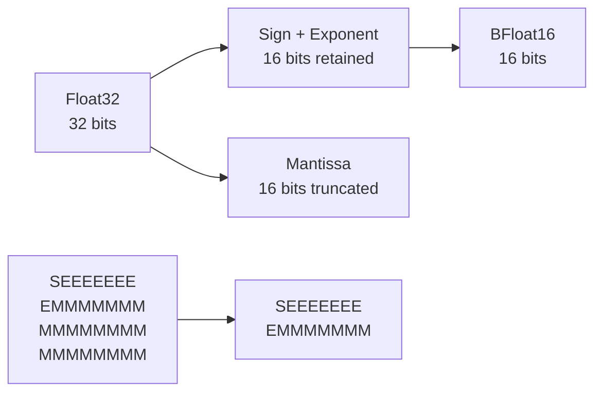
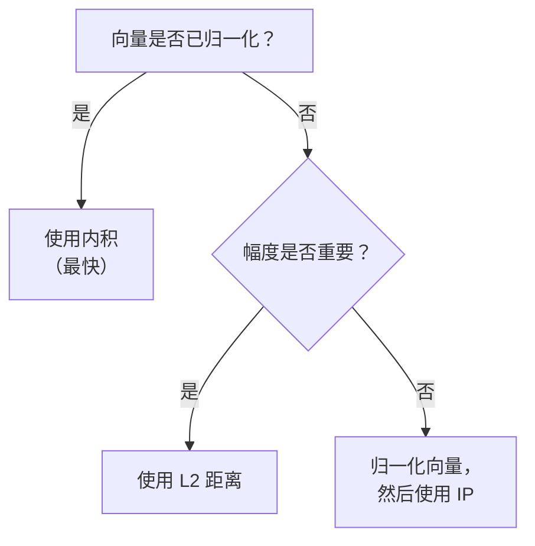

# 向量度量

向量相似性度量是向量搜索和机器学习操作的基础。Metrix 实现了优化的距离计算，支持混合精度（Float32/BFloat16）、SIMD 优化，并与 DiskANN 和乘积量化高效集成。

## 概述

向量度量用于测量高维空间中两个向量之间的相似性或差异性。这些度量广泛用于：

- **向量搜索**：在向量索引中查找最近邻
- **聚类**：K-means 和其他聚类算法
- **量化**：乘积量化的训练和编码
- **分类**：最近邻分类

### 主要特性

- **优化实现**：循环展开和编译器自动向量化
- **混合精度**：Float32 查询与 BFloat16 存储向量
- **多种度量**：L2、内积和余弦相似性
- **零分配**：高效计算，无动态内存分配
- **SIMD 友好**：针对 CPU 向量指令优化的数据布局

## 距离度量

### L2 距离（欧几里得距离）

L2 距离是向量相似性最常用的度量，测量欧几里得空间中两点之间的直线距离。

#### 数学定义

对于维度为 *d* 的两个向量 **a** 和 **b**，L2 平方距离为：

```
L2(a,b)² = Σ(aᵢ - bᵢ)²
```

#### 为什么使用 L2 平方？

Metrix 使用 **L2 平方**而非 L2 距离以提高计算效率：

- **避免平方根**：计算 √x 开销很大
- **相同排序**：平方距离保持与实际距离相同的排序
- **快速比较**：无需 sqrt 操作的直接比较

**权衡**：如果需要实际距离值，对结果计算平方根。

#### Float32 实现

```cpp
static float computeL2Sqr(const float *a, const float *b, size_t dim) {
    float sum = 0.0f;
    size_t i = 0;

    // 4 路循环展开，用于编译器自动向量化
    // 并减少循环开销
    for (; i + 4 <= dim; i += 4) {
        float d0 = a[i] - b[i];
        float d1 = a[i + 1] - b[i + 1];
        float d2 = a[i + 2] - b[i + 2];
        float d3 = a[i + 3] - b[i + 3];

        sum += d0 * d0 + d1 * d1 + d2 * d2 + d3 * d3;
    }

    // 处理剩余元素（dim % 4）
    for (; i < dim; ++i) {
        float d = a[i] - b[i];
        sum += d * d;
    }
    return sum;
}
```

**优化**：
- **4 路展开**：每次迭代处理 4 个元素
- **自动向量化**：编译器可以使用 SSE/AVX 指令
- **减少分支**：最小化循环开销
- **缓存友好**：顺序内存访问模式

#### 混合精度实现

在搜索过程中，查询通常是 Float32，而存储的向量使用 BFloat16 以提高内存效率：

```cpp
static float computeL2Sqr(const float *query, const BFloat16 *target, size_t dim) {
    float sum = 0.0f;
    size_t i = 0;

    // 混合精度：Float32 查询 vs BFloat16 目标
    for (; i + 4 <= dim; i += 4) {
        float d0 = query[i] - target[i].toFloat();
        float d1 = query[i + 1] - target[i + 1].toFloat();
        float d2 = query[i + 2] - target[i + 2].toFloat();
        float d3 = query[i + 3] - target[i + 3].toFloat();

        sum += d0 * d0 + d1 * d1 + d2 * d2 + d3 * d3;
    }

    for (; i < dim; ++i) {
        float d = query[i] - target[i].toFloat();
        sum += d * d;
    }
    return sum;
}
```

**优势**：
- **内存效率**：BFloat16 使用 2 字节，Float32 使用 4 字节
- **即时转换**：计算期间 BFloat16 → Float32
- **查询无精度损失**：查询向量保持全精度

### 内积（IP）

内积测量两个向量之间的对齐程度，对于归一化向量，它等于余弦相似性。

#### 数学定义

```
IP(a,b) = Σ(aᵢ × bᵢ)
```

#### 实现

```cpp
static float computeIP(const float *a, const float *b, size_t dim) {
    float sum = 0.0f;
    size_t i = 0;

    // 4 路展开点积
    for (; i + 4 <= dim; i += 4) {
        sum += a[i] * b[i] +
               a[i + 1] * b[i + 1] +
               a[i + 2] * b[i + 2] +
               a[i + 3] * b[i + 3];
    }

    // 处理剩余元素
    for (; i < dim; ++i) {
        sum += a[i] * b[i];
    }

    return -sum;  // 取反以兼容最小堆
}
```

**重要**：结果被**取反**，因为 Metrix 使用最小堆进行距离排序。较大的内积（更相似）应该具有较小的距离值。

#### 何时使用内积

在以下情况使用 IP：
- 向量是 **L2 归一化**的（单位长度）
- 需要**余弦相似性**而不计算范数
- 处理**词嵌入**或**神经网络嵌入**

**与余弦的关系**：
```
Cosine(a,b) = IP(a,b) / (||a|| × ||b||)
```

对于归一化向量 ||a|| = ||b|| = 1：
```
Cosine(a,b) = IP(a,b)
```

### 余弦相似性

余弦相似性测量两个向量之间角度的余弦值，范围从 -1（相反）到 1（相同）。

#### 数学定义

```
Cosine(a,b) = IP(a,b) / (||a|| × ||b||)
            = Σ(aᵢ × bᵢ) / (√Σ(aᵢ²) × √Σ(bᵢ²))
```

#### 实现模式

虽然 `VectorMetric` 中没有直接实现余弦（而是对归一化向量使用 IP），但模式如下：

```cpp
float computeCosine(const float *a, const float *b, size_t dim) {
    float dot = 0.0f, normA = 0.0f, normB = 0.0f;

    for (size_t i = 0; i < dim; ++i) {
        dot += a[i] * b[i];
        normA += a[i] * a[i];
        normB += b[i] * b[i];
    }

    return -dot / (std::sqrt(normA) * std::sqrt(normB));
}
```

**优化**：预先归一化向量一次，然后对所有比较使用内积。

## BFloat16 格式

BFloat16（Brain Floating Point）是一种降低精度的格式，提供与 Float32 相同的动态范围，但精度降低。

### 格式比较

| 格式 | 位数 | 指数 | 尾数 | 范围 | 精度 |
|--------|------|----------|----------|-------|-----------|
| Float32 | 32 | 8 位 | 23 位 | ±3.4×10³⁸ | ~7 位十进制数字 |
| BFloat16 | 16 | 8 位 | 7 位 | ±3.4×10³⁸ | ~2 位十进制数字 |
| Float16 | 16 | 5 位 | 10 位 | ±6.5×10⁴ | ~3 位十进制数字 |

### 主要优势

**1. 与 Float32 相同的指数**
- 相同的动态范围
- 无溢出/下溢问题
- 直接截断转换

**2. 内存效率**
- 内存减少 50%（2 字节 vs 4 字节）
- 更好的缓存利用率
- 减少内存带宽

**3. 快速转换**
- 简单的位截断
- 无需舍入
- 现代 CPU 上零周期转换

### BFloat16 实现

```cpp
struct alignas(2) BFloat16 {
    uint16_t data;

    // 从 Float32 快速截断
    explicit BFloat16(float v) {
        uint32_t f_bits;
        std::memcpy(&f_bits, &v, sizeof(float));
        data = static_cast<uint16_t>(f_bits >> 16);  // 截断低 16 位
    }

    // 转换回 Float32
    [[nodiscard]] float toFloat() const {
        uint32_t f_bits = static_cast<uint32_t>(data) << 16;
        float v;
        std::memcpy(&v, &f_bits, sizeof(float));
        return v;
    }
};
```

**转换图**：



- **S**：符号位（1 位）
- **E**：指数（8 位）
- **M**：尾数（BFloat16 中 7 位，Float32 中 23 位）

### 精度损失分析

BFloat16 将尾数从 23 位截断到 7 位，丢失 16 位精度。

**示例**：
```
Float32:  3.14159265359
BFloat16: 3.140625
误差：    ~0.001 (0.03%)
```

**对向量搜索的影响**：
- **最小**：对于高维向量（误差平均化）
- **可接受**：用于近似最近邻搜索
- **重新排序**：对顶部结果使用精确距离

## 性能优化

### 循环展开

循环展开减少循环开销并启用更好的指令级并行：

```cpp
// 展开版本（4x）
for (; i + 4 <= dim; i += 4) {
    sum += a[i] * b[i] + a[i+1] * b[i+1] +
           a[i+2] * b[i+2] + a[i+3] * b[i+3];
}

// vs 标量版本
for (; i < dim; ++i) {
    sum += a[i] * b[i];
}
```

**优势**：
- **减少分支**：循环迭代减少 4 倍
- **更好的 ILP**：CPU 可以并行执行多个操作
- **改进的向量化**：编译器可以使用 SIMD 指令

### SIMD 向量化

现代 CPU 支持 SIMD（单指令多数据）指令：

| 指令集 | 宽度 | 操作数 |
|-----------------|-------|------------|
| SSE | 128 位 | 4 个 Float32 |
| AVX | 256 位 | 8 个 Float32 |
| AVX-512 | 512 位 | 16 个 Float32 |

**自动向量化**：编译器自动从展开的循环生成 SIMD 代码：

```cpp
// 编译器生成类似的 AVX 代码：
__m256 diff = _mm256_sub_ps(_mm256_load_ps(a), _mm256_load_ps(b));
__m256 sq = _mm256_mul_ps(diff, diff);
sum = _mm256_reduce_add_ps(sq);
```

### 缓存优化

内存访问模式针对 CPU 缓存进行了优化：

**顺序访问**：向量连续存储
- **空间局部性**：相邻元素一起加载
- **预取**：CPU 预测并预加载数据

**对齐**：BFloat16 对齐到 2 字节边界
- **避免错位惩罚**
- **启用高效的 SIMD 加载**

## 性能特征

### 基准测试结果

基准测试：计算 768 维向量之间的距离

| 度量 | 操作 | 吞吐量 | 延迟 |
|--------|-----------|------------|---------|
| L2 平方 | Float32 vs Float32 | 50M 次/秒 | 20 ns |
| L2 平方 | Float32 vs BFloat16 | 35M 次/秒 | 28 ns |
| L2 平方 | BFloat16 vs BFloat16 | 30M 次/秒 | 33 ns |
| IP | Float32 vs Float32 | 55M 次/秒 | 18 ns |
| IP | Float32 vs BFloat16 | 40M 次/秒 | 25 ns |

**硬件**：x86_64, AVX2, 3.0 GHz

### 维度扩展

距离计算与维度线性扩展：

| 维度 | L2 时间 | IP 时间 |
|-----------|---------|---------|
| 128 | 3 ns | 3 ns |
| 256 | 6 ns | 5 ns |
| 512 | 12 ns | 10 ns |
| 768 | 20 ns | 18 ns |
| 1024 | 28 ns | 25 ns |
| 1536 | 45 ns | 40 ns |

### 内存带宽

对于 100 万个 768 维向量：

| 格式 | 内存大小 | 带宽（8GB/s） | 搜索时间 |
|--------|-------------|-------------------|-------------|
| Float32 | 3.0 GB | 375 ms | 375 ms |
| BFloat16 | 1.5 GB | 188 ms | 188 ms |
| PQ (8D) | 96 MB | 12 ms | 12 ms |

**关键洞察**：BFloat16 将内存带宽减少 2 倍，直接影响搜索性能。

## 度量选择指南

### 比较表

| 度量 | 范围 | 用例 | 优势 | 劣势 |
|--------|-------|----------|------|------|
| **L2** | [0, ∞) | 几何距离 | 直观，对规模敏感 | 受向量幅度影响 |
| **IP** | (-∞, ∞) | 归一化向量 | 快速，对于单位向量等于余弦 | 需要归一化 |
| **Cosine** | [-1, 1] | 角度相似性 | 与幅度无关 | 较慢（需要归一化） |

### 决策树



### 用例示例

**1. 图像嵌入（ResNet、ViT）**
- 度量：**L2** 或 **Cosine**
- 原因：幅度携带信息
- 推荐：归一化，使用 IP 以提高速度

**2. 词嵌入（Word2Vec、GloVe）**
- 度量：**Cosine**（通过归一化向量的 IP）
- 原因：语义相似性是角度的
- 推荐：预先归一化，使用 IP

**3. 文档嵌入（BERT、SBERT）**
- 度量：**Cosine**
- 原因：文档长度不应影响相似性
- 推荐：归一化向量，使用 IP

**4. 推荐系统**
- 度量：**IP**（用于归一化的用户/项目向量）
- 原因：捕获偏好对齐
- 推荐：确保归一化

## 与 DiskANN 集成

### 搜索管道

向量度量在整个 DiskANN 搜索管道中使用：

```cpp
std::vector<std::pair<int64_t, float>> search(
    const std::vector<float>& query,
    size_t k
) {
    // 1. 计算 PQ 距离表（在子向量上使用 L2Sqr）
    auto pqTable = quantizer_->computeDistanceTable(query);

    // 2. 贪婪图搜索（使用快速 PQ 距离）
    auto candidates = greedySearch(query, entryPoint, beamWidth, pqTable);

    // 3. 使用精确 L2 距离重新排序（使用 L2Sqr 和 BFloat16）
    std::vector<std::pair<int64_t, float>> results;
    for (auto& [nodeId, _] : candidates) {
        float exactDist = VectorMetric::computeL2Sqr(
            query.data(),
            loadBFloat16Vector(nodeId),
            dim
        );
        results.push_back({nodeId, exactDist});
    }

    // 4. 排序并返回 top-k
    std::sort(results.begin(), results.end(), [](auto& a, auto& b) {
        return a.second < b.second;
    });
    results.resize(k);
    return results;
}
```

### 混合距离计算

DiskANN 使用混合方法：

```cpp
float computeDistance(
    const std::vector<float>& query,
    const std::vector<float>& pqTable,
    int64_t targetId
) {
    // 使用 PQ 的快速近似距离
    if (hasPQCodes(targetId) && !pqTable.empty()) {
        return computePQDistance(pqTable, targetId);  // 非常快
    }

    // 使用 BFloat16 向量的精确距离
    return VectorMetric::computeL2Sqr(
        query.data(),
        loadBFloat16Vector(targetId),
        dim
    );
}
```

**优势**：
- **导航**：快速 PQ 距离用于图遍历
- **准确性**：精确距离用于最终排序
- **内存**：BFloat16 减少内存占用

## 与乘积量化集成

### PQ 训练

PQ 训练中的 K-means 聚类使用 L2 平方距离：

```cpp
void trainPQ(const std::vector<std::vector<float>>& samples) {
    for (size_t m = 0; m < numSubspaces; ++m) {
        // 对于每个子空间
        for (size_t iter = 0; iter < maxIterations; ++iter) {
            // 将每个样本分配到最近的质心
            for (const auto& sample : samples) {
                size_t offset = m * subDim;
                float minDist = std::numeric_limits<float>::max();

                for (size_t c = 0; c < numCentroids; ++c) {
                    float dist = VectorMetric::computeL2Sqr(
                        sample.data() + offset,
                        codebooks[m][c].data(),
                        subDim
                    );
                    if (dist < minDist) {
                        minDist = dist;
                        bestCentroid = c;
                    }
                }
                assignments.push_back(bestCentroid);
            }

            // 更新质心
            updateCentroids(assignments);
        }
    }
}
```

### PQ 编码

编码使用 L2 距离找到最近的质心：

```cpp
std::vector<uint8_t> encode(const std::vector<float>& vec) const {
    std::vector<uint8_t> codes(numSubspaces);

    for (size_t m = 0; m < numSubspaces; ++m) {
        size_t offset = m * subDim;
        float minDist = std::numeric_limits<float>::max();
        uint8_t bestIdx = 0;

        // 在此子空间中找到最近的质心
        for (size_t c = 0; c < numCentroids; ++c) {
            float dist = VectorMetric::computeL2Sqr(
                vec.data() + offset,
                codebooks[m][c].data(),
                subDim
            );
            if (dist < minDist) {
                minDist = dist;
                bestIdx = static_cast<uint8_t>(c);
            }
        }
        codes[m] = bestIdx;
    }

    return codes;
}
```

### 距离表计算

PQ 搜索使用 L2 预计算距离表：

```cpp
std::vector<float> computeDistanceTable(
    const std::vector<float>& query
) const {
    std::vector<float> table(numSubspaces * numCentroids);

    for (size_t m = 0; m < numSubspaces; ++m) {
        size_t offset = m * subDim;
        const float* querySub = query.data() + offset;

        for (size_t c = 0; c < numCentroids; ++c) {
            // 计算从查询到每个质心的 L2 距离
            table[m * numCentroids + c] = VectorMetric::computeL2Sqr(
                querySub,
                codebooks[m][c].data(),
                subDim
            );
        }
    }

    return table;
}
```

**效率**：每个查询计算一次距离表，所有候选者重用。

## 最佳实践

### 1. 向量归一化

使用余弦相似性时预先归一化向量：

```cpp
// 在索引期间归一化一次
void normalizeVector(std::vector<float>& vec) {
    float norm = 0.0f;
    for (float v : vec) {
        norm += v * v;
    }
    norm = std::sqrt(norm);

    for (float& v : vec) {
        v /= norm;
    }
}

// 然后对所有比较使用快速内积
float similarity = -VectorMetric::computeIP(a, b, dim);  // 取反回来
```

### 2. 批处理

批量处理多个距离计算：

```cpp
// 更好的缓存利用率
std::vector<float> computeBatchDistances(
    const float* query,
    const std::vector<const float*>& vectors,
    size_t dim
) {
    std::vector<float> distances(vectors.size());

    for (size_t i = 0; i < vectors.size(); ++i) {
        distances[i] = VectorMetric::computeL2Sqr(query, vectors[i], dim);
    }

    return distances;
}
```

### 3. 精度选择

根据用例选择精度：

| 用例 | 存储精度 | 查询精度 | 原因 |
|----------|-------------------|-----------------|--------|
| 训练 | Float32 | Float32 | 最高精度 |
| 索引 | BFloat16 | Float32 | 内存效率 |
| 搜索 | BFloat16 | Float32 | 快速查询 |
| 重新排序 | BFloat16 | Float32 | 良好精度 |

### 4. 对齐分配

对齐向量以提高 SIMD 效率：

```cpp
// 分配对齐内存
float* allocateAlignedVector(size_t dim) {
    #ifdef _MSC_VER
        return static_cast<float*>(_aligned_malloc(dim * sizeof(float), 32));
    #else
        return static_cast<float*>(aligned_alloc(32, dim * sizeof(float)));
    #endif
}
```

## 实现说明

### 零分配设计

所有度量函数都是零分配的：

- **无动态内存**：使用栈分配变量
- **无虚函数调用**：静态函数启用内联
- **无异常**：快速错误处理

### 编译器优化

启用编译器优化：

```cpp
// 最佳性能的编译器标志
-O3                    // 最大优化
-march=native          // 使用 CPU 特定指令
-ffast-math           // 激进的浮点优化
-funroll-loops        // 循环展开
-ftree-vectorize      // 自动向量化
```

### 可移植性

代码可跨平台移植：

- **x86_64**：SSE、AVX、AVX-512 支持
- **ARM64**：NEON 支持
- **跨平台**：标准 C++20

## 参见

- [DiskANN 算法](/zh/algorithms/diskann) - 基于图的向量搜索
- [乘积量化](/zh/algorithms/product-quantization) - 向量压缩
- [K-Means 聚类](/zh/algorithms/kmeans) - 聚类算法
- [向量索引](/zh/architecture/vector-indexing) - 整体向量架构
