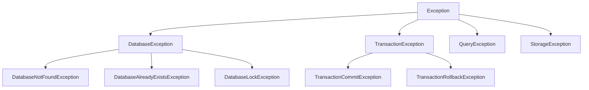

# 错误处理

ZYX 通过异常和错误码提供全面的错误处理。本指南涵盖错误处理最佳实践和完整的错误 API。

## 异常层次结构

ZYX 使用分层异常系统：



## 基本异常类

所有 ZYX 异常都继承自基类 `Exception`：

```cpp
#include <zyx/zyx.hpp>

try {
    // ZYX 操作
} catch (const zyx::Exception& e) {
    std::cerr << "错误: " << e.what() << std::endl;
    std::cerr << "错误码: " << e.getErrorCode() << std::endl;
}
```

## 数据库异常

### DatabaseNotFoundException

尝试打开不存在的数据库时抛出。

```cpp
try {
    auto db = zyx::Database::open("/nonexistent/path");
} catch (const zyx::DatabaseNotFoundException& e) {
    std::cerr << "数据库未找到: " << e.what() << std::endl;
}
```

### DatabaseLockException

数据库被另一个进程锁定时抛出。

```cpp
try {
    auto db = zyx::Database::open("/locked/path");
} catch (const zyx::DatabaseLockException& e) {
    std::cerr << "数据库已锁定: " << e.what() << std::endl;
}
```

## 事务异常

### TransactionCommitException

事务提交失败时抛出。

```cpp
auto tx = db->beginTransaction();

try {
    tx->execute("CREATE (p:Person {name: 'Alice'})");
    tx->commit();
} catch (const zyx::TransactionCommitException& e) {
    tx->rollback();
    std::cerr << "提交失败: " << e.what() << std::endl;
}
```

### TransactionTimeoutException

事务超过超时时间时抛出。

```cpp
auto tx = db->beginTransaction();
tx->setTimeout(zyx::Duration::seconds(30));

try {
    // 长时间运行的操作
    while (condition) {
        tx->execute("MATCH (n:Node) RETURN n");
    }
} catch (const zyx::TransactionTimeoutException& e) {
    std::cerr << "事务超时: " << e.what() << std::endl;
}
```

## 查询异常

### ParseException

Cypher 查询解析失败时抛出。

```cpp
try {
    auto result = db->execute("INVALID CYPHER QUERY");
} catch (const zyx::ParseException& e) {
    std::cerr << "解析错误: " << e.what() << std::endl;
}
```

### ExecutionException

查询执行失败时抛出。

```cpp
try {
    auto result = db->execute("MATCH (n:NonExistentLabel) RETURN n");
} catch (const zyx::ExecutionException& e) {
    std::cerr << "执行错误: " << e.what() << std::endl;
}
```

## 存储异常

### IOException

发生 I/O 相关错误时抛出。

```cpp
try {
    auto db = zyx::Database::open("/path/to/db");
} catch (const zyx::IOException& e) {
    std::cerr << "I/O 错误: " << e.what() << std::endl;
}
```

### CorruptionException

检测到数据库损坏时抛出。

```cpp
try {
    auto db = zyx::Database::open("/corrupted/db");
} catch (const zyx::CorruptionException& e) {
    std::cerr << "数据库已损坏: " << e.what() << std::endl;
}
```

## 错误处理模式

### 全面错误处理

```cpp
#include <zyx/zyx.hpp>

using namespace zyx;

int main() {
    try {
        auto db = Database::open("/path/to/database");
        auto result = db->execute("MATCH (p:Person) RETURN p.name, p.age");
        
        for (const auto& row : result) {
            std::cout << row["p.name"].asString() << std::endl;
        }

    } catch (const DatabaseNotFoundException& e) {
        std::cerr << "数据库未找到: " << e.what() << std::endl;
        return 1;

    } catch (const ParseException& e) {
        std::cerr << "查询解析错误: " << e.what() << std::endl;
        return 3;

    } catch (const Exception& e) {
        std::cerr << "一般错误: " << e.what() << std::endl;
        return 7;
    }

    return 0;
}
```

### 重试与指数退避

```cpp
template<typename Func>
auto retryWithBackoff(Func&& func, int maxRetries = 3) -> decltype(func()) {
    int retries = 0;
    std::chrono::milliseconds delay(100);

    while (true) {
        try {
            return func();
        } catch (const TransactionException& e) {
            if (++retries >= maxRetries) {
                throw;
            }
            std::this_thread::sleep_for(delay);
            delay *= 2; // 指数退避
        }
    }
}
```

## 最佳实践

1. **捕获特定异常**：适当处理不同错误类型
2. **使用 RAII**：确保异常时清理资源
3. **记录错误**：维护详细的错误日志用于调试
4. **提供上下文**：在错误消息中包含相关信息
5. **实现重试**：使用重试处理瞬态故障
6. **验证输入**：执行操作前检查参数
7. **监控错误**：跟踪错误率和模式
8. **规划恢复**：为常见错误场景制定策略

## 另请参阅

- [Transaction 类](/zh/api/transaction) - 事务错误处理
- [Database 类](/zh/api/cpp-api) - 数据库错误处理
- [值类型](/zh/api/types) - 类型相关错误
