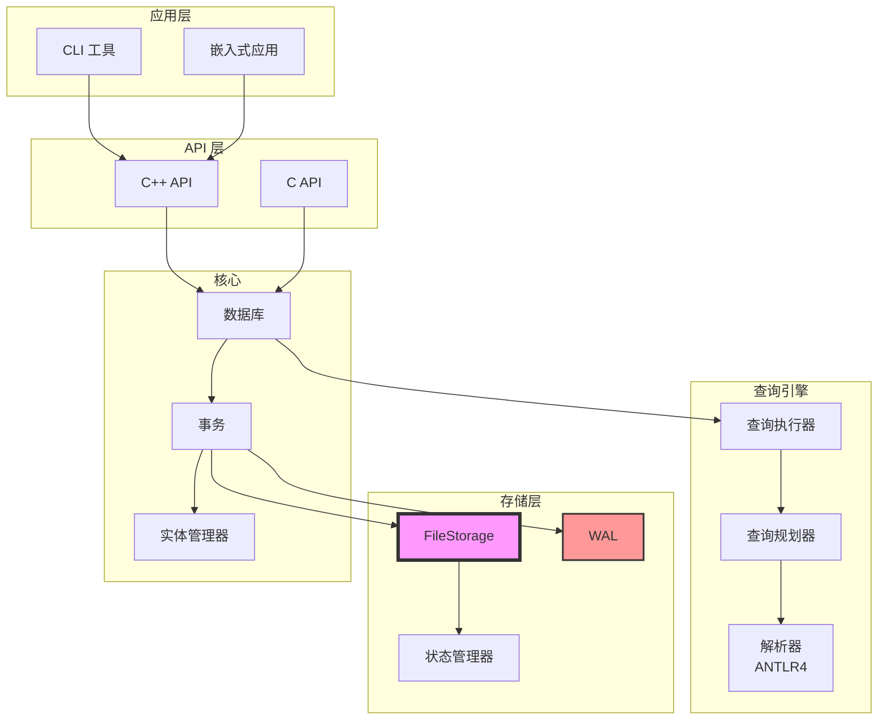
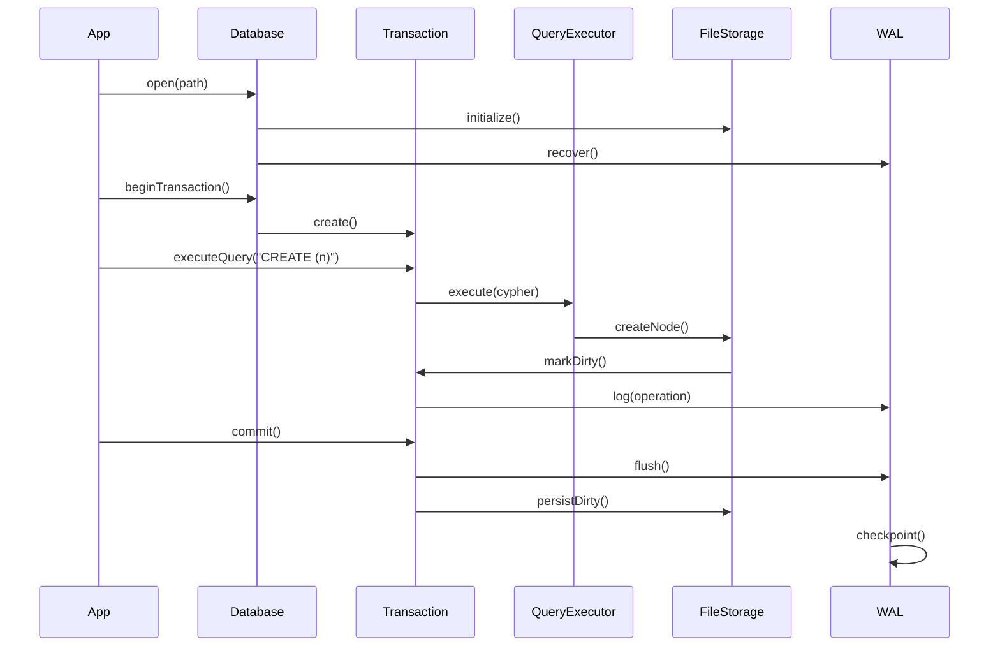

# 架构概述

Metrix 是一个高性能、可嵌入的图数据库，基于自定义存储引擎构建，采用段式架构。

## 系统架构



## 核心设计原则

### 1. 嵌入式优先

Metrix 设计为库而非服务器。可以直接嵌入到 C++ 应用中，无需外部依赖。

### 2. ACID 合规性

完整的事务支持，具有乐观并发控制和预写日志，确保数据完整性。

### 3. 自定义存储引擎

针对图工作负载优化的段式文件格式，具有高效的空间管理和快速访问模式。

### 4. 可扩展性

基于插件的架构，支持自定义索引和运算符。

## 组件概览

| 组件 | 描述 | 位置 |
|-----------|-------------|----------|
| **Database** | 主入口点，生命周期管理 | `graph/core/Database.hpp` |
| **FileStorage** | 段式文件存储 | `graph/storage/FileStorage.hpp` |
| **QueryEngine** | Cypher 查询执行 | `graph/query/QueryEngine.hpp` |
| **Transaction** | ACID 事务管理 | `graph/core/Transaction.hpp` |
| **WAL** | 预写日志 | `graph/storage/WAL.hpp` |

## 数据流



### 流程说明

1. **数据库打开**：`Database::open()` 初始化所有存储组件
2. **事务开始**：为操作创建隔离上下文
3. **查询执行**：通过运算符解析、规划和执行
4. **写操作**：首先记录到 WAL，然后应用到存储
5. **提交**：WAL 刷新，脏实体持久化，触发检查点

## 分层架构

```
应用层 (CLI, Benchmark)
         ↓
   公共 API (C++ & C)
         ↓
   查询引擎 (解析器 → 规划器 → 执行器)
         ↓
   存储层 (FileStorage, WAL, 状态管理)
         ↓
   核心层 (数据库, 事务, 实体管理)
```

### 应用层

- **CLI 工具**：用于执行 Cypher 查询的交互式 REPL
- **嵌入式应用**：使用 Metrix 作为库的自定义应用
- **基准测试**：性能测试套件

### API 层

- **C++ API**：现代 C++20 接口，具有 RAII 和类型安全
- **C API**：用于 FFI 绑定的 C 兼容接口
- **类型系统**：支持各种数据类型的值系统

### 查询引擎

- **解析器**：基于 ANTLR4 的 Cypher 解析器，完全支持语言
- **规划器**：将解析的 Cypher 转换为逻辑计划并进行优化
- **执行器**：使用高效运算符执行物理计划

### 存储层

- **FileStorage**：带压缩的段式文件格式
- **WAL**：用于持久性的预写日志
- **状态管理器**：版本跟踪和回滚支持

### 核心层

- **数据库**：生命周期管理和协调
- **事务**：ACID 属性和隔离
- **实体管理器**：节点和关系管理

## 技术栈

### C++20 特性

Metrix 利用现代 C++20 特性：

- **概念**：模板参数的类型约束
- **协程**：高效异步操作（未来）
- **模块**：更快的编译时间（计划中）
- **范围**：函数式数据处理

### 依赖项

| 依赖 | 用途 | 版本 |
|------------|---------|---------|
| **Boost** | 文件系统、系统工具 | 最新 |
| **zlib** | 压缩 | 1.2+ |
| **ANTLR4** | 解析器生成 | 4.13.1 |
| **GoogleTest** | 测试框架 | 最新 |

## 性能特征

| 操作 | 复杂度 | 说明 |
|-----------|------------|-------|
| 创建节点 | O(1) | 直接段分配 |
| 创建边 | O(1) | 链接到现有节点 |
| 按 ID 查找 | O(1) | 直接偏移量计算 |
| 标签扫描 | O(n) | 扫描带有标签的所有节点 |
| 属性查询 | O(1) | 有索引 |
| 属性查询 | O(n) | 无索引 |

## 内存管理

### 栈和堆分配

- **栈**：小对象、频繁分配
- **池**：实体的自定义分配器
- **竞技场**：临时查询执行数据

### 缓存策略

- **LRU 缓存**：热实体缓存在内存中
- **脏跟踪**：跟踪修改的实体以持久化
- **驱逐策略**：可配置的缓存大小限制

## 并发模型

### 乐观并发控制

- **版本控制**：每个实体都有版本号
- **冲突检测**：检测并发修改
- **重试策略**：冲突时自动重试

### 隔离级别

- **读已提交**：默认隔离级别
- **可序列化**：完全隔离（计划中）
- **快照一致性**：每事务视图

## 错误处理

### 异常安全

- **基本保证**：无资源泄漏
- **强保证**：错误时回滚
- **Noexcept**：关键操作不抛出异常

### 错误类型

- **StorageError**：磁盘 I/O 失败
- **TransactionError**：事务冲突
- **QueryError**：无效的 Cypher 语法
- **ConstraintError**：违反约束

## 扩展点

### 自定义索引

实现 `Index` 接口以进行自定义索引策略：

```cpp
class CustomIndex : public Index {
    // 实现
};
```

### 自定义运算符

扩展 `Operator` 以进行自定义查询操作：

```cpp
class CustomOperator : public Operator {
    // 实现
};
```

### 存储插件

实现存储后端接口以进行替代存储：

```cpp
class CustomStorage : public IStorageBackend {
    // 实现
};
```

## 下一步

- [存储系统](/zh/architecture/storage) - 深入了解存储架构
- [查询引擎](/zh/architecture/query-engine) - 如何执行查询
- [事务管理](/zh/architecture/transactions) - 事务管理详情
