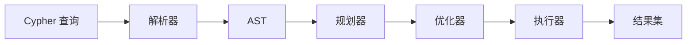
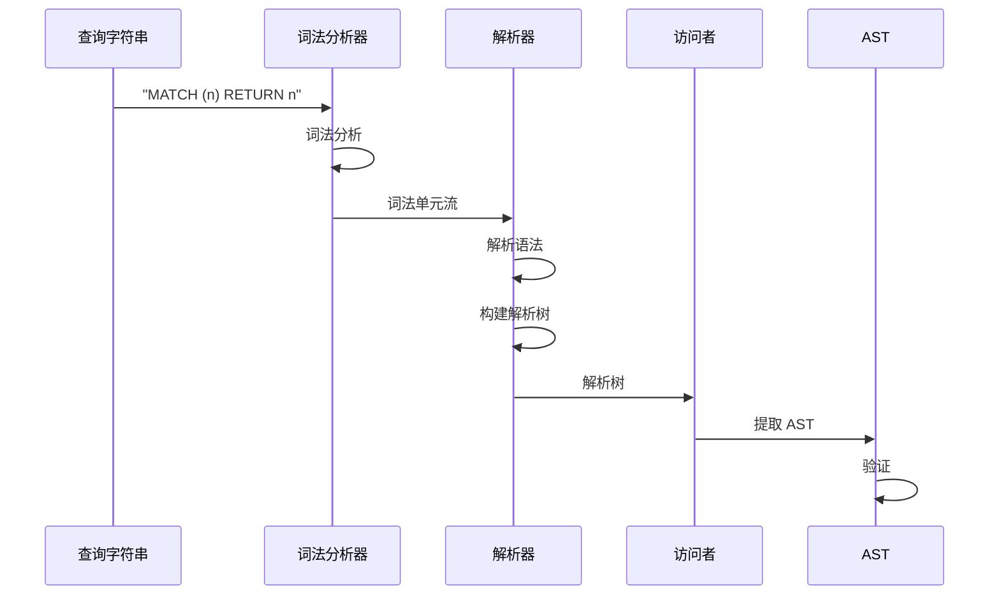
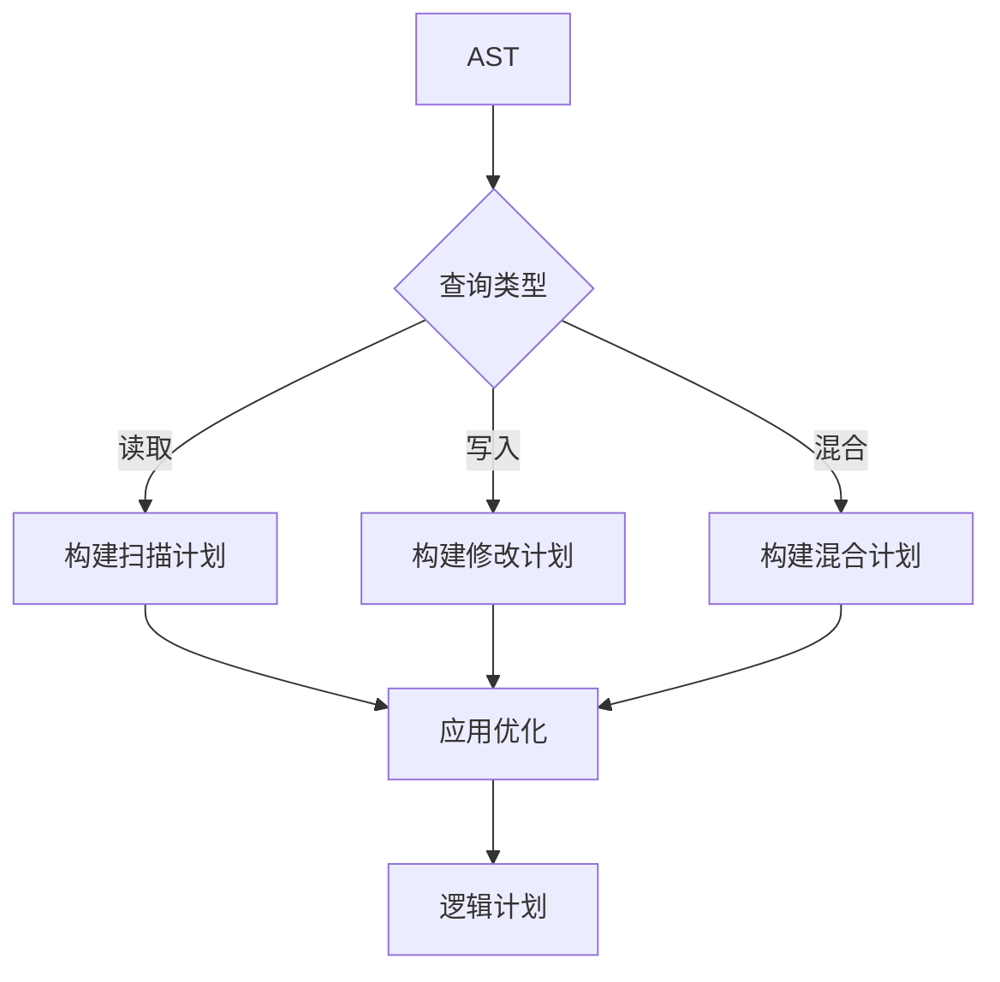
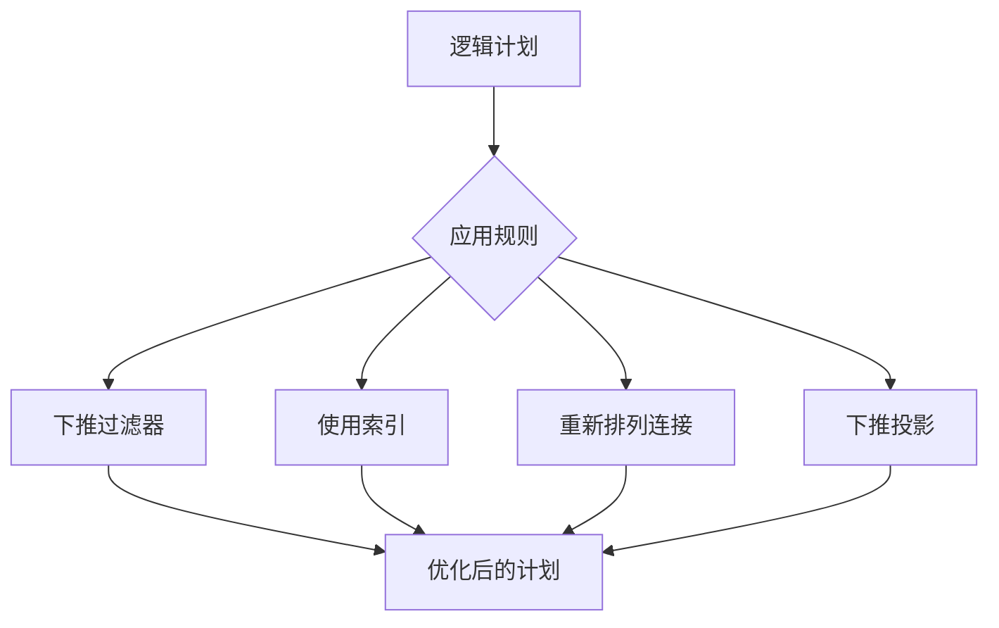
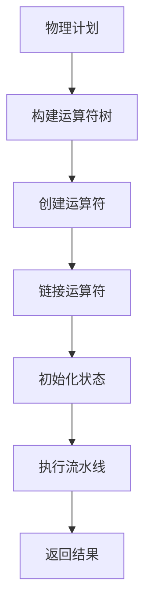
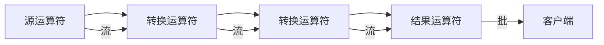

# 查询引擎

ZYX 查询引擎通过三阶段流水线处理 Cypher 查询：解析器 → 规划器 → 执行器。

## 查询流水线



**查询流水线阶段：**
- 解析器：基于 ANTLR4 的 Cypher 解析器
- AST：抽象语法树
- 规划器：创建逻辑计划
- 优化器：生成物理计划
- 执行器：执行运算符
- 结果集：查询结果

## 解析器

解析器将 Cypher 查询文本转换为抽象语法树（AST）。

### ANTLR4 语法

ZYX 使用 ANTLR4 从语法文件生成解析器：

- **CypherLexer.g4**：词法单元定义
- **CypherParser.g4**：语法规则
- **生成代码**：C++ 解析器和访问者类

### 解析过程



### AST 结构

```cpp
struct Query {
    std::vector<Clause*> clauses;

    // 子句可以是：
    // - MatchClause
    // - CreateClause
    // - ReturnClause
    // - WhereClause
    // - WithClause
    // 等等。
};
```

### 支持的 Cypher 特性

::: info 完整 Cypher 支持
ZYX 支持完整的 Cypher 查询语言，例外很少。详情请参阅项目根目录。
:::

**读取子句**：
- `MATCH`：模式匹配
- `WHERE`：过滤条件
- `RETURN`：结果投影
- `ORDER BY`：排序
- `LIMIT`/`SKIP`：分页
- `WITH`：查询链接

**写入子句**：
- `CREATE`：创建节点和关系
- `MERGE`：如果不存在则创建
- `DELETE`：删除节点/关系
- `SET`：更新属性
- `REMOVE`：删除属性

**子句处理器**：
- 位于 `src/query/parser/cypher/clauses/`
- 每个子句都有专用的处理器类
- 实现用于 AST 遍历的访问者模式

## 查询规划器

规划器将 AST 转换为优化的逻辑计划。

### 逻辑规划



### 规划步骤

1. **子句分析**：识别查询类型和子句
2. **模式提取**：从 MATCH 提取图模式
3. **计划构建**：创建逻辑运算符
4. **优化**：应用基于规则的优化

### 逻辑运算符

| 运算符 | 描述 |
|----------|-------------|
| **Scan** | 全表扫描 |
| **IndexScan** | 基于索引的查找 |
| **Filter** | 谓词求值 |
| **Project** | 列选择 |
| **Sort** | 排序 |
| **Limit** | 结果限制 |
| **Join** | 模式匹配 |
| **Aggregate** | 分组和聚合 |

### 优化规则



**规则示例**：
- **过滤器下推**：将过滤器移至更靠近数据源
- **索引选择**：在可用时使用索引
- **连接重排**：最优连接顺序
- **投影修剪**：删除未使用的列

## 查询执行器

执行器使用高效运算符执行物理计划。

### 物理运算符



### 运算符类型

#### 扫描运算符

**NodeScanOperator**
```cpp
class NodeScanOperator : public Operator {
    // 扫描带有可选标签过滤器的所有节点
    ResultSet execute() override;
};
```

**EdgeScanOperator**
```cpp
class EdgeScanOperator : public Operator {
    // 扫描带有可选类型过滤器的所有边
    ResultSet execute() override;
};
```

**IndexScanOperator**
```cpp
class IndexScanOperator : public Operator {
    // 使用索引进行高效查找
    ResultSet execute() override;
};
```

#### 修改运算符

**CreateNodeOperator**
```cpp
class CreateNodeOperator : public Operator {
    // 创建带有标签和属性的新节点
    ResultSet execute() override;
};
```

**CreateEdgeOperator**
```cpp
class CreateEdgeOperator : public Operator {
    // 在节点之间创建关系
    ResultSet execute() override;
};
```

**DeleteOperator**
```cpp
class DeleteOperator : public Operator {
    // 删除节点和关系
    ResultSet execute() override;
};
```

**MergeNodeOperator**
```cpp
class MergeNodeOperator : public Operator {
    // 如果节点不存在则创建它
    ResultSet execute() override;
};
```

#### 查询运算符

**FilterOperator**
```cpp
class FilterOperator : public Operator {
    // 求值 WHERE 子句谓词
    ResultSet execute() override;
};
```

**ProjectOperator**
```cpp
class ProjectOperator : public Operator {
    // 选择和重命名列
    ResultSet execute() override;
};
```

**SortOperator**
```cpp
class SortOperator : public Operator {
    // 实现 ORDER BY
    ResultSet execute() override;
};
```

**AggregateOperator**
```cpp
class AggregateOperator : public Operator {
    // 实现 GROUP BY 和聚合
    ResultSet execute() override;
};
```

#### 特殊运算符

**VectorSearchOperator**
```cpp
class VectorSearchOperator : public Operator {
    // 执行向量相似性搜索
    ResultSet execute() override;
};
```

**TrainVectorIndexOperator**
```cpp
class TrainVectorIndexOperator : public Operator {
    // 训练向量索引以加快搜索速度
    ResultSet execute() override;
};
```

### 运算符执行模型



**流水线执行**：
- **流式传输**：运算符通过流水线传递数据
- **惰性求值**：仅处理请求的行
- **批处理**：高效的批大小

### 执行示例

查询：
```cypher
MATCH (u:User)
WHERE u.age > 25
RETURN u.name, u.age
ORDER BY u.age DESC
LIMIT 5
```

执行计划：
```
1. NodeScanOperator (标签: User)
   ↓
2. FilterOperator (u.age > 25)
   ↓
3. ProjectOperator (u.name, u.age)
   ↓
4. SortOperator (u.age DESC)
   ↓
5. LimitOperator (5)
   ↓
6. 结果
```

## 表达式求值

### 表达式类型

- **字面量**：数字、字符串、布尔值
- **变量**：查询变量（n、r 等）
- **属性**：属性访问（n.name）
- **运算符**：算术、比较、逻辑
- **函数**：内置函数

### 表达式求值器

```cpp
class ExpressionEvaluator {
public:
    Value evaluate(const Expression* expr, const Context& ctx);

private:
    Value evaluateLiteral(const Literal* expr);
    Value evaluateVariable(const Variable* expr);
    Value evaluateProperty(const Property* expr);
    Value evaluateBinaryOp(const BinaryOp* expr);
    Value evaluateFunction(const Function* expr);
};
```

## 结果处理

### ResultSet

```cpp
class ResultSet {
private:
    std::vector<std::string> columns_;
    std::vector<std::vector<Value>> rows_;

public:
    void addColumn(const std::string& name);
    void addRow(const std::vector<Value>& values);
    Value getValue(size_t row, size_t col) const;
};
```

### 值类型

| 类型 | 描述 | 示例 |
|------|-------------|---------|
| **Null** | 空值 | `null` |
| **Boolean** | 真/假 | `true`, `false` |
| **Integer** | 64 位整数 | `42` |
| **Float** | 双精度 | `3.14` |
| **String** | UTF-8 字符串 | `"hello"` |
| **List** | 值数组 | `[1, 2, 3]` |
| **Node** | 图节点 | `(n:User)` |
| **Edge** | 图边 | `-(n:KNOWS)->` |

## 性能优化

### 查询性能提示

1. **使用索引**：在频繁查询的属性上创建索引
2. **尽早过滤**：在 WHERE 子句中应用过滤器
3. **限制结果**：使用 LIMIT 避免大型结果集
4. **避免交叉积**：确保模式是连接的
5. **使用 PROFILE**：分析查询执行计划

### 查询性能分析

```cypher
PROFILE MATCH (u:User)
WHERE u.age > 25
RETURN u.name, u.age
```

输出包括：
- 运算符执行时间
- 每个运算符处理的行数
- 内存使用

### 常见模式

#### 高效模式匹配

```cypher
# 好的做法 - 使用索引
MATCH (u:User {id: 123}) RETURN u

# 避免 - 全扫描
MATCH (u:User) WHERE u.id = 123 RETURN u
```

#### 高效过滤

```cypher
# 好的做法 - 尽早过滤
MATCH (u:User)
WHERE u.age > 25 AND u.city = 'NYC'
RETURN u

# 避免 - 延迟过滤
MATCH (u:User)
RETURN u
WHERE u.age > 25 AND u.city = 'NYC'
```

## 向量索引支持

ZYX 支持向量索引进行相似性搜索：

### 创建向量索引

```cypher
CALL vector.create_index('embedding', 1536)
```

### 向量搜索

```cypher
CALL vector.search('embedding', [0.1, 0.2, ...], 10)
YIELD node, score
RETURN node.name, score
```

### 训练索引

```cypher
CALL vector.train_index('embedding')
```

## 扩展点

### 自定义运算符

为专门的操作实现自定义运算符：

```cpp
class CustomOperator : public Operator {
public:
    ResultSet execute() override {
        // 自定义逻辑
    }
};
```

### 自定义函数

添加自定义 Cypher 函数：

```cpp
class CustomFunction : public Function {
public:
    Value execute(const std::vector<Value>& args) override {
        // 函数实现
    }
};
```

## 下一步

- [事务管理](/zh/architecture/transactions) - 事务管理
- [存储系统](/zh/architecture/storage) - 数据存储方式
- [API 参考](/zh/api/cpp-api) - 编程查询执行
