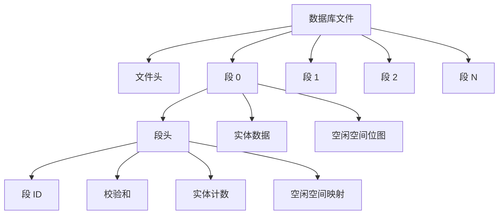

# 段格式

Metrix 使用自定义的基于段的存储格式，提供高效的空间管理、快速访问和 ACID 合规性。

## 概述

数据库文件被划分为固定大小的段，每个段独立管理。这种设计实现了：
- **高效空间分配**：基于位图的空间跟踪
- **快速访问**：直接段偏移计算
- **并发操作**：段级锁定
- **易于恢复**：段级校验和和元数据

### 数据库文件结构

```mermaid
block-beta
    columns 8

    block:db_file["数据库文件"]
        fh["文件头<br/>256 字节"]:1:4
        st["段表<br/>4KB"]:5:8

        block:segments["段 (每个 4MB)"]
            s0["段 0<br/>节点"]:1:2
            s1["段 1<br/>边"]:3:4
            s2["段 2<br/>属性"]:5:6
            s3["段 3<br/>..."]:7:8
        end

        wal["WAL<br/>100MB"]:1:8
    end
```

### 段层次结构



## 文件头

文件头包含数据库范围的元数据。

## 段结构

每个段具有固定大小（默认：1MB），包含：
- 段头：段元数据
- 实体数据：实际存储的数据
- 自由空间位图：空间分配跟踪

## 实体存储

### 数据页布局

```
┌─────────────────────────────────────────────────────────┐
│                    数据页 (4096 字节)                   │
├─────────────────────────────────────────────────────────┤
│  页头 (32 字节)                                         │
│  ├─ pageId: 42                                         │
│  ├─ segmentId: 0                                       │
│  ├─ entityType: NODE                                   │
│  ├─ entityCount: 45                                    │
│  ├─ freeSpace: 1024 字节                               │
│  └─ checksum: 0xABCD1234                               │
├─────────────────────────────────────────────────────────┤
│  实体槽表 (可变大小, ~256 字节)                         │
│  ┌──────────┬──────────┬──────────┬──────────┐        │
│  │ 槽 0     │ 槽 1     │ 槽 2     │ 槽 3     │        │
│  │ 已用     │ 空闲     │ 已用     │ 已用     │        │
│  │ 偏移:0   │          │ 偏移:64  │ 偏移:92  │        │
│  │ 大小:28  │          │ 大小:36  │ 大小:44  │        │
│  └──────────┴──────────┴──────────┴──────────┘        │
│  ... (每页 32 个槽)                                     │
├─────────────────────────────────────────────────────────┤
│  实体数据区 (剩余 ~3800 字节)                           │
│  ┌─────────────────────────────────────────────────┐   │
│  │ 实体 0 (28 字节)                                │   │
│  │ id: 0x0001                                      │   │
│  │ label: "Person"                                 │   │
│  │ properties: {name: "Alice", age: 30}            │   │
│  └─────────────────────────────────────────────────┘   │
│  ┌─────────────────────────────────────────────────┐   │
│  │ 实体 2 (36 字节)                                │   │
│  │ id: 0x0003                                      │   │
│  │ label: "User"                                   │   │
│  │ properties: {email: "bob@ex.com", active: true} │   │
│  │ outgoing: [0x0005, 0x0008]                     │   │
│  └─────────────────────────────────────────────────┘   │
│  ... (空闲空间穿插其中)                                 │
└─────────────────────────────────────────────────────────┘
```

实体在段内存储，包含：
- 实体头：元数据和校验和
- 实体数据：实际属性和关系

## 自由空间管理

使用位图分配器跟踪段内的可用空间，每个位对应一个固定大小的块（64 字节）。

## 最佳实践

1. **批量操作**：分组多个实体操作
2. **使用适当的段大小**：根据工作负载调整
3. **监控碎片**：定期回收空间
4. **策略性压缩**：压缩写入频率低的段
5. **验证校验和**：定期检查数据完整性
6. **优先顺序访问**：比随机访问更高效

## 另请参阅

- [存储系统](/zh/architecture/storage) - 整体存储架构
- [WAL 实现](/zh/architecture/wal) - 写前日志
- [缓存管理](/zh/architecture/cache) - 段缓存
