# 存储系统

Metrix 使用自定义的**段式存储引擎**，针对图工作负载优化，具有高效的空间管理和快速访问模式。

## 段架构

存储被组织成固定大小的**段（Segment）** - 可以分配给不同实体类型的连续磁盘空间块。

### 文件布局

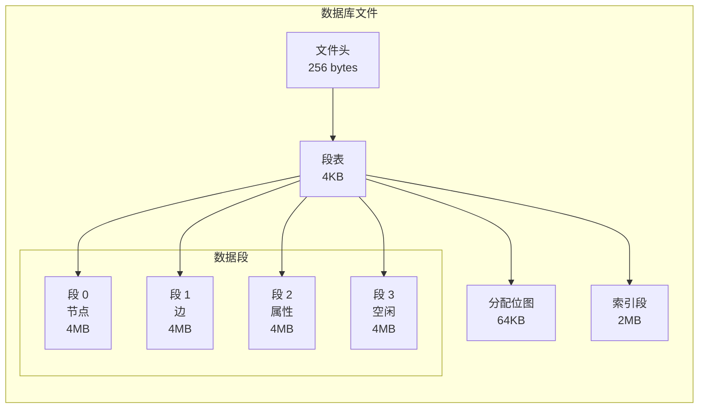

### 内部结构

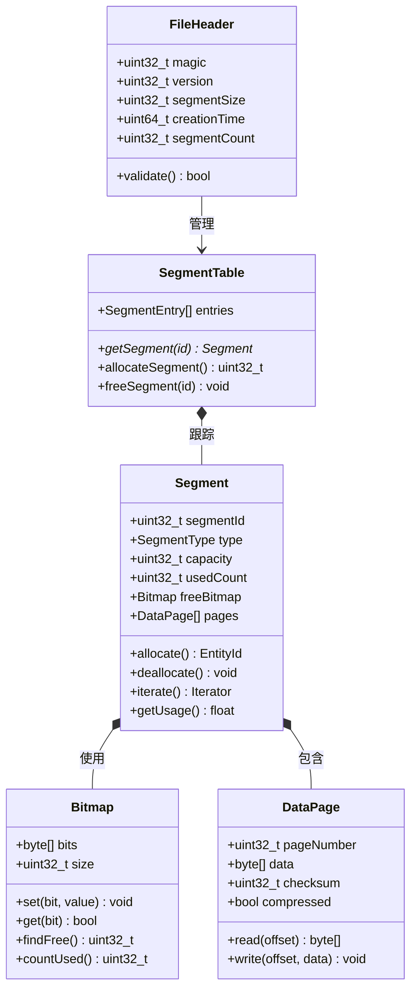

### 存储模型

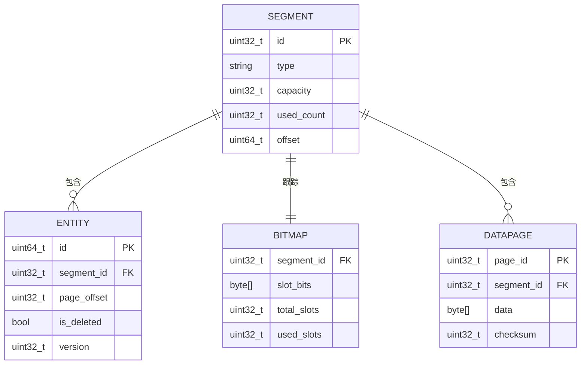

### 段结构

每个段包含：

```
+----------------------------------------------------------+
|                    段头 (64 字节)                        |
+---------------------+-----------+-----------+-------------+
| 字段                | 偏移量    | 大小      | 描述        |
+---------------------+-----------+-----------+-------------+
| segmentId           | 0         | 4 字节    | 段 ID       |
| type                | 4         | 4 字节    | 节点/边     |
| capacity            | 8         | 4 字节    | 最大插槽数  |
| usedCount           | 12        | 4 字节    | 已用插槽数  |
| checksum            | 16        | 4 字节    | 头部 CRC    |
| flags               | 20        | 4 字节    | 标志位      |
| reserved            | 24        | 40 字节   | 填充        |
+---------------------+-----------+-----------+-------------+
|              空闲空间位图 (8KB)                         |
|  位 0 = 插槽 0 | 位 1 = 插槽 1 | ... | 位 65535        |
+----------------------------------------------------------+
|                  数据页 (剩余 ~4MB)                      |
|  页 0 (4KB)    页 1 (4KB)   ...    页 511 (4KB)         |
|  [64 实体]     [64 实体]           [64 实体]            |
+----------------------------------------------------------+
```

### 段分配流程

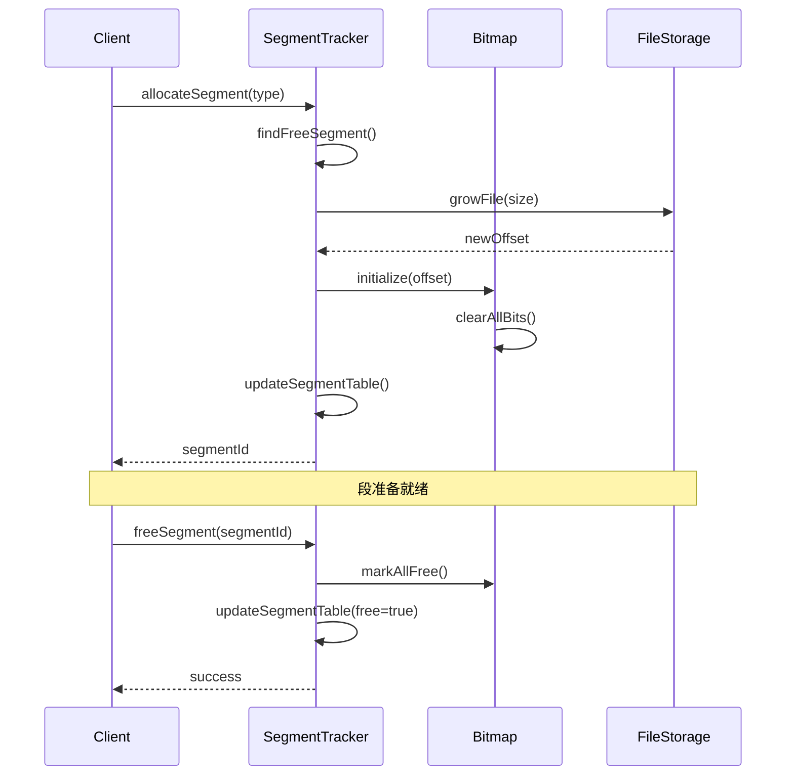

### 主要优势

1. **快速分配**：使用位图查找实现 O(1) 分配
2. **高效扫描**：段内顺序读取
3. **空间回收**：可以释放整个段
4. **缓存友好**：可预测的访问模式

## 存储组件

### FileHeaderManager

管理文件级元数据：

- **数据库版本**：用于兼容性格式标识符
- **段大小**：可配置的段大小（默认：4MB）
- **校验和**：验证文件完整性
- **创建时间**：数据库创建时间戳

### SegmentTracker

跟踪段分配：

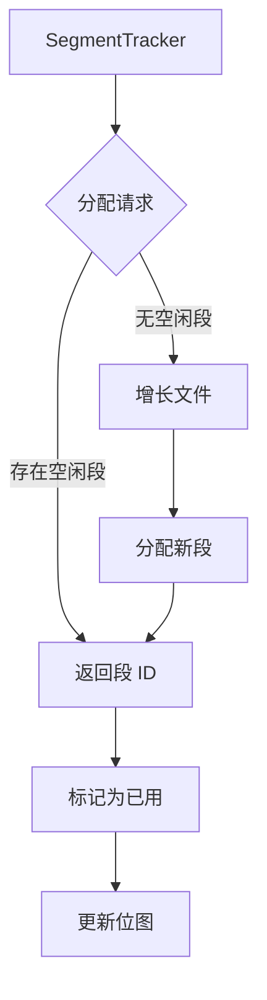

**职责**：
- 跟踪哪些段是空闲/已用
- 在需要时分配新段
- 删除后将段标记为空闲
- 维护段元数据

### DataManager

处理节点和边存储：

#### 节点存储
- **标签索引**：按标签快速查找节点
- **属性**：带有类型信息的键值对
- **关系**：指向传入/传出边的链接

#### 边存储
- **起始节点**：对源节点的引用
- **结束节点**：对目标节点的引用
- **类型**：关系类型标签
- **属性**：键值对

#### 属性存储
- **类型代码**：整数、字符串、布尔值、浮点数等
- **压缩**：大值的 zlib 压缩
- **内联存储**：小值直接存储在记录中

### IndexManager

管理两种类型的索引：

#### 标签索引
- **结构**：将标签映射到节点 ID 的哈希表
- **查找**：基于标签的查询 O(1) 复杂度
- **更新**：节点创建/删除时的增量更新

#### 属性索引
- **B-Tree 索引**：用于范围查询的有序索引
- **哈希索引**：快速相等性查找
- **复合索引**：多列索引（计划中）

### DeletionManager

基于墓碑的删除：

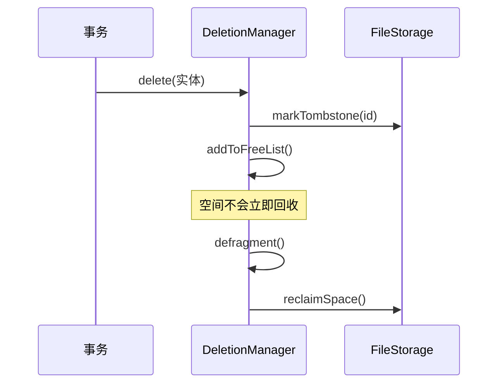

**过程**：
1. **标记墓碑**：实体标记为已删除
2. **空闲列表**：空间添加到回收列表
3. **碎片整理**：后台进程回收空间
4. **重用**：回收的空间可用于新实体

### CacheManager

带脏跟踪的 LRU 缓存：

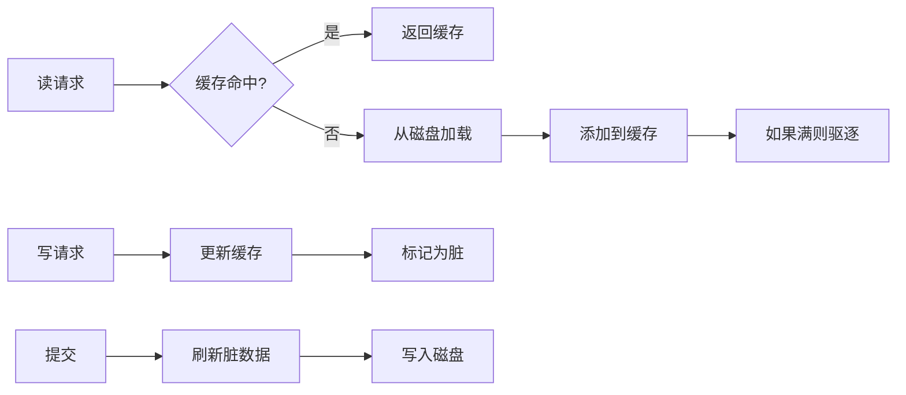

**特性**：
- **LRU 驱逐**：最近最少使用的实体先被驱逐
- **脏跟踪**：跟踪修改的实体以持久化
- **写回**：脏实体在提交时刷新
- **可配置大小**：缓存大小限制（字节）

## 预写日志 (WAL)

所有修改在应用到主存储之前都会被记录。

### WAL 流程

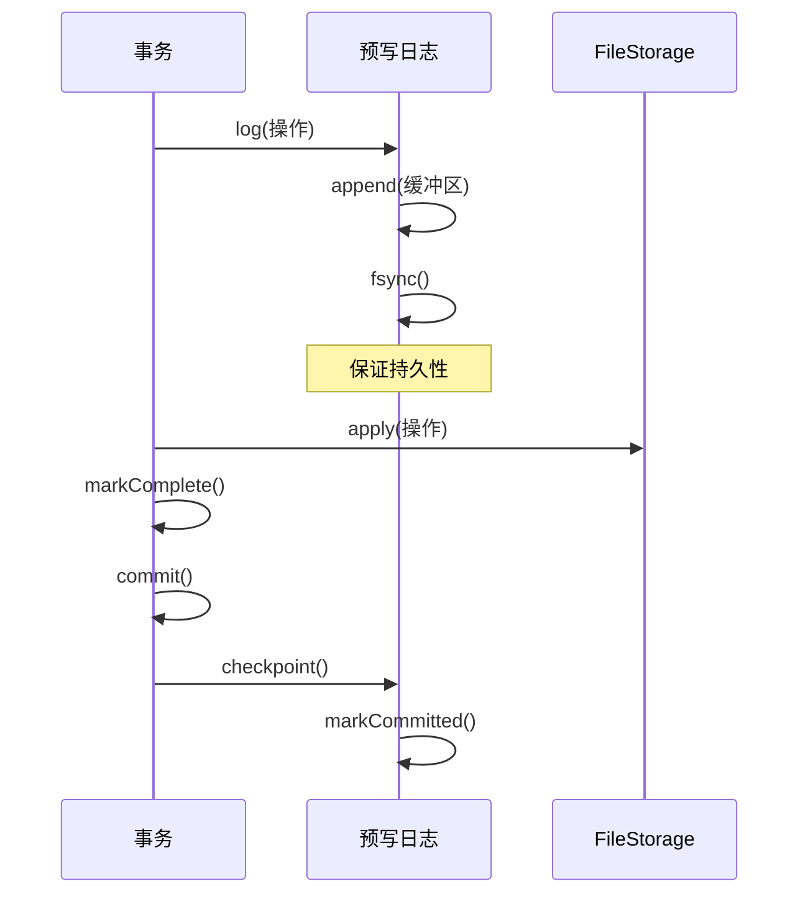

### WAL 结构

```
┌─────────────────────────────────┐
│ WAL 头                          │
│ - 检查点 ID                     │
│ - 日志序列号 (LSN)               │
├─────────────────────────────────┤
│ 日志条目                        │
│ ┌─────────────────────────────┐ │
│ │ 条目 1: CreateNode          │ │
│ │ - 事务 ID                   │ │
│ │ - 节点 ID                   │ │
│ │ - 标签                      │ │
│ │ - 属性                      │ │
│ └─────────────────────────────┘ │
│ ┌─────────────────────────────┐ │
│ │ 条目 2: CreateRelationship  │ │
│ │ - 事务 ID                   │ │
│ │ - 边 ID                     │ │
│ │ - 起始/结束节点             │ │
│ └─────────────────────────────┘ │
├─────────────────────────────────┤
│ 检查点标记                      │
│ - 已提交的 LSN                  │
│ - 时间戳                        │
└─────────────────────────────────┘
```

### WAL 优势

1. **原子性**：可以重放整个事务
2. **持久性**：已提交的更改在崩溃后仍然存在
3. **回滚**：通过反转 WAL 条目撤销操作
4. **恢复**：崩溃后重建状态

### 检查点过程

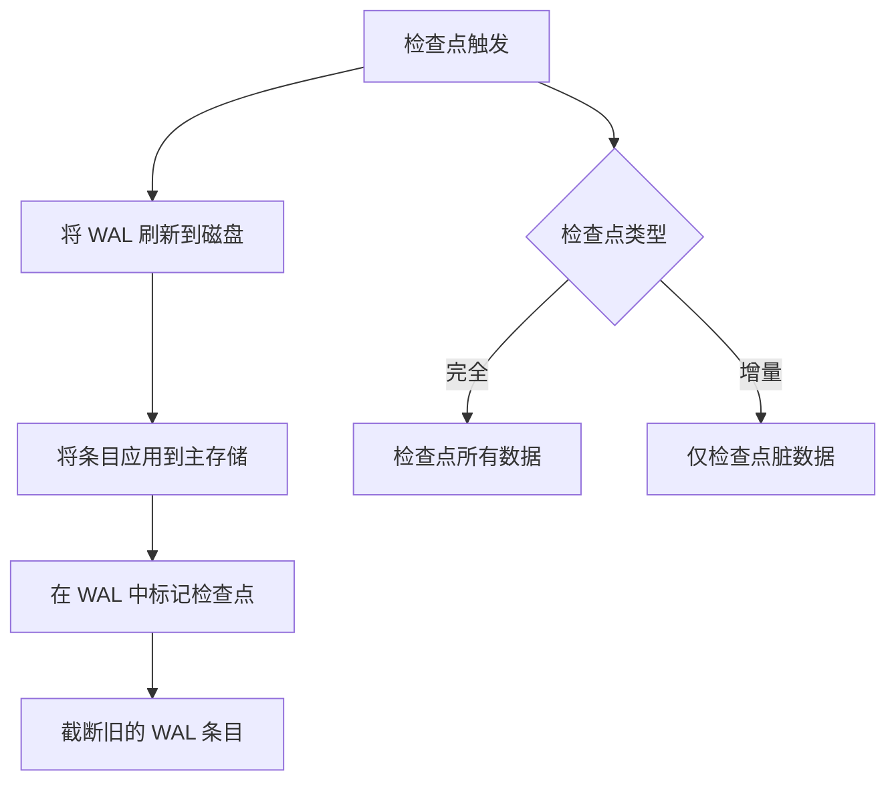

## 状态管理

### 状态链

每个实体维护一个状态链以进行版本控制：


### 状态链优势

- **MVCC**：读操作不阻塞写操作
- **时间旅行**：查询历史状态
- **回滚**：无数据丢失的撤销
- **冲突检测**：检测并发修改

### 状态转换

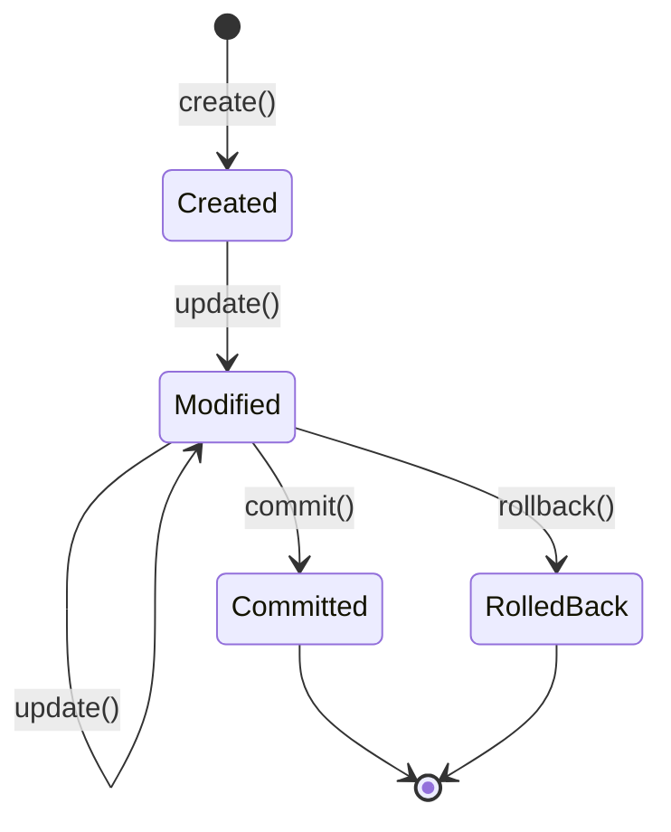

## 文件格式

### 数据库文件布局

```
┌─────────────────────────────────┐
│ 文件头 (512 字节)               │
│ - 魔数                          │
│ - 版本                          │
│ - 段大小                        │
│ - 校验和                        │
├─────────────────────────────────┤
│ 段表                            │
│ - 段元数据                      │
│ - 分配位图                      │
├─────────────────────────────────┤
│ 段 0: 节点数据                  │
├─────────────────────────────────┤
│ 段 1: 边数据                    │
├─────────────────────────────────┤
│ 段 2: 属性数据                  │
├─────────────────────────────────┤
│ ... 更多段 ...                  │
├─────────────────────────────────┤
│ 段 N: 索引数据                  │
└─────────────────────────────────┘
```

### WAL 文件布局

```
┌─────────────────────────────────┐
│ WAL 头                          │
│ - 检查点 ID                     │
│ - 起始 LSN                      │
├─────────────────────────────────┤
│ 日志记录 1                      │
│ - 事务 ID                       │
│ - 操作类型                      │
│ - 操作数据                      │
├─────────────────────────────────┤
│ 日志记录 2                      │
├─────────────────────────────────┤
│ ... 更多记录 ...                │
├─────────────────────────────────┤
│ 检查点标记                      │
└─────────────────────────────────┘
```

## 压缩

Metrix 使用 zlib 压缩用于：

1. **大型属性**：字符串和二进制数据 > 1KB
2. **段**：空闲时压缩整个段
3. **WAL**：压缩旧的 WAL 条目

### 压缩策略

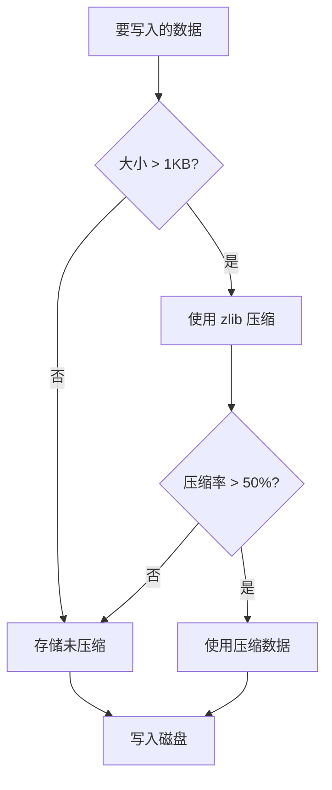

## 性能特征

| 操作 | 复杂度 | 说明 |
|-----------|------------|-------|
| 创建节点 | O(1) | 直接段分配 |
| 创建边 | O(1) | 链接到现有节点 |
| 按 ID 查找 | O(1) | 直接偏移量计算 |
| 标签扫描 | O(n) | 扫描带有标签的所有节点 |
| 属性查询 | O(1) | 有索引 |
| 属性查询 | O(n) | 无索引 |
| 删除节点 | O(1) | 墓碑标记 |
| 压缩存储 | O(n) | 后台碎片整理 |

## 恢复

### 崩溃恢复

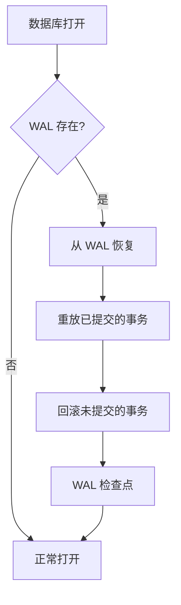

### 恢复步骤

1. **检查 WAL**：确定是否发生崩溃
2. **重放日志**：从 WAL 应用已提交的事务
3. **回滚**：撤销未提交的事务
4. **检查点**：将所有更改持久化到主存储
5. **截断**：清除已处理的 WAL 条目

## 配置

### 存储参数

```cpp
struct StorageConfig {
    size_t segmentSize = 4 * 1024 * 1024;  // 4MB 段
    size_t cacheSize = 256 * 1024 * 1024;  // 256MB 缓存
    bool compressionEnabled = true;
    size_t compressionThreshold = 1024;    // 1KB
    size_t walMaxSize = 100 * 1024 * 1024; // 100MB
};
```

### 调优指南

- **段大小**：较大的段 = 更少的碎片
- **缓存大小**：更多内存 = 更快的读取
- **压缩**：用 CPU 换取磁盘空间
- **WAL 大小**：平衡持久性和磁盘使用

## 下一步

- [查询引擎](/zh/architecture/query-engine) - 如何执行查询
- [事务管理](/zh/architecture/transactions) - 事务管理详情
- [API 参考](/zh/api/cpp-api) - 存储 API 使用
