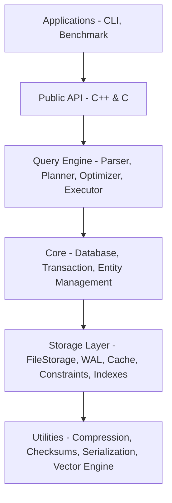

# Architecture Reference

## Layered Architecture



## Key Components

### Database (`include/graph/core/Database.hpp`)

- Main entry point for database operations
- Manages lifecycle: open, close, transactions
- Coordinates between storage engine and query engine
- Provides access to `FileStorage` and `QueryEngine`

### Storage System (`include/graph/storage/FileStorage.hpp`)

- **Segment-based storage**: Custom file format with checksums and compression
- **Component hierarchy**:
    - `FileHeaderManager`: Manages file-level metadata
    - `SegmentTracker`: Tracks segment allocation and usage
    - `SpaceManager`: Manages free space across segments
    - `DataManager`: Coordinates node/edge/property/blob data managers
        - `NodeManager`, `EdgeManager`, `PropertyManager`, `BlobManager`: Entity-specific CRUD
        - `StateManager`: Temporal state tracking via state chains
        - `TransactionContext`: Transaction-scoped state for data operations
    - `IndexManager`: Manages label indexes, property indexes, and segment indexes
        - `LabelIndex`, `PropertyIndex`: Core index types
        - `EntityTypeIndexManager`: Per-type index management
        - `VectorIndexManager`: Vector similarity index management
        - `IndexBuilder`: Bulk index construction
    - `ConstraintManager`: Schema constraint enforcement
        - `UniqueConstraint`, `NotNullConstraint`, `NodeKeyConstraint`, `TypeConstraint`
    - `DeletionManager`: Tombstone management and space reclamation
    - `CacheManager`: LRU cache with dirty entity tracking
    - `PersistenceManager`: Manages entity persistence to disk
    - `SnapshotManager`: Committed state snapshot management
    - `DirtyEntityRegistry`: Tracks modified entities for efficient persistence
    - `TokenRegistry`: Maps string labels/types to integer tokens
    - `WALManager`: Write-Ahead Log for durability and crash recovery
    - `StorageBootstrap`: Initialization and bootstrap logic
    - `PageBufferPool`: Buffered I/O for segment reads/writes
- **ACID compliance**: Full transaction support with WAL
- **State management**: Temporal state tracking via state chains (`StateChainManager`)

### Query Engine (`include/graph/query/`)

- **Parser** (`src/query/parser/`): ANTLR4-based Cypher parser
    - `common/`: Base parser interface (`IQueryParser.hpp`)
    - `cypher/`: Cypher-specific implementation
        - `*.g4`: ANTLR4 grammar files (lexer and parser)
        - `helpers/public/`: AST extraction, expression building, pattern building
        - `helpers/internal/`: Internal parser utilities
        - `clauses/`: Cypher clause handlers (reading, writing, result, admin)
        - `generated/`: ANTLR4 auto-generated code (DO NOT EDIT)
- **Planner** (`include/graph/query/planner/`): Converts parsed Cypher to logical plans
    - `QueryPlanner`: Main planning entry point
    - `PhysicalPlanConverter`: Converts logical plans to physical operators
    - `PipelineValidator`: Validates query pipeline correctness
    - `ProcedureRegistry`: Registry for callable procedures (e.g., GDS algorithms)
    - `ScopeStack`: Variable scope management during planning
- **Logical Plan** (`include/graph/query/logical/`): Intermediate representation
    - `LogicalOperator` base class with operator-specific subclasses
    - `LogicalPlanPrinter` for EXPLAIN output
- **Optimizer** (`include/graph/query/optimizer/`): Rule-based and cost-based optimization
    - `CostModel`, `Statistics`, `StatisticsCollector` for cost estimation
    - Rules: `FilterPushdownRule`, `IndexPushdownRule`, `EnhancedIndexSelectionRule`, `ProjectionPushdownRule`, `JoinReorderRule`, `PredicateSimplificationRule`
- **Executor** (`include/graph/query/execution/`): Executes physical plans
    - Scan: `NodeScanOperator`, `TraversalOperator`, `VarLengthTraversalOperator`
    - Mutation: `CreateNodeOperator`, `CreateEdgeOperator`, `MergeNodeOperator`, `MergeEdgeOperator`, `DeleteOperator`, `SetOperator`, `RemoveOperator`
    - Query: `FilterOperator`, `SortOperator`, `ProjectOperator`, `LimitOperator`, `SkipOperator`, `UnwindOperator`, `UnionOperator`, `CartesianProductOperator`, `OptionalMatchOperator`, `CallSubqueryOperator`, `ForeachOperator`
    - Aggregation: `AggregateOperator` with `AggregateAccumulator`
    - Index/Schema: `CreateIndexOperator`, `DropIndexOperator`, `ShowIndexesOperator`, `CreateConstraintOperator`, `DropConstraintOperator`, `ShowConstraintsOperator`, `CreateVectorIndexOperator`
    - Vector: `VectorSearchOperator`, `TrainVectorIndexOperator`
    - GDS Algorithms: `GdsOperators` (shortest path via `AlgoShortestPathOperator`)
    - CSV: `LoadCsvOperator` with `CsvReader`
    - Admin: `ExplainOperator`, `ProfileOperator`, `ListConfigOperator`, `SetConfigOperator`, `ShowStatsOperator`, `ResetStatsOperator`, `TransactionControlOperator`
    - Utility: `SingleRowOperator`, `RecordInjectorOperator`
- **Expressions** (`include/graph/query/expressions/`): Expression evaluation
    - `ExpressionEvaluator` with `EvaluationContext`
    - `FunctionRegistry`: Built-in and user-defined functions
    - Quantifier functions: `AllFunction`, `AnyFunction`, `NoneFunction`, `SingleFunction`
    - List operations: `ListComprehensionExpression`, `ListSliceExpression`, `ReduceExpression`
    - Pattern: `PatternComprehensionExpression`, `ExistsExpression`, `IsNullExpression`
- **Algorithm** (`include/graph/query/algorithm/`): Neo4j GDS-compatible graph algorithms
    - `GraphProjection` / `GraphProjectionManager`: Named graph projections
    - `GraphAlgorithm`: Algorithm execution framework
- **Plan Cache** (`include/graph/query/cache/`): Query plan caching (`PlanCache`)

### Transaction System (`include/graph/core/Transaction.hpp`)

- ACID transactions with full rollback capabilities
- Optimistic locking with versioning
- `TransactionManager` coordinates transaction lifecycle
- Coordinates with WAL for durability

### Vector Engine (`include/graph/vector/`)

- **Core**: `BFloat16` half-precision type, `VectorMetric` distance functions
- **Index**: `DiskANNIndex` for disk-based approximate nearest neighbor search
- **Quantization**: `NativeProductQuantizer`, `KMeans` for vector compression
- **Registry**: `VectorIndexRegistry` manages vector index instances
- **Configuration**: `VectorIndexConfig` for index parameters

### Configuration (`include/graph/config/SystemConfigManager.hpp`)

- Dynamic runtime configuration
- Entity observer pattern for reactive updates
- Per-module configurations (logging, memory, etc.)

### Concurrency (`include/graph/concurrent/ThreadPool.hpp`)

- Thread pool for parallel query execution and background tasks

### Traversal (`include/graph/traversal/RelationshipTraversal.hpp`)

- Graph traversal algorithms for relationship-based queries

## Data Flow

1. **Database open**: `Database::open()` → `StorageBootstrap` → `FileStorage::open()` → Initialize all components
2. **Query execution**: Cypher string → Parser → QueryPlanner → Optimizer → PhysicalPlanConverter → QueryExecutor → Storage operations
3. **Transaction**: `beginTransaction()` → Operations in context → commit/rollback → WAL updates
4. **Persistence**: Entity changes → `DirtyEntityRegistry` → `PersistenceManager` → `CacheManager` → FileStorage write → WAL

## Public API

- **C++ API**: `include/zyx/zyx.hpp` - Embeddable interface for C++ applications
- **C API**: `include/zyx/zyx_c_api.h` - C-compatible interface for FFI
- **Types**: `include/zyx/value.hpp` - Data type definitions
- **Query API**: `include/graph/query/api/` - `QueryEngine`, `QueryBuilder`, `QueryResult`, `ResultValue`
- CLI tool: `buildDir/apps/cli/zyx` - Interactive REPL

## Directory Structure

```
include/
├── zyx/                     # Public headers (API)
│   ├── zyx.hpp              # C++ API
│   ├── zyx_c_api.h          # C API
│   └── value.hpp            # Value types
└── graph/                   # Internal headers
    ├── core/               # Database, Transaction, Entity, State, Index, Types
    ├── storage/            # FileStorage, WAL, cache, deletion, persistence
    │   ├── constraints/    # Schema constraints (unique, not-null, node-key, type)
    │   ├── data/           # Entity managers (node, edge, property, blob, state)
    │   ├── dictionaries/   # TokenRegistry (label/type string↔token mapping)
    │   ├── indexes/        # Label, property, vector, and segment indexes
    │   ├── state/          # System state management
    │   └── wal/            # Write-Ahead Log
    ├── query/              # Query engine
    │   ├── algorithm/      # GDS-compatible graph algorithms and projections
    │   ├── api/            # QueryEngine, QueryBuilder, QueryResult
    │   ├── cache/          # Query plan cache
    │   ├── execution/      # Physical operators and executor
    │   │   └── operators/  # All physical operator implementations
    │   ├── expressions/    # Expression evaluation and function registry
    │   ├── logical/        # Logical plan operators
    │   │   └── operators/  # All logical operator implementations
    │   ├── optimizer/      # Cost model, statistics, optimization rules
    │   │   └── rules/      # Individual optimizer rules
    │   └── planner/        # Query planner and physical plan converter
    ├── traversal/          # Graph traversal algorithms
    ├── vector/             # Vector index engine
    │   ├── core/           # BFloat16, distance metrics
    │   ├── index/          # DiskANN index implementation
    │   └── quantization/   # Product quantization, KMeans
    ├── concurrent/         # Thread pool
    ├── config/             # Configuration management
    ├── cli/                # CLI-specific components (REPL, commands)
    ├── debug/              # Performance tracing
    ├── log/                # Logging
    └── utils/              # Checksum, compression, serialization utilities

src/
├── core/                   # Core implementation
├── storage/                # Storage layer implementation
│   ├── constraints/        # Constraint implementations
│   ├── data/               # Entity manager implementations
│   ├── dictionaries/       # TokenRegistry implementation
│   ├── indexes/            # Index implementations
│   ├── state/              # System state implementation
│   └── wal/                # WAL implementation
├── query/                  # Query engine implementation
│   ├── algorithm/          # Graph algorithm implementations
│   ├── api/                # QueryEngine, QueryBuilder implementations
│   ├── execution/          # Executor and operator implementations
│   │   └── operators/      # Physical operator implementations
│   ├── expressions/        # Expression evaluator implementations
│   ├── optimizer/          # Optimizer implementations
│   ├── parser/             # Query parser implementations
│   │   ├── common/         # Base parser interface (IQueryParser)
│   │   └── cypher/         # Cypher parser
│   │       ├── *.g4        # ANTLR4 grammar files
│   │       ├── helpers/    # AST extraction, expression/pattern building
│   │       │   ├── public/ # Public helper interfaces
│   │       │   └── internal/ # Internal implementation helpers
│   │       ├── clauses/    # Clause handlers (reading, writing, result, admin)
│   │       └── generated/  # ANTLR4 auto-generated code (DO NOT EDIT)
│   └── planner/            # Planner implementations
├── traversal/              # Traversal implementation
├── vector/                 # Vector engine implementation
│   └── index/              # DiskANN implementation
├── api/                    # C API implementation
├── cli/                    # CLI implementation
├── config/                 # Configuration implementation
├── debug/                  # Debug/perf tracing implementation
└── utils/                  # Utility implementations

apps/
├── cli/                    # CLI application (REPL)
└── benchmark/              # Performance benchmarking

tests/
├── include/                # Shared test utilities and helpers
├── integration/            # Integration tests (end-to-end workflows)
└── src/                    # Unit tests (mirrors source structure)
    ├── api/                # C/C++ API tests
    ├── cli/                # CLI tests
    ├── concurrent/         # Thread pool tests
    ├── config/             # Configuration tests
    ├── core/               # Database, transaction, entity tests
    ├── log/                # Logging tests
    ├── query/              # Query engine tests
    │   ├── algorithm/      # Graph algorithm tests
    │   ├── api/            # Query API tests
    │   ├── cache/          # Plan cache tests
    │   ├── execution/      # Executor tests
    │   │   └── operators/  # Individual operator tests
    │   ├── expressions/    # Expression evaluation tests
    │   ├── logical/        # Logical plan tests
    │   ├── optimizer/      # Optimizer rule tests
    │   ├── parser/         # Parser tests
    │   │   └── cypher/     # Cypher-specific parser tests
    │   │       ├── clauses/
    │   │       ├── helpers/
    │   │       └── syntax/
    │   └── planner/        # Planner tests
    ├── storage/            # Storage tests
    │   ├── constraints/    # Constraint tests
    │   ├── data/           # Entity manager tests
    │   ├── dictionaries/   # TokenRegistry tests
    │   ├── Indexes/        # Index tests
    │   ├── state/          # System state tests
    │   └── wal/            # WAL tests
    ├── traversal/          # Traversal tests
    ├── utils/              # Utility tests
    └── vector/             # Vector engine tests
        ├── core/           # BFloat16, metrics tests
        ├── index/          # DiskANN tests
        └── quantization/   # Quantizer tests

scripts/                    # Build and utility scripts
```

## Dependencies (via Conan)

- **boost**: Filesystem, system utilities
- **zlib**: Compression
- **gtest/gmock**: Testing framework
- **cli11**: Command line interface
- **antlr4-cppruntime**: Cypher parser generation

## Implementation Notes

1. **Segment Architecture**: All data is stored in fixed-size segments with bitmap tracking for space management
2. **State Chains**: All persistent modifications go through state chains for versioning and rollback
3. **Dirty Tracking**: Modified entities are tracked via `DirtyEntityRegistry` for efficient persistence
4. **LRU Cache**: Hot entities are cached in memory with configurable eviction policy
5. **WAL Integration**: Write operations are logged to WAL before actual disk writes for durability
6. **Parser Generation**: ANTLR4 grammar files are in `src/query/parser/cypher/` - generated code should not be manually edited
7. **Vector Engine**: DiskANN-based approximate nearest neighbor search with product quantization support
8. **Graph Algorithms**: Neo4j GDS-compatible graph algorithms with named projection support

## Library Build Outputs

- **`zyx_core`**: Internal static library for tests and CLI (not installed)
- **`libzyx`**: Public shared library for embedding (installed to system)
- **pkg-config**: Generated for easy integration (`pkg-config --libs --cflags zyx`)
